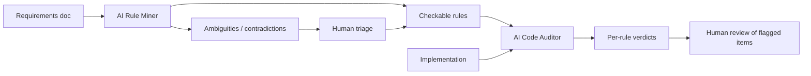

# LLM Static Verification Against Natural-Language Requirements

> A two-stage LLM workflow that extracts checkable rules from a natural-language requirements document, then audits the implementation rule by rule — useful only when the structure constrains the verifier and a human reviews flagged items.

Use an LLM to statically verify code against a natural-language requirements document only when the verification is **factored into two stages** — an *AI rule miner* that extracts discrete checkable rules from the spec and surfaces ambiguities, followed by an *AI code auditor* that judges each rule against the implementation independently ([Zhou, Towey, Chen, 2026](https://arxiv.org/abs/2605.17926)). The single-prompt variant — handing the LLM the whole spec and the whole code base and asking "does this match?" — systematically misclassifies correct implementations as non-conforming and gets worse with elaborate prompting ([Jin & Chen, ASE 2025](https://arxiv.org/abs/2508.12358); [Jin & Chen, 2026](https://arxiv.org/abs/2603.00539)).

## The Two-Stage Workflow

**Stage 1 — Rule Miner.** The LLM reads the requirements document and emits two outputs: a list of discrete, individually checkable rules ("the password reset endpoint must invalidate all prior session tokens"), and a list of statements it cannot reduce to rules — vague quality attributes, contradictions between paragraphs, missing actors ([Zhou et al., 2026](https://arxiv.org/abs/2605.17926)). The second list is the early-warning channel. Half the value of the stage is exposing what the spec leaves unsaid.

**Stage 2 — Code Auditor.** The LLM evaluates each extracted rule against the implementation in isolation. The auditor sees one rule and the relevant code surface, not the entire spec. The structured intermediate representation is the load-bearing constraint — it reduces the context the auditor must hold, which is the mechanism the experience report credits for reduced hallucination ([Zhou et al., 2026](https://arxiv.org/abs/2605.17926)).

## Why It Works

Splitting verification into rule extraction and per-rule judgment is the same mechanism behind factored chain-of-verification: answering each check in a context that excludes the rest forces independent recall instead of anchoring on the draft ([Dhuliawala et al., 2023](https://arxiv.org/abs/2309.11495)). The rule miner adds a second mechanism on top — it commits the verifier to discrete, named rules before any code is judged, which constrains the output surface. The over-correction paper found that **enriching the verifier prompt** (asking for explanations and proposed corrections) raises the false-negative rate, while narrowing the verifier's surface area does the opposite ([Jin & Chen, 2026](https://arxiv.org/abs/2603.00539)). The two-stage design implements that narrowing structurally rather than relying on prompt discipline.

## When This Backfires

- **Plain single-prompt verification.** Handing the LLM the full spec and the full code in one prompt inherits the systematic false-negative pattern documented in [Jin & Chen, ASE 2025](https://arxiv.org/abs/2508.12358) — correct implementations get flagged as non-conforming at rates that overwhelm reviewers. The two-stage structure is necessary, not optional.
- **Chain-of-explanation prompts in the auditor.** Asking the code auditor to *explain* its verdict or *propose corrections* raises the misjudgment rate. The intuitive prompt-engineering instinct inverts the desired outcome ([Jin & Chen, 2026](https://arxiv.org/abs/2603.00539)).
- **Requirements that lean on vague quality attributes.** "The system should be intuitive" or "must scale appropriately" cannot be reduced to checkable rules. The miner flags them, but the auditor has nothing to evaluate — coverage of the spec drops silently.
- **Treated as a substitute for tests.** The pattern is a complement to runtime evidence, not a replacement. Teams that retire test investment because LLM verification "covers requirements" lose the runtime oracle that catches the residual false negatives. Even strong models score only ~64% on coding judge benchmarks ([JudgeBench, ICLR 2025](https://openreview.net/pdf?id=G0dksFayVq)) and are sensitive to formatting and paraphrase changes ([CodeJudgeBench](https://arxiv.org/abs/2507.10535)).
- **No human gate on flagged items.** Without a reviewer triaging miner-flagged ambiguities and auditor-flagged failures, the noise dominates. Treat the LLM output as a queue that routes work to humans, not as a verdict.

## Where It Fits Among Verification Techniques

| Approach | What it checks | Oracle type |
|----------|---------------|-------------|
| Tests | Observed behaviour against expected output | Runtime, deterministic |
| Types and lints | Structural invariants | Static, deterministic |
| [Chain-of-verification](chain-of-verification-coding-agents.md) | Residual claims no test or LSP can reach | LLM, factored |
| LLM static verification (this page) | Per-rule conformance to a natural-language spec | LLM, structured two-stage |
| [Test-driven intent clarification](test-driven-intent-clarification.md) | Spec ambiguity surfaced *before* code | LLM-generated tests as proxy |

LLM static verification covers the gap between a written spec and the implementation when no executable oracle exists for the rules. Once an executable oracle does exist — a test, a type, a lint — prefer it.

## Key Takeaways

- The two-stage structure (rule miner, then per-rule code auditor) is what earns the pattern its place. Single-prompt verification of code against a spec misclassifies correct code as non-conforming and degrades further with elaborate prompts.
- The rule miner's *unverifiable* output is the early-warning channel — vague quality attributes and contradictions surface before any code is judged.
- Keep the code auditor's prompt narrow. Asking it to explain or propose corrections raises the false-negative rate.
- LLM static verification is a complement to tests, types, and lints — not a substitute. Reserve it for the rules no executable oracle covers.
- Route flagged items to human review. Coding judge benchmarks cap at ~64% accuracy with significant variance, so the LLM output is a triage queue, not a verdict.

## Related

- [Chain-of-Verification for Coding Agents](chain-of-verification-coding-agents.md) — Factored verification over residual claims no executable oracle covers; the same independent-recall mechanism underlies the two-stage design.
- [Test-Driven Intent Clarification](test-driven-intent-clarification.md) — Surface spec ambiguity by generating tests *before* implementation, rather than auditing existing code against the spec.
- [Deterministic Guardrails Around Probabilistic Agents](deterministic-guardrails.md) — Wrap LLM verifiers with deterministic checks that enforce correctness regardless of what the LLM produces.
- [Spec-Driven Development with Spec Kit](../workflows/spec-driven-development.md) — The reverse direction: compile a Markdown spec into code, rather than checking written code against an existing spec.
- [Multi-Agent RAG Spec-to-Test](multi-agent-rag-spec-to-test.md) — Convert specifications into executable tests through a multi-agent pipeline so the spec becomes a runtime oracle.
