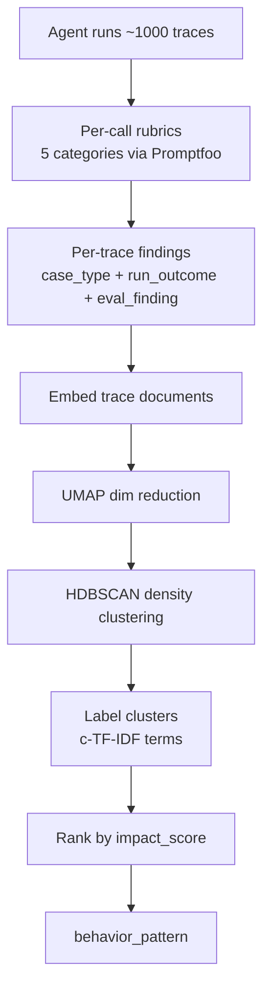

# Macro Evals for Agentic Systems

> Macro evaluation aggregates per-trace findings across a corpus of agent runs to surface recurring behavior patterns that single-trace evals cannot expose.

Macro evaluation is the population-level layer above per-call and per-trace evals: it asks which problems repeat, where they concentrate, and which part of the workflow to inspect first — questions a single trace cannot answer because the signal is statistical, not local ([OpenAI Cookbook, 2026](https://developers.openai.com/cookbook/examples/partners/macro_evals_for_agentic_systems/macro_evals_for_agentic_systems)). Below the conditions where it earns its keep, it substitutes a heavy unsupervised pipeline for what a sorted frequency table would surface.

## When This Layer Applies

Three conditions decide whether the macro layer is the right tool ([OpenAI Cookbook, 2026](https://developers.openai.com/cookbook/examples/partners/macro_evals_for_agentic_systems/macro_evals_for_agentic_systems)):

- **Trace volume in the thousands.** The reference run analyses 992 traces. Below this order of magnitude, density-based clustering (HDBSCAN over UMAP-reduced embeddings) either reports everything as noise or merges unrelated cases into spurious groups.
- **Per-trace `eval_finding` reliable enough not to amplify systematically.** Macro aggregation concentrates judge bias rather than averaging it out. Below ~70% judge precision, "behavior patterns" can be recurring judge mistakes ([AgentRewardBench, 2025](https://arxiv.org/abs/2504.08942)).
- **Cross-trace structure worth aggregating.** Multi-specialist workflows where the same agent recurs across scenarios, or where conditions (tariffs, capacity, compliance) vary across runs, expose patterns clustering can find. One-shot CI bots returning a patch per task do not.

When these hold, macro evals catch failures the [trajectory-opaque evaluation gap](trajectory-opaque-evaluation-gap.md) and [outcome grading](grade-agent-outcomes.md) cannot see — population properties of a workflow, not of any single run.

## The Four-Label Taxonomy

The cookbook's reference implementation tags every analysable trace with four labels ([OpenAI Cookbook, 2026](https://developers.openai.com/cookbook/examples/partners/macro_evals_for_agentic_systems/macro_evals_for_agentic_systems)):

| Label | What it captures | Granularity |
|-------|------------------|-------------|
| `case_type` | The generated business scenario (clean order, supplier substitution, pricing exception, compound) | Per-trace |
| `run_outcome` | How the workflow ended (completed, awaiting review, blocked, failed) | Per-trace |
| `eval_finding` | The local rubric symptom from per-call evals (final decision quality, policy compliance, routing, market drift, review appropriateness) | Per-trace, judge-graded |
| `behavior_pattern` | The recurring pattern surfaced by clustering across the corpus | Per-cluster |

The first three are inputs; the fourth is the macro output. Patterns rank by an `impact_score = prevalence × severity_weighted_prevalence` heuristic so investigation time goes to patterns that occur often *and* hurt when they occur.

## Pipeline Shape



The cookbook uses BERTopic-style ingredients: an embedding model, UMAP for dimensionality reduction, HDBSCAN for density clustering, c-TF-IDF for distinctive cluster labels. The cluster step is engineering choice — what matters is the unit-of-analysis shift, not the specific algorithm ([OpenAI Cookbook, 2026](https://developers.openai.com/cookbook/examples/partners/macro_evals_for_agentic_systems/macro_evals_for_agentic_systems)).

## Why It Works

Some failure classes are not properties of any single trace. An agent that drops a constraint in step 2, drifts when two conditions interact, or triggers review for the wrong cases produces individually plausible traces — the failure is the *concentration* of similar suboptimal decisions across runs, not the badness of any one. Shifting the unit of analysis to a labelled subset of the corpus makes a cluster with poor `eval_finding` concrete evidence of recurring system behavior that per-trace scoring cannot expose ([OpenAI Cookbook, 2026](https://developers.openai.com/cookbook/examples/partners/macro_evals_for_agentic_systems/macro_evals_for_agentic_systems)). Independent corroboration: trace-grounded rubric evaluation finds state-tracking inconsistency 2.7× more prevalent in failed runs than passing runs ([TraceSIR, 2026](https://arxiv.org/abs/2603.00623)).

## Example

A synthetic EV order workflow runs 992 traces. Specialist agents handle pricing, compliance, supply risk, factory routing, scheduling, and release decisions while market conditions vary. Per-call evals (helpfulness, policy compliance, routing correctness) report acceptable scores. The macro layer surfaces a different signal:

```
Cluster 7 — pricing-incentive-omission (impact_score: 0.42)
  prevalence:  18% of supplier-substitution case_type
  severity:    8/14 traces ended awaiting-review
  pattern:     pricing agent ignored the supplier-substitution incentive
               when stockout flag also present
  next step:   inspect pricing-agent prompt under compound conditions
```

No individual trace looked broken — the pricing agent answered every turn correctly given its inputs. The macro layer reveals that pricing systematically ignores the substitution-incentive interaction whenever stockout pressure compounds with it. The fix is at the prompt or specialist boundary, not at any single response.

## When This Backfires

Macro evaluation is a heavy pipeline and a noisy aggregator. Narrow scope when:

- **Trace volume is low.** Below ~1,000 traces, HDBSCAN reports noise or collapses unrelated cases together. Macro evals on a 50-trace set are theatre; a frequency table of `(case_type, error_code)` carries the same signal at zero pipeline cost.
- **The per-trace judge is below the precision floor.** AgentRewardBench measured 12 LLM judges on 1,302 web-agent trajectories — none cleared human inter-annotator agreement, with errors clustering around grounding mismatch and misunderstood actions ([AgentRewardBench, 2025](https://arxiv.org/abs/2504.08942)). TRAIL found long-context LLMs score only 11% on trace-debugging tasks ([TRAIL, 2025](https://arxiv.org/abs/2505.08638)). Macro aggregation amplifies these errors — clusters become recurring judge mistakes that look like system behavior.
- **The analysis pool is selection-biased.** The cookbook's pipeline only clusters traces already carrying failure, review, or Promptfoo signals ([OpenAI Cookbook, 2026](https://developers.openai.com/cookbook/examples/partners/macro_evals_for_agentic_systems/macro_evals_for_agentic_systems)). Reading the clusters as "how the system behaves" is wrong; they describe the pathology of flagged traces. Acting on them as a triage queue is correct.
- **Agents are one-shot, not corpus-shaped.** A CI agent that takes a task and returns a patch has no recurring cross-trace structure; the relevant failure modes are per-trace (correctness, safety) and per-call (tool selection). [pass@k metrics](pass-at-k-metrics.md) and [trajectory decomposition](trajectory-decomposition-diagnosis.md) cover the workload.
- **Spec churn changes case-type distribution faster than the suite regenerates.** Clusters labelled last week describe a system that no longer exists; impact scores become a moving target rather than a comparable signal across releases.
- **Clusters are mistaken for diagnosis.** The cookbook itself warns that clustering is not proof of causality, and suspect scoring guides inspection rather than locating the fault ([OpenAI Cookbook, 2026](https://developers.openai.com/cookbook/examples/partners/macro_evals_for_agentic_systems/macro_evals_for_agentic_systems)). A cluster labelled "pricing-incentive-omission" is a hypothesis to test, not a verdict to ship a fix against.

Macro evaluation pairs with — does not replace — per-call rubrics, trajectory-aware safety auditing, and outcome grading. It is the third eval tier when the first two are in place and the workload supplies the corpus to aggregate over.

## Key Takeaways

- Macro evals are the population-level layer above per-call and per-trace evals, surfacing recurring patterns that are properties of the corpus, not of any single run.
- The four-label taxonomy (`case_type`, `run_outcome`, `eval_finding`, `behavior_pattern`) separates per-trace inputs from the per-cluster macro output.
- Pipeline: per-call rubrics → embed traces → UMAP + HDBSCAN → c-TF-IDF labelling → impact-score ranking. The shift in unit of analysis, not the clustering algorithm, is the mechanism.
- Three pre-conditions must hold: thousands of traces, judge precision above ~70%, cross-trace structure. Outside those, frequency tables do the same job.
- Clusters are hypotheses, not diagnoses — the selection-biased pool describes flagged-trace pathology, not full-system behavior.

## Related

- [Trajectory-Opaque Evaluation Gap](trajectory-opaque-evaluation-gap.md) — Per-trace safety blindness; macro evals are the population-level analogue across the corpus.
- [Multi-Turn Conversation Evaluation](multi-turn-conversation-evaluation.md) — Per-turn plus trace-level scoring within one conversation; macro evals extend the pattern across many conversations.
- [Grade Agent Outcomes, Not Execution Paths](grade-agent-outcomes.md) — Per-trace outcome grading; macro evals aggregate outcomes plus findings across runs.
- [Trajectory Decomposition: Diagnose Where Coding Agents Fail](trajectory-decomposition-diagnosis.md) — Per-trace stage-level diagnosis; macro evals look at recurring stage failures across the corpus.
- [Structural Coverage Criteria for Agent Workflows](structural-coverage-agent-workflows.md) — Adequacy floor for declared workflow edges; macro evals score behavior across runs against declared structure.
