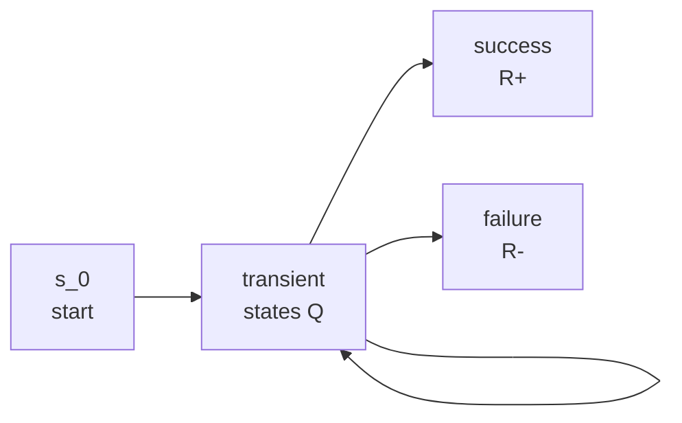

# Markov-Chain Reliability for LLM Agents: Audit the Abstraction Before You Trust the Metric

> pass@k, pass^k, and the reliability decay curve are not independent metrics — they are projections of one success first-passage distribution. Fitting an absorbing Markov chain to agent traces, with a goodness-of-fit certificate, is what makes any of those numbers defensible.

## Why a Single Pass Rate Is Underspecified

[pass@k and pass^k](pass-at-k-metrics.md) summarise non-deterministic agent behaviour, but they do not identify the success-time distribution they estimate, test whether traces support that distribution, or quantify finite-trace uncertainty [Source: [Tran-Truong & Le, *Measuring the Unmeasurable*](https://arxiv.org/abs/2604.24579)]. Reporting pass@k=0.62 with no fit diagnostic is a point estimate of an unvalidated model.

TraceToChain reframes this: model the agent loop as an absorbing discrete-time Markov chain (DTMC), fit it from traces, certify the fit, and read pass@k, pass^k, and the reliability decay curve as closed-form projections of the same chain.

## The Absorbing-Chain Reframing

Each agent step is a transient state; success and failure are absorbing states. The fitted chain is M̂ = (Ŝ_T, Q̂, R̂₊, R̂₋, s₀), where Q̂ holds transient transitions and R̂₊, R̂₋ are exit probabilities.



The fundamental matrix N = (I − Q̂)⁻¹ gives a closed-form *d*-step reliability: R(d) = e_{s₀}^T(I − Q^d) N R̂₊. From that one object:

- **pass@k** = 1 − (1 − R∞)^k
- **pass^k** = R∞^k
- **RDC** = R(d) over horizon *d*

Three metrics teams estimate independently are forced to agree once the chain is fit.

## The Pipeline

```mermaid
graph TD
    A[Agent traces] --> B[Featurize steps]
    B --> C[Cluster into m states]
    C --> D[Estimate Q-hat with<br/>Laplace-smoothed MLE]
    D --> E[Order check<br/>AIC: 1st vs 2nd order]
    E --> F[Fit certificate<br/>composite KS + AIC]
    F -->|Accept| G[Report R(d), pass@k,<br/>pass^k with CIs]
    F -->|Reject| H[Segment, re-featurize,<br/>or use richer process]
```

Steps:

1. Featurize each step (rule-based or learned embedding)
2. Cluster with Ward linkage; pick *m* by silhouette score
3. Estimate Q̂, R̂₊, R̂₋ with Laplace-smoothed maximum likelihood
4. AIC order-check comparing first- vs. second-order Markov fits
5. Composite KS test on the first-passage CDF plus the AIC check; both must pass at α=0.05
6. Dirichlet-posterior credible intervals on transition rows; bootstrap intervals on derived metrics

The certificate is the load-bearing piece. If KS rejects, the chain is unsupported and any pass@k read off it has no model behind it.

## What the Validation Shows

Validation traces come from seven frameworks — ReAct, Reflexion, CoT Agent, Toolformer, BabyAGI, AutoGPT, AgentBench. The composite KS certificate accepts at α=0.05 across all seven (minimum p-value 0.78), held-out KS distances in [0.017, 0.047], and maximum sup-norm error between fitted and empirical RDCs of 0.053 (median 0.048).

The claim is not that Markov chains correctly model agents in general — only that for these seven frameworks the abstraction holds well enough that closed-form reliability projections track empirical curves within ~5%.

## When the Abstraction Fails

The Markov assumption is real. The paper is explicit about when it breaks:

- **Memory carries information across steps.** Mapping trajectories to a DTMC aggregates over memory, tool state, and context — no mapping is canonical. Agents leaning heavily on scratchpad violate memorylessness and the certificate rejects.
- **Sparse trace corpora.** Small suites leave rows of Q̂ poorly estimated; CI widths grow until point estimates are uninformative.
- **Non-i.i.d. sampling.** Temperature-0 or shared-prefix sampling breaks the i.i.d. assumption the bootstrap inherits.
- **Featurization is not canonical.** Two analysts can produce different chains from the same traces; report (φ, m, p_KS, ΔAIC) so the choice is auditable.
- **SWE-bench / τ-bench are not yet validated** — raw trajectories require step-level feature data and remain future targets.

When the certificate rejects, segment, re-featurize, or use a richer process. Do not report pass@k from a rejected chain.

## How to Adopt This in an Eval Pipeline

The fitted chain does not *replace* pass@k — it *certifies* it:

1. Keep pass@k and pass^k as headline numbers
2. Attach the certificate: fit Q̂, run KS+AIC, report (p_KS, ΔAIC)
3. Replace point estimates with bootstrap intervals from the fitted chain [Source: [Hariri et al., *Don't Pass@k*](https://arxiv.org/abs/2510.04265)]
4. Treat a rejected certificate as a stop signal — the result is unreportable until the abstraction is fixed

This aligns with the critique that pass@k is exponentially forgiving at large *k* [Source: [Brooker, *Pass@k is Mostly Bunk*](https://brooker.co.za/blog/2026/01/21/pass-k.html)] — pass@k is one projection of the distribution, not the distribution itself.

## When This Is Worth the Overhead

Use the fitted chain when comparing eval results across frameworks, when you need R(d) for an unmeasured *d*, or for sensitivity analysis without re-running the agent.

Skip it when ship/don't-ship rests on one threshold that pass@k with bootstrap CIs already settles, when traces are too sparse to fit, or when memory dependence makes the certificate unreachable.

## Key Takeaways

- pass@k, pass^k, and the reliability decay curve are projections of one first-passage distribution — not independent metrics
- N = (I − Q̂)⁻¹ lets you read all three from one closed-form expression
- The composite KS+AIC certificate is the load-bearing piece — a chain that fails it cannot support pass@k claims
- Validation: seven frameworks, minimum KS p-value 0.78, max RDC error 0.053; SWE-bench and τ-bench are explicitly future work
- Adopt as a certificate layer alongside existing pass@k reporting, not a replacement

## Related

- [Use pass@k and pass^k to Separate Agent Capability from Consistency](pass-at-k-metrics.md) — the metrics this work reframes as projections
- [PASS@(k,T): Evaluate RL for Agents Along Sampling and Interaction Depth](pass-at-k-t-agentic-rl-eval.md) — orthogonal extension that varies interaction depth alongside sampling
- [Trajectory Decomposition: Diagnose Where Coding Agents Fail](trajectory-decomposition-diagnosis.md) — stage-level diagnosis where this provides distribution-level certification
- [Behavioral Testing for Non-Deterministic AI Agents](behavioral-testing-agents.md) — the broader testing context
- [Nonstandard Errors in AI Agents](nonstandard-errors-ai-agents.md) — why single-run outputs are samples from an unsampled distribution
- [Grade Agent Outcomes, Not Execution Paths](grade-agent-outcomes.md) — outcome-based grading that pass@k aggregates
