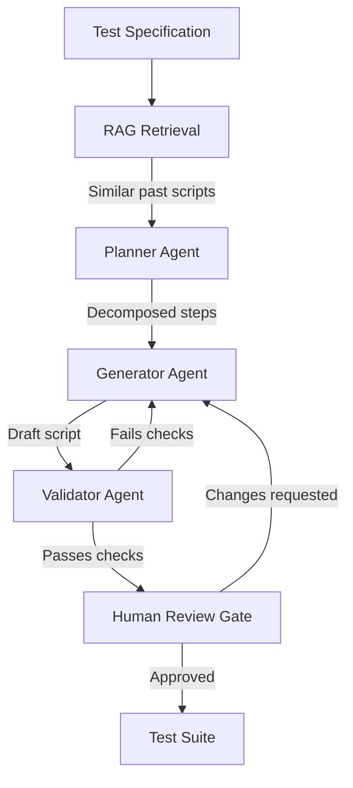

# Multi-Agent RAG for Spec-to-Test Automation

> A retrieval-augmented multi-agent pipeline converts test specifications to executable scripts by grounding generation in your team's existing test corpus.

## The Spec-to-Test Bottleneck

Multi-Agent RAG for spec-to-test automation uses a retrieval-augmented pipeline — typically planner, generator, and validator agents — to convert natural-language acceptance criteria into runnable test scripts grounded in a team's existing test corpus. It directly addresses the gap where agile teams produce specifications faster than they can manually implement them as executable tests.

[arXiv:2603.08190](https://arxiv.org/abs/2603.08190), developed with Hacon/Siemens, demonstrates that a RAG multi-agent approach significantly increases test script throughput while preserving human review gates. The pattern may generalize to other domains where formal specifications exist and spec production outpaces manual implementation.

## Architecture

Three agents split the conversion task:



**Planner**: Decomposes the spec into implementable steps using retrieved scripts as structural reference — what setup, assertion, and teardown patterns your team uses. This role is an architectural inference from the RAG retrieval step; the [Hacon/Siemens implementation](https://arxiv.org/abs/2603.08190) uses a Generator/Evaluator split without a discrete planner.

**Generator**: Produces candidate test scripts using retrieval-augmented generation over historical specification–script pairs ([arXiv:2603.08190](https://arxiv.org/abs/2603.08190)). RAG grounds library choices in your existing corpus rather than the model's training data.

**Validator**: Checks syntactical correctness and executability before the script reaches a human reviewer ([arXiv:2603.08190](https://arxiv.org/abs/2603.08190)). Feeds failures back to the generator.

## RAG Grounding

The retrieval step provides stylistic grounding. Without it, generators produce syntactically valid but stylistically inconsistent scripts that reviewers must normalize. RAG over code examples reduces hallucinated API calls by anchoring generation in real usage patterns ([Lewis et al., 2020](https://arxiv.org/abs/2005.11401)). With it:

- Library choices match your existing test framework
- Assertion patterns match team conventions
- Setup/teardown idioms are consistent
- Hallucinated APIs are caught earlier because the retrieved examples use real ones

Embed your existing test scripts at setup time and retrieve by semantic similarity to the incoming spec. The top-k retrieved examples go into the generator's context window.

## Prerequisites

Ambiguous specs produce ambiguous scripts. Before feeding specs to the pipeline:

- Verify each spec has unambiguous acceptance criteria
- Confirm preconditions and expected outcomes are explicit
- Remove specs that depend on undocumented system state

## Human Review Gate

Keep a mandatory human review gate on each generated script before merge. The pipeline provides throughput gains; the gate preserves quality. Reviewers focus on:

- Test intent matches spec intent
- Edge cases the generator may have missed
- Assertions that are structurally valid but semantically wrong

The [Hacon/Siemens study](https://arxiv.org/abs/2603.08190) found 30–50% of generated code per script was left unchanged by test engineers, indicating selective rather than exhaustive review. Reviewers focus on the spec-to-test mapping — whether assertions match intent — rather than optimizing every generated line.

## Scope

The pattern may apply beyond test generation. The Hacon/Siemens study is narrowly focused on regression testing; generalization is an inference. Any workflow where:

- Specifications are produced at higher volume than implementations
- Prior implementations are a reliable style reference
- The transformation is well-defined but labor-intensive

...is a candidate: API stub generation from OpenAPI specs, data pipeline schemas from business requirements, configuration files from infrastructure specs.

## Example

A transport booking system has an acceptance criterion written in Gherkin format. The pipeline converts it to a Playwright test by retrieving the three most similar existing scripts from the team's test corpus.

The incoming spec:

```gherkin
Feature: Seat reservation
  Scenario: Passenger reserves a window seat on a direct train
    Given a train journey from Berlin to Hamburg is available
    And at least one window seat is unreserved
    When the passenger selects a window seat and confirms
    Then the reservation is confirmed with a seat number
    And the booking reference is visible in the passenger's account
```

The retrieval step embeds this spec and returns the three closest existing scripts. In this case they include a prior seat-selection test and a booking-confirmation test. The generator receives the spec plus those two retrieved scripts as context and produces:

```typescript
import { test, expect } from '@playwright/test';
import { loginAsPassenger, searchJourney } from '../helpers/booking';

test('passenger reserves a window seat on a direct train', async ({ page }) => {
  await loginAsPassenger(page, 'test-passenger@example.com');
  const results = await searchJourney(page, { from: 'Berlin', to: 'Hamburg', date: '2025-06-01' });

  await results.selectFirstDirect();
  await page.locator('[data-testid="seat-map"]').waitFor();
  const windowSeat = page.locator('[data-seat-type="window"][data-status="available"]').first();
  await windowSeat.click();
  await page.locator('[data-testid="confirm-reservation"]').click();

  await expect(page.locator('[data-testid="booking-confirmation"]')).toBeVisible();
  await expect(page.locator('[data-testid="seat-number"]')).not.toBeEmpty();

  await page.goto('/account/bookings');
  await expect(page.locator('[data-testid="booking-reference"]').first()).toBeVisible();
});
```

The validator runs `npx playwright test --dry-run` plus import resolution checks. If either fails, the failure output is sent back to the generator. A passing script goes to human review, where the reviewer verifies that the test assertions match the spec's acceptance criteria — not that every line of generated code is optimal.

The retrieval step is what makes this work at scale. Without it, the generator would invent import paths and helper function names. With the retrieved examples, it uses `loginAsPassenger`, `searchJourney`, and `data-testid` selectors that already exist in the codebase.

## When This Backfires

The pattern degrades or fails under several conditions:

- **Thin corpus**: Retrieval is only as useful as the existing test library. When the corpus is too small or thin in a given domain, top-k results return generic examples, and the generator falls back to its training priors and produces style-inconsistent output.
- **Unstable specs**: If acceptance criteria change frequently between writing and review, retrieved examples from an older spec style diverge from the incoming spec. Spec quality must be locked before pipeline entry, not after.
- **High API churn**: The generator anchors to helper functions and selectors from retrieved examples. When the codebase is under heavy refactoring, those anchors break — retrieved examples become misleading rather than grounding, and hallucination rates increase rather than decrease.
- **Semantically narrow test suites**: If the existing corpus covers only one test pattern (e.g., all smoke tests), retrieval degenerates into retrieving the same unhelpful example for every spec regardless of type.

Treat RAG as a style-grounding mechanism, not a correctness mechanism. A systematic study across five Python ML/DL libraries found that RAG did **not** improve the correctness of LLM-generated unit tests and only improved line coverage by 6.5% on average ([Shin et al., 2026](https://arxiv.org/abs/2409.12682), ICSE 2026). The throughput and style-consistency gains justify the pattern; human review of assertion semantics remains load-bearing for correctness.

## Key Takeaways

- RAG grounds script generation in your team's existing test patterns, reducing hallucination and style drift
- A three-agent split (planner, generator, validator) catches errors before they reach human reviewers
- Ambiguous specs block the pipeline — spec quality is a prerequisite, not an afterthought
- Human review gates remain necessary; the pipeline increases throughput without bypassing judgment

## Related

- [Retrieval-Augmented Agent Workflows](../context-engineering/retrieval-augmented-agent-workflows.md)
- [Spec-Driven Development](../workflows/spec-driven-development.md)
- [Orchestrator-Worker Pattern](../multi-agent/orchestrator-worker.md)
- [Agent-Assisted Code Review](../code-review/agent-assisted-code-review.md)
- [RAG/Agent Reliability Problem Map](rag-agent-reliability-problem-map.md)
