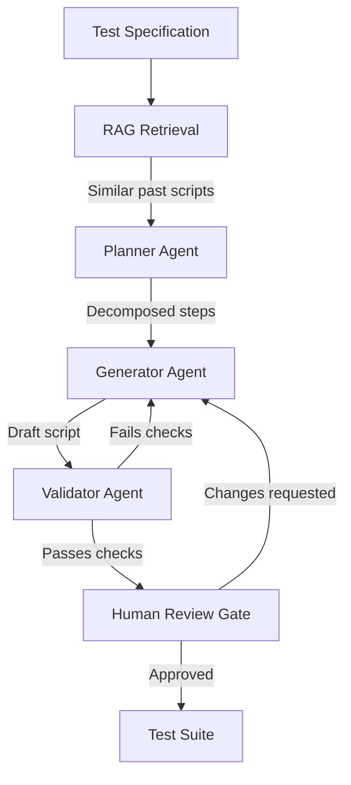

# Multi-Agent RAG for Spec-to-Test Automation

> A retrieval-augmented multi-agent pipeline converts test specifications to executable scripts by grounding generation in your team's existing test corpus.

## The Spec-to-Test Bottleneck

Agile teams produce test specifications faster than they can manually convert them to executable scripts. The conversion step — mapping natural-language acceptance criteria to runnable test code — is labor-intensive and creates a release bottleneck.

[arXiv:2603.08190](https://arxiv.org/abs/2603.08190), developed with Hacon/Siemens, demonstrates that a RAG multi-agent approach significantly increases test script throughput while preserving human review gates. The pattern may generalize to other domains where formal specifications exist and spec production outpaces manual implementation.

## Architecture

Three agents split the conversion task:



**Planner** `[unverified]`: Decomposes the spec into implementable steps. Uses the retrieved scripts as structural reference — what setup, assertion, and teardown patterns your team uses.

**Generator** `[unverified]`: Writes executable code for each step. RAG retrieval grounds style and library choices in your existing corpus rather than the model's training data.

**Validator** `[unverified]`: Runs static checks (syntax, import resolution, schema conformance) before the script reaches a human reviewer. Feeds failures back to the generator.

## RAG Grounding

The retrieval step provides stylistic grounding. Without it, generators produce syntactically valid but stylistically inconsistent scripts that reviewers must normalize. With it:

- Library choices match your existing test framework
- Assertion patterns match team conventions
- Setup/teardown idioms are consistent
- Hallucinated APIs are caught earlier because the retrieved examples use real ones

Embed your existing test scripts at setup time and retrieve by semantic similarity to the incoming spec. The top-k retrieved examples go into the generator's context window.

## Prerequisites

Ambiguous specs produce ambiguous scripts. Before feeding specs to the pipeline:

- Verify each spec has unambiguous acceptance criteria
- Confirm preconditions and expected outcomes are explicit
- Remove specs that depend on undocumented system state

## Human Review Gate

Keep a mandatory human review gate on each generated script before merge. The pipeline provides throughput gains; the gate preserves quality. Reviewers focus on:

- Test intent matches spec intent
- Edge cases the generator may have missed
- Assertions that are structurally valid but semantically wrong

`[unverified]` The gate does not require line-by-line reading of generated code — reviewers review the spec-to-test mapping, not the implementation details.

## Scope

`[unverified]` The pattern may apply beyond test generation. Any workflow where:

- Specifications are produced at higher volume than implementations
- Prior implementations are a reliable style reference
- The transformation is well-defined but labor-intensive

...is a candidate: API stub generation from OpenAPI specs, data pipeline schemas from business requirements, configuration files from infrastructure specs.

## Example

A transport booking system has an acceptance criterion written in Gherkin format. The pipeline converts it to a Playwright test by retrieving the three most similar existing scripts from the team's test corpus.

The incoming spec:

```gherkin
Feature: Seat reservation
  Scenario: Passenger reserves a window seat on a direct train
    Given a train journey from Berlin to Hamburg is available
    And at least one window seat is unreserved
    When the passenger selects a window seat and confirms
    Then the reservation is confirmed with a seat number
    And the booking reference is visible in the passenger's account
```

The retrieval step embeds this spec and returns the three closest existing scripts. In this case they include a prior seat-selection test and a booking-confirmation test. The generator receives the spec plus those two retrieved scripts as context and produces:

```typescript
import { test, expect } from '@playwright/test';
import { loginAsPassenger, searchJourney } from '../helpers/booking';

test('passenger reserves a window seat on a direct train', async ({ page }) => {
  await loginAsPassenger(page, 'test-passenger@example.com');
  const results = await searchJourney(page, { from: 'Berlin', to: 'Hamburg', date: '2025-06-01' });

  await results.selectFirstDirect();
  await page.locator('[data-testid="seat-map"]').waitFor();
  const windowSeat = page.locator('[data-seat-type="window"][data-status="available"]').first();
  await windowSeat.click();
  await page.locator('[data-testid="confirm-reservation"]').click();

  await expect(page.locator('[data-testid="booking-confirmation"]')).toBeVisible();
  await expect(page.locator('[data-testid="seat-number"]')).not.toBeEmpty();

  await page.goto('/account/bookings');
  await expect(page.locator('[data-testid="booking-reference"]').first()).toBeVisible();
});
```

The validator runs `npx playwright test --dry-run` plus import resolution checks. If either fails, the failure output is sent back to the generator. A passing script goes to human review, where the reviewer verifies that the test assertions match the spec's acceptance criteria — not that every line of generated code is optimal.

The retrieval step is what makes this work at scale. Without it, the generator would invent import paths and helper function names. With the retrieved examples, it uses `loginAsPassenger`, `searchJourney`, and `data-testid` selectors that already exist in the codebase.

## Key Takeaways

- RAG grounds script generation in your team's existing test patterns, reducing hallucination and style drift
- A three-agent split (planner, generator, validator) catches errors before they reach human reviewers
- Ambiguous specs block the pipeline — spec quality is a prerequisite, not an afterthought
- Human review gates remain necessary; the pipeline increases throughput without bypassing judgment

## Unverified Claims

- Planner agent decomposes spec into implementable steps using retrieved scripts as structural reference [unverified]
- Generator agent grounds style and library choices in existing corpus via RAG retrieval [unverified]
- Validator agent runs static checks before human review and feeds failures back to generator [unverified]
- Human review gate does not require line-by-line reading of generated code [unverified]
- The pattern may apply beyond test generation to API stubs, data pipelines, and config files [unverified]

## Related

- [Retrieval-Augmented Agent Workflows](../context-engineering/retrieval-augmented-agent-workflows.md)
- [Spec-Driven Development](../workflows/spec-driven-development.md)
- [Orchestrator-Worker Pattern](../multi-agent/orchestrator-worker.md)
- [Agent-Assisted Code Review](../code-review/agent-assisted-code-review.md)
