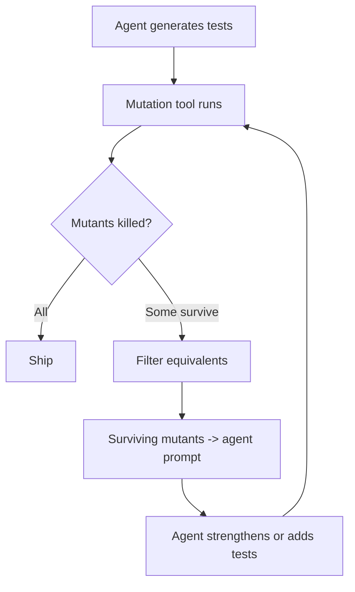

# Mutation Testing as a Quality Gate for AI-Generated Test Suites

> Coverage proves a line ran; mutation testing proves the suite would notice a regression. Applied to LLM-generated tests, surviving mutants flag tests that catch nothing and name the assertions the suite is missing.

Coding agents now produce more tests per feature than humans, often with high coverage and zero failures on first generation. The [Test Homogenization Trap](../anti-patterns/test-homogenization-trap.md) shows why that signal is misleading: LLM-generated tests cluster around the same blind spots as the model's code, so green suites overstate correctness. Mutation testing forces each test to prove it would catch a regression — a behavioural claim coverage cannot make.

## Mutation Testing Primer

A **mutant** is a small syntactic change to the source — a flipped relational operator, an inverted boundary, a removed call. A test **kills** the mutant when it fails against the mutated code. The **mutation score** is `killed / (total − equivalent)`. **Equivalent mutants** change syntax but preserve behaviour (`i <= n − 1` vs `i < n`); they cannot be killed and bias the score downward.

Coverage records that a line was executed. Mutation testing records whether the suite would notice a defect on that line. A test that touches a line without an assertion strong enough to fail when the line changes leaves the mutant alive.

## Two Applications With Agent-Written Tests

**Discriminate.** Surviving mutants identify which tests are ceremonial. A test that runs against a mutated code path but does not fail is asserting nothing the mutation invalidates — a candidate for removal or strengthening. Without this signal, high coverage hides weak assertions indefinitely.

**Generate.** Surviving mutants name the failure modes the suite misses. Feeding them back into the LLM as prompt context produces tests that target those gaps. [Mutation-feedback prompting in MUTGEN reaches 89.5% mutation score on HumanEval-Java vs 69.5% for EvoSuite — a 20-point gap from prompt augmentation alone](https://arxiv.org/abs/2506.02954). Survey work across the LLM-testing literature reports up to 28% improvement in fault detection over zero-shot or few-shot test generation when surviving mutants are added to the prompt. [Source: [LLM4SoftwareTesting survey](https://github.com/LLM-Testing/LLM4SoftwareTesting)]

## The Loop



[MUTGEN reports the kill rate plateaus around four iterations](https://arxiv.org/abs/2506.02954); further loops produce diminishing returns and start exercising equivalent mutants the filter missed.

## Production Existence Proof — Meta ACH

Meta's Automated Compliance Hardening applied this loop across 7 platforms and [10,795 Android Kotlin classes, generating 9,095 mutants and 571 hardening tests; engineers accepted 73% of the generated tests, with 36% judged privacy-relevant](https://arxiv.org/abs/2501.12862). Equivalent-mutant detection is the central practical bottleneck: ACH uses a separate LLM agent for the classification, [boosting mutant precision from 0.79 to 0.95 with preprocessing](https://arxiv.org/abs/2501.12862). The abstract notes ACH can harden code "against any type of regression" — privacy was the first deployment, not the constraint.

## When This Backfires

The technique is most valuable on production code with rigorous suites and selective or LLM-filtered mutation generation. The conditions where the cost outruns the signal:

- **Throwaway scripts and prototypes** — code with no production SLA. Mutation tooling cost (CI minutes, equivalent-mutant triage, prompt iteration) exceeds the regression risk. The same condition is called out in the [Test Homogenization Trap](../anti-patterns/test-homogenization-trap.md#when-this-backfires).
- **Pure functions over small input domains** — a comparator, a unit converter. Example-based tests can essentially exhaust the input space; mutation operators add little signal because human-discoverable bugs map directly onto the example assertions.
- **Per-PR gating without selective mutation** — full mutation runs on medium codebases take hours, incompatible with PR-blocking gates; an industrial case study at Zenseact found mutation testing best applied at commit level only with selective tooling and trend visualisation, not raw scoring. [Source: [Mutation Testing in CI: An Exploratory Industrial Case Study (IEEE 2023)](https://ieeexplore.ieee.org/document/10132170/)] Without learned operator selection or incremental analysis, mutation testing belongs nightly or post-merge — not on the merge path.
- **No equivalent-mutant filter** — raw mutation output runs at >50% survival rate on rigorous test suites, including at Facebook scale. [In a Facebook industrial study, only ~50% of surveyed developers said they would act on the surfaced mutants](https://arxiv.org/abs/2010.13464); without a classifier filtering equivalents, surfaced "gaps" are dominated by noise and developers stop acting on them.
- **One model generates tests *and* judges equivalence** — error clustering re-enters by the back door. The same blind spots described in the homogenization trap propagate to mutant triage; prefer a different model, a learned classifier, or human review for equivalence.

## Example

An agent generates a sorting function and a test suite reaching 95% line coverage. The mutation tool produces 12 mutants. Three survive:

```python
# Original
def find_max(nums: list[int]) -> int:
    if not nums:
        raise ValueError("empty input")
    result = nums[0]
    for n in nums[1:]:
        if n > result:
            result = n
    return result

# Surviving mutant 1: > replaced with >=
#   if n >= result:
# Surviving mutant 2: nums[1:] replaced with nums[:]
#   for n in nums[:]:
# Surviving mutant 3: ValueError replaced with empty return
#   return  (no exception raised)
```

Mutant 1 survives because no test asserts which index the max comes from when duplicates are present — `[3, 3, 1]` returns the same value either way. Mutant 2 survives because no test compares performance or relies on `nums[0]` being skipped. Mutant 3 survives because no test exercises the empty-input branch.

The surviving-mutant report becomes the next prompt:

```
The following mutants survived test suite execution. Generate tests
that would kill each one. Do not modify existing tests.

Mutant 1: line 7, '>' -> '>='. Suggested test: assert which element is
returned when the input contains duplicates of the max.
Mutant 2: line 6, 'nums[1:]' -> 'nums[:]'. Suggested test: ...
Mutant 3: line 4, 'raise ValueError' -> 'return'. Suggested test: assert
ValueError is raised on empty input.
```

The agent adds three targeted tests; the mutation tool reruns and confirms all 12 mutants are killed. The 95% coverage was unchanged — coverage was not the missing signal.

## Key Takeaways

- Coverage records execution; mutation testing records whether the suite would notice a regression — the only widely-used signal that separates assertion strength from path coverage
- Surviving mutants discriminate ceremonial tests (remove or strengthen) and name the failure modes a generator pass should target next
- The validated loop — generate, mutate, feed surviving mutants into the prompt, regenerate — plateaus around four iterations on benchmark code
- Equivalent-mutant filtering is the production bottleneck; raw output runs at >50% survival and surfaces too much noise to act on without a classifier
- Reserve mutation testing for production code with rigorous suites; run nightly or post-merge, not as a per-PR gate without selective mutation

## Related

- [The Test Homogenization Trap](../anti-patterns/test-homogenization-trap.md) — why LLM-generated tests share the model's blind spots; this page is the dedicated mitigation
- [Skill Evals](skill-evals.md) — evaluable-unit framing for any agent capability, with discriminating-assertion guidance
- [Behavioral Testing for Agents](behavioral-testing-agents.md) — testing what agents do, not how they do it
- [Coverage-Guided Agents for Fuzz Harness Generation](coverage-guided-fuzz-harness-generation.md) — the same generate-measure-refine loop applied to fuzzing
- [Anti-Reward-Hacking](anti-reward-hacking.md) — designing rubrics agents cannot game by surface metrics
