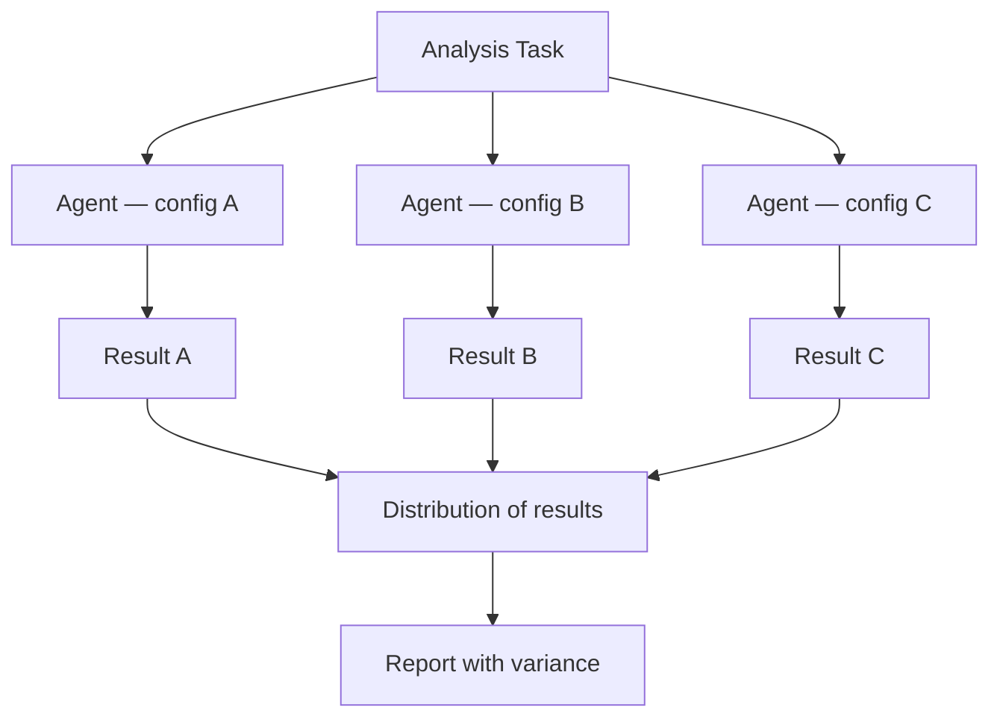

# Nonstandard Errors in AI Agents

> AI agents analyzing identical data with identical instructions reach different conclusions — not randomly, but systematically, based on model family. Single-run agent outputs carry hidden variance that is not visible from the output alone.

## The Problem

When 150 Claude Code agents (Sonnet and Opus) independently analyzed the same NYSE market microstructure dataset and answered the same research questions, they did not converge on the same answers. They diverged substantially — not due to random noise, but due to *systematic methodological preferences* that are stable within each model family.

This is the AI analog of **nonstandard errors (NSEs)** from human-researcher studies: variation arising from discretionary analytical choices rather than sampling or measurement error. [Gao & Xiao (2026)](https://arxiv.org/abs/2603.16744) documented this directly in a controlled 150-agent experiment.

The practical implication: if you run one agent on an analysis task and report the result, you are reporting one point from a distribution you have never sampled.

## Empirical Styles by Model Family

Different model families exhibit **stable, systematic methodological preferences** — "empirical styles" — rather than random variation:

| Choice | Sonnet 4.6 | Opus 4.6 |
|--------|------------|----------|
| Regression type | Level OLS (dominant) | Log OLS (64–88%) |
| Frequency | Daily | Monthly |
| Volume measure | Mixed | Volume-weighted (dominant) |
| H1 measure | Autocorrelation (87%) | Variance ratio (100%) |

The H1 finding is striking: Sonnet and Opus agents chose *different statistical tests* for the same hypothesis. They were running different experiments on the same question.

For hypothesis H4 (trading volume trends), measure choice alone flipped the conclusion:

- Dollar-volume agents: ~+6.1%/year growth
- Share-volume agents: ~−4.6%/year decline
- IQR across agents: 10.69%/year

This is not a marginal difference. Two agents with different empirical styles, given identical instructions and identical data, would report opposite conclusions.

## Why Peer Review Between Agents Does Not Fix This

A common response is to add a review loop: have one agent critique another's output. The evidence does not support this.

In the study, AI peer review had **minimal effect** on reducing agent-to-agent dispersion. Agents did not revise their methodological choices based on written critiques.

This matters for pipeline designers who use evaluator-critic loops for variance reduction: critique loops address *output quality* but not *methodological bias*.

## What Does Reduce Variance: Exemplar Injection

Showing agents **exemplar outputs** before they run their analysis reduced the interquartile range of estimates by **80–99%** in the study.

Agents did not reason toward a better methodology — they *imitated* the exemplar's choices, switching measure families en masse:

- 78 of 90 dollar-volume agents switched to share volume simultaneously
- 41 of 60 share-volume agents switched the opposite direction simultaneously

This chaotic cross-switching produced apparent convergence, not analytical agreement. Estimates tightened because agents copied the exemplar's choices, not because they reasoned toward a correct method.

**Implication:** Exemplar injection is effective for variance reduction, but the exemplar choice determines the result. If you inject a flawed exemplar, agents will converge on the flaw.

## Recommended Mitigation: Multiverse Analysis

The structural fix is to treat agent analytical output as a **distribution, not a point estimate**. The parallel study at [arXiv:2602.18710](https://arxiv.org/abs/2602.18710) corroborates this and advocates **multiverse-style reporting** for AI-generated analysis.



In practice:

1. Run the same analysis task with multiple agents across model families (Sonnet + Opus) or with varied configurations (temperature, system prompt phrasing)
2. Collect results as a distribution
3. Report the distribution, not just the modal result
4. Flag conclusions that are sensitive to analytical choice (high IQR = low robustness)
5. Reserve single-run reporting for conclusions that are stable across the distribution

For software engineering tasks (code generation, architecture reviews, test writing), direct equivalents exist: code style preferences, framework choices, security posture, and test coverage strategy vary systematically by model family in ways that are not yet fully documented but are predictable once observed [unverified].

## Example

An engineering team runs five Sonnet and five Opus agents on the same architecture decision — "How should we structure the service boundary between auth and billing?" — using parallel Claude Code sessions:

```bash
# Launch 5 Sonnet agents and 5 Opus agents on the same prompt
for i in $(seq 1 5); do
  claude --model sonnet -p "$(cat arch-prompt.md)" > "results/sonnet-$i.md" &
  claude --model opus  -p "$(cat arch-prompt.md)" > "results/opus-$i.md" &
done
wait

# Compare clustering across results
claude -p "Read all files in results/. Group recommendations by \
architectural approach. Report the distribution of choices and \
flag any conclusion that differs between model families."
```

The agents produce structurally different recommendations:

- Sonnet agents cluster around thin shared-kernel design
- Opus agents cluster around strict domain isolation

Rather than picking one result, the team reports both clusters, identifies the shared constraints both agree on, and escalates the point of divergence to human review.

## Unverified Claims

- Empirical styles from market microstructure analysis generalize to software engineering tasks `[unverified]`
- The imitation mechanism (not reasoning) is the sole explanation for exemplar-driven convergence `[unverified]` — this is the authors' interpretation

## Related

- [pass@k and pass^k Metrics](pass-at-k-metrics.md)
- [Grade Agent Outcomes](grade-agent-outcomes.md)
- [Cross-Vendor Competitive Routing](../agent-design/cross-vendor-competitive-routing.md)
- [Evaluator-Optimizer Pattern](../agent-design/evaluator-optimizer.md)
