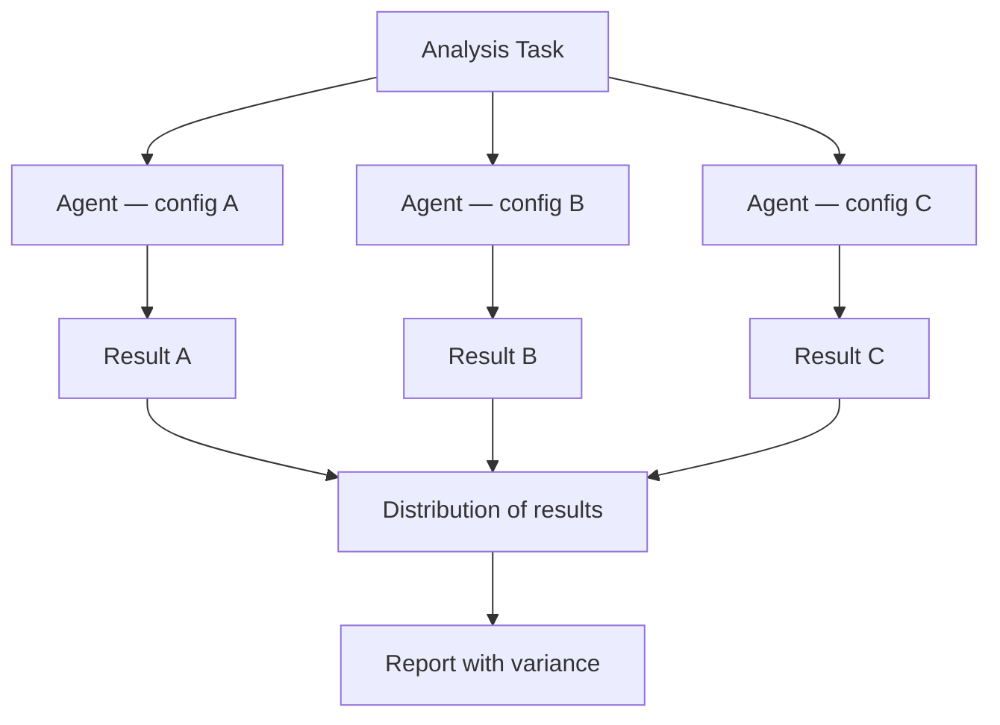

# Nonstandard Errors in AI Agents

> AI agents analyzing identical data with identical instructions reach different conclusions systematically by model family — a single run hides this nonstandard variance.

## The problem

When 150 Claude Code agents (Sonnet and Opus) independently analyzed the same NYSE market microstructure dataset, they diverged substantially — not from random noise, but from systematic methodological preferences stable within each model family.

This is the AI analog of nonstandard errors (NSEs) from human-researcher studies: variation from discretionary analytical choices rather than sampling or measurement error. [Gao & Xiao (2026)](https://arxiv.org/abs/2603.16744) documented this in a controlled 150-agent experiment.

Run one agent and report its result, and you report one point from a distribution you have never sampled.

## Empirical styles by model family

Different model families show stable, systematic methodological preferences — "empirical styles" — rather than random variation:

| Choice | Sonnet 4.6 | Opus 4.6 |
|--------|------------|----------|
| Regression type | Level OLS (dominant) | Log OLS (64–88%) |
| Frequency | Daily | Monthly |
| Volume measure | Mixed | Volume-weighted (dominant) |
| H1 measure | Autocorrelation (87%) | Variance ratio (100%) |

On H1, Sonnet and Opus chose different statistical tests for the same hypothesis — they ran different experiments on the same question.

For H4 (trading volume trends), measure choice alone flipped the conclusion:

- Dollar-volume agents: ~+6.1%/year growth
- Share-volume agents: ~−4.6%/year decline
- IQR across agents: 10.69%/year

Two agents with different empirical styles, given identical instructions and identical data, would report opposite conclusions.

## Why peer review between agents does not fix this

A common response is to add a review loop — one agent critiques another's output. The evidence does not support it: AI peer review had minimal effect on dispersion, and agents did not revise their methodological choices based on written critiques.

For pipeline designers using evaluator-critic loops: critique loops address output quality but not methodological bias.

## What does reduce variance: exemplar injection

Showing agents exemplar outputs before analysis reduced the interquartile range of estimates by 80–99%.

Agents did not reason toward a better methodology — they imitated the exemplar, switching measure families all at once:

- 78 of 90 dollar-volume agents switched to share volume simultaneously
- 41 of 60 share-volume agents switched the opposite direction simultaneously

Cross-switching produced apparent convergence, not analytical agreement.

Exemplar injection reduces variance, but the exemplar determines the result. A flawed exemplar produces tight, wrong answers.

## Recommended mitigation: multiverse analysis

The structural fix is to treat agent analytical output as a distribution, not a point estimate. The parallel study at [arXiv:2602.18710](https://arxiv.org/abs/2602.18710) supports this and recommends multiverse-style reporting for AI-generated analysis.


```mermaid
graph TD
    T[Analysis Task] --> A1[Agent — config A]
    T --> A2[Agent — config B]
    T --> A3[Agent — config C]
    A1 --> O1[Result A]
    A2 --> O2[Result B]
    A3 --> O3[Result C]
    O1 --> D[Distribution of results]
    O2 --> D
    O3 --> D
    D --> R[Report with variance]
```

In practice:

1. Run the task across multiple model families (Sonnet and Opus) or varied configurations (temperature, prompt phrasing).
2. Collect results as a distribution.
3. Report the distribution, not just the modal result.
4. Flag conclusions sensitive to analytical choice (high IQR means low confidence).
5. Reserve single-run reporting for conclusions stable across the distribution.

For software-engineering tasks (code generation, architecture reviews, test writing), analogous variance is plausible in code style, framework choice, security posture, and test-coverage strategy — though not yet documented at the scale of the market-microstructure findings.

## Example

An engineering team runs five Sonnet and five Opus agents on the same architecture decision — "How should we structure the service boundary between auth and billing?" — using parallel Claude Code sessions:

```bash
# Launch 5 Sonnet agents and 5 Opus agents on the same prompt
for i in $(seq 1 5); do
  claude --model sonnet -p "$(cat arch-prompt.md)" > "results/sonnet-$i.md" &
  claude --model opus  -p "$(cat arch-prompt.md)" > "results/opus-$i.md" &
done
wait

# Compare clustering across results
claude -p "Read all files in results/. Group recommendations by \
architectural approach. Report the distribution of choices and \
flag any conclusion that differs between model families."
```

The agents produce structurally different recommendations:

- Sonnet agents cluster around thin shared-kernel design
- Opus agents cluster around strict domain isolation

Rather than picking one result, the team reports both clusters, identifies the shared constraints both agree on, and escalates the point of divergence to human review.

## When this backfires

Multiverse analysis carries real costs that make it impractical in several conditions:

- Latency-sensitive tasks: Running 10+ agents in parallel adds infrastructure and wall-clock time that is unjustifiable for tasks requiring a fast single answer (code completions, quick refactors, CI steps).
- Cost-constrained pipelines: Running multiple model families at Opus-tier pricing multiplies inference cost linearly. For routine tasks, exemplar injection into a single agent achieves acceptable variance reduction at a fraction of the cost.
- Single-output requirements: Some tasks require a deterministic commit — a migration script that will be applied once, a schema that will be deployed. Distributing results is not applicable. The right response is to tighten the exemplar, not report a distribution.
- Convergent tasks: When agents consistently agree across runs regardless of model family — Sonnet and Opus reaching the same result on formatting, type errors, or well-specified unit tests — multiverse overhead adds nothing. Sample first. Escalate to multiverse only when dispersion is detected.
- Exemplar dependency risk as a mitigation: If you reduce variance through exemplar injection rather than full multiverse reporting, exemplar quality becomes a single point of failure. A flawed exemplar produces tight, wrong answers — harder to detect than spread-out answers from multiverse reporting.

## Key Takeaways

- A single agent run is one sample from a distribution shaped by model-family methodological preferences, not a representative result
- Sonnet and Opus exhibit stable empirical styles — they pick different statistical tests for the same hypothesis, so identical prompts can yield opposite conclusions
- AI peer-review loops correct output quality but not methodological bias; agents do not revise their analytical choices based on written critiques
- Exemplar injection reduces dispersion by 80–99% via imitation, not reasoning — the exemplar determines the answer, so a flawed exemplar produces tight, wrong results
- For analytical tasks, run the multiverse across model families and configurations, report the distribution, and flag conclusions sensitive to analytical choice

## Related

- [pass@k and pass^k Metrics](pass-at-k-metrics.md)
- [Grade Agent Outcomes](grade-agent-outcomes.md)
- [Cross-Vendor Competitive Routing](../agent-design/cross-vendor-competitive-routing.md)
- [Evaluator-Optimizer Pattern](../agent-design/evaluator-optimizer.md)
