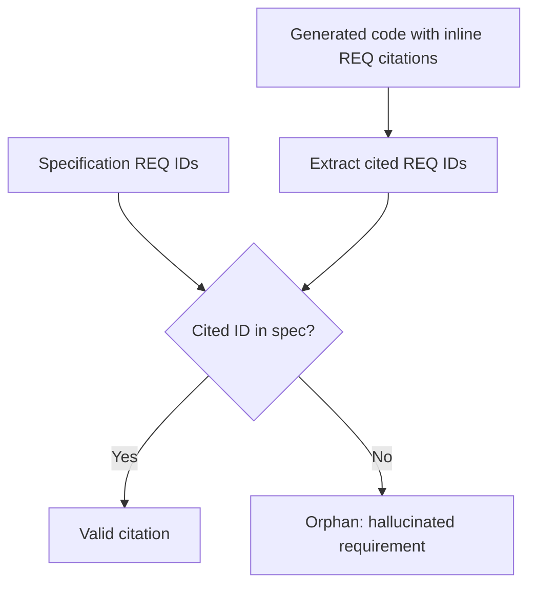

# Per-Line Requirement Citations for Hallucination Detection

> Require an inline requirement citation on every generated line, then flag any citation that names a requirement absent from the spec as a hallucination.

Reach for per-line requirement citations when you want a cheap, deterministic hallucination check in a long-lived, spec-driven codebase and can accept less run-to-run reproducibility to get it. The technique makes the model annotate every non-trivial generated line with the requirement it implements, then verifies those annotations against the specification by set difference. It buys automated hallucination detection that no other traceability style achieves, but it lowers output determinism and does nothing for whether the code is correct ([Panda, 2026](https://arxiv.org/abs/2606.30689)). Skip it for exploratory or solo work where no one runs the check, and for pipelines that value reproducible output over detectability.

## The check

The specification assigns each requirement a hierarchical identifier of the form REQ-XXX.Y.Z: category, sub-requirement, and specific point. The model then emits an inline comment naming the requirement each line implements, matching a pattern like `# [REQ-003.2.1]` ([Panda, 2026](https://arxiv.org/abs/2606.30689)).

Detection is a set difference. Extract every REQ ID cited in the generated code, subtract the set of valid IDs in the specification, and flag any remainder. A citation to a requirement that does not exist is an orphan — a hallucinated requirement, such as a fabricated `REQ-099.1.1` for an out-of-scope function or unauthorized import. The check runs in one pass per file with a single grep and no manual effort, so it drops straight into a continuous integration gate ([Panda, 2026](https://arxiv.org/abs/2606.30689)).



Across two controlled studies covering 840 implementations on two frontier models (Claude Sonnet 4.6 and GLM-5-turbo), the cited condition detected hallucinated requirements at 86.4% (Claude) and 88.0% (GLM) with a 0% false-positive rate. Every alternative — the same specification without inline citations, Spec Kit's artifact-level acceptance criteria, and OpenSpec's post-hoc external trace maps — detected nothing, scoring 0% ([Panda, 2026](https://arxiv.org/abs/2606.30689)).

## Why it works

The citations turn each requirement reference into a claim a machine can check by membership, not by judgment. Existing traceability styles ask a reviewer or a model whether code matches intent; the orphan-REQ check asks only whether a cited identifier appears in an authoritative set. That question is deterministic, so it catches fabrications a probabilistic judge misses — the same category shift behind [phantom symbol detection](phantom-symbol-detection.md) and [generative provenance records](generative-provenance-records.md), which convert a fuzzy "does this look right?" into a set-membership lookup ([Panda, 2026](https://arxiv.org/abs/2606.30689)). Detection needs the citations in the code, not just a structured spec: the uncited condition used the identical REQ-format specification and still scored 0%, because with no citations there is nothing to resolve against the requirement set.

## When this backfires

- Determinism-sensitive pipelines. Citations lower run-to-run reproducibility. Cited lexical-similarity scores fell to 0.535 and 0.510 against 0.745 and 0.644 uncited, a medium-to-large penalty (Cohen's d = −0.76, p = 0.003 for Claude; d = −0.72, p < 0.001 for GLM). The model must decide where and how often to place each annotation, and those choices have no correct answer, so they inject lexical divergence across runs — worst on easy, small tasks where placement noise dominates ([Panda, 2026](https://arxiv.org/abs/2606.30689)). Uncited code from the identical spec is measurably more consistent.
- Expecting a correctness gain. Functional correctness held at 100% across every condition in both studies. Citation discipline changes what you can detect, not whether the code passes its tests; specification quality remains the correctness bottleneck ([Panda, 2026](https://arxiv.org/abs/2606.30689)).
- Evasive generation. About 12% of hallucinated Claude outputs omitted citations entirely rather than citing a fake REQ ID, slipping past the orphan check. Detection has a documented blind spot, so pair it with other layers ([Panda, 2026](https://arxiv.org/abs/2606.30689)).
- Untested regimes. The studies cover Python at 50 to 1,000 lines on two models. Production-scale code beyond 5,000 lines, other languages, and other model families are explicitly out of scope — do not assume the numbers carry over ([Panda, 2026](https://arxiv.org/abs/2606.30689)).
- Unverified annotations left to rot. The check is only as good as its enforcement. Trace annotations that no build step validates degrade silently as requirements, code, and tests evolve, leaving stale IDs that read as valid ([Schlathölter, 2026](https://arxiv.org/abs/2603.13999)). Run the set-difference check on every change, or the discipline decays into decoration.

## Where it fits among verification techniques

| Technique | What it verifies | Claim surface |
|-----------|------------------|---------------|
| Per-line requirement citations (this page) | Every cited requirement exists in the spec | Requirement IDs in code comments |
| [Phantom symbol detection](phantom-symbol-detection.md) | Every symbol exists in the target API | Imports, methods, constructors |
| [Generative provenance records](generative-provenance-records.md) | Every sentence is grounded in a tool observation | Evidence spans and relations |
| [Dependency gap validation](dependency-gap-validation.md) | Every runtime dependency is declared | Package manifest entries |

Each is one layer of a [layered accuracy defense](layered-accuracy-defense.md): a deterministic check over a structured claim, catching a failure class that probabilistic review misses.

## Example

A specification defines email validation as `REQ-003.2.1` (format check) and `REQ-003.2.2` (error handling). The model generates:

```python
def validate_email(address):
    if not EMAIL_RE.match(address):        # [REQ-003.2.1]
        raise ValidationError("bad email") # [REQ-003.2.2]
    log_validation(address)                # [REQ-099.1.1]
    return True
```

The set-difference check extracts `{REQ-003.2.1, REQ-003.2.2, REQ-099.1.1}`, subtracts the spec's valid set `{REQ-003.2.1, REQ-003.2.2}`, and flags `REQ-099.1.1` as an orphan. The logging call implements no requirement in the spec — a hallucinated feature the gate rejects before merge, in one grep ([Panda, 2026](https://arxiv.org/abs/2606.30689)).

## Key Takeaways

- Per-line requirement citations plus a set-difference orphan check detect hallucinated requirements at roughly 87% with a 0% false-positive rate, where uncited code, Spec Kit, and OpenSpec detect nothing ([Panda, 2026](https://arxiv.org/abs/2606.30689)).
- It is a trade-off, not a free win. Citations lower output determinism (d ≈ −0.76) and leave functional correctness unchanged — you buy detectability, not reproducibility or a higher pass rate.
- Detection needs citations in the code itself; the same spec without inline citations detects nothing.
- The check has a blind spot: about 12% of hallucinations dodged it by omitting citations, so treat it as one layer, not the whole defense.
- Enforce it on every change. Unvalidated trace annotations rot silently and stop meaning anything.

## Related

- [Phantom Symbol Detection for LLM API Migration](phantom-symbol-detection.md) — The sibling technique for fabricated symbols: verify each against an authoritative index instead of trusting a probabilistic judge.
- [Generative Provenance Records for Tool-Using Agents](generative-provenance-records.md) — Attach a structured, machine-checkable record to each output so grounding is verified deterministically, the same claim-as-set-membership move.
- [Deterministic Guardrails Around Probabilistic Agents](deterministic-guardrails.md) — The general principle: encode the invariant in a check the agent cannot reason around.
- [Layered Accuracy Defense](layered-accuracy-defense.md) — Where this check sits among independent layers that do not share failure modes.
- [Spec-Driven Development with Spec Kit](../workflows/spec-driven-development.md) — The specification workflow this citation discipline layers onto, and one of the frameworks it was measured against.
