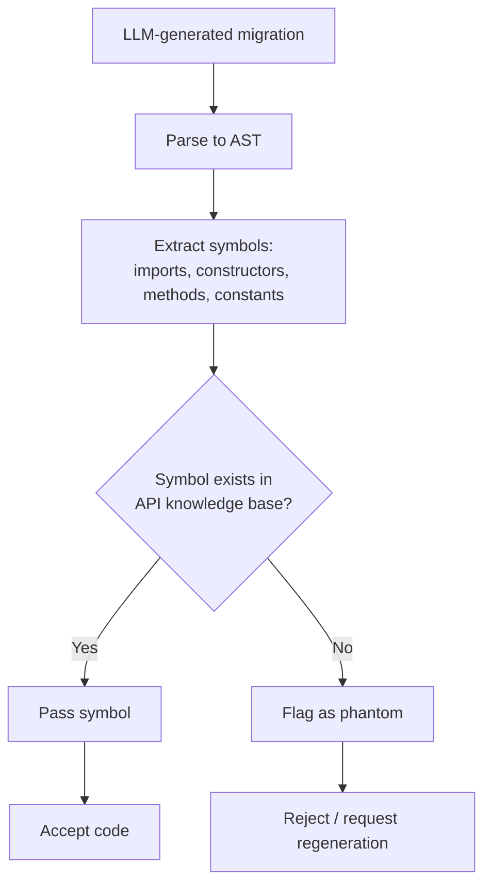

# Phantom Symbol Detection for LLM API Migration

> Verify symbols extracted from generated code against an API knowledge base — a deterministic check that catches the fabricated imports, constructors, and methods that probabilistic judges miss.

## The Failure Mode

When an LLM migrates code from one API to another, it sometimes generates Phantom Symbols — imports, constructors, constants, or methods that look plausible but do not exist in the target API specification. Tileria et al. (2026) call this **Scaffolding Hallucination**: the model identifies the right migration pattern but invents calling context that fails at link time, not at compile time, so the error is invisible to surface-level reviewers ([Hallucination Inspector: A Fact-Checking Judge for API Migration](https://arxiv.org/abs/2604.20202)).

Phantom symbols survive standard evaluation because they preserve surface coherence:

- **CodeBLEU** rewards lexical similarity to a reference solution. A fabricated method name close to a real one scores well ([Hallucination Inspector](https://arxiv.org/abs/2604.20202)).
- **LLM-as-judge** evaluates surface qualities — fluency, structural plausibility, stylistic fit — and phantom-symbol code satisfies all three, so the judge cannot distinguish fabricated calls from real ones without an independent check on symbol existence.
- **pass@k** measures the probability that at least one of k sampled solutions passes the unit tests ([Chen et al., 2021](https://arxiv.org/abs/2107.03374)); by construction it only catches phantoms that reach runtime, so failures at import or link time never enter the test loop.

## The Check

Phantom Symbol Detection treats the API specification as ground truth and the generated code as the claim to verify:

The knowledge base is built directly from the target API's documentation — structured references, type stubs, or parsed SDK sources — so symbol existence is a binary lookup, not a probabilistic judgment ([Hallucination Inspector](https://arxiv.org/abs/2604.20202)).

## Why This Works

The mechanism is a category shift. Existing metrics ask "does this code look right?" — a question LLMs answer by pattern-matching. Phantom Symbol Detection asks "does this specific symbol appear in the authoritative index?" — a question resolved by set membership. Because the API documentation is structured and complete for the class of errors being detected, the check is deterministic where probabilistic judges are not. This is the same shift deployed by other [deterministic guardrails around probabilistic agents](deterministic-guardrails.md): encode the invariant in a check the agent cannot reason around.

## Where the Check Fits

Phantom Symbol Detection is one layer in a [layered accuracy defense](layered-accuracy-defense.md), not a replacement for review:

| Layer | Catches |
|-------|---------|
| Phantom Symbol Detection | Nonexistent imports, constructors, methods, constants |
| Compile / type check | Real symbols used with wrong argument types |
| Test suite | Real symbols called with wrong semantics |
| Human review | Design-level migration errors |

Each layer is independent — a phantom symbol must pass a documentation lookup before it reaches the compiler, and the layers do not share failure modes.

## When This Backfires

The check is only as strong as the knowledge base and the AST. It degrades or fails under:

- **Dynamic or reflective code paths** — `getattr` in Python, `send` in Ruby, string-keyed member access in JavaScript. Static AST cannot resolve the called symbol, so legitimate reflective calls produce false positives.
- **Stale knowledge base** — the paper's evaluation is preliminary and Android-specific ([source](https://arxiv.org/abs/2604.20202)); a knowledge base out of sync with the deployed SDK flags real symbols as phantoms and trains reviewers to dismiss the output.
- **APIs without machine-readable documentation** — the knowledge base requires structured references. For internal or undocumented APIs, building the index is the harder problem and this pattern does not solve it.
- **Real symbol, wrong use** — the check confirms existence, not semantic correctness. An agent that calls a real constructor with the wrong argument types, or a deprecated method scheduled for removal, passes this check and still ships broken code. Pair the symbol check with type checking and tests.

## Key Takeaways

- Phantom Symbols — fabricated imports, constructors, methods, or constants — survive CodeBLEU, LLM-as-judge, and pass@k because they preserve surface coherence
- A documentation-derived knowledge base plus AST symbol extraction converts symbol existence from a probabilistic judgment to a deterministic lookup
- The check catches a specific failure class — it does not replace compilation, tests, or human review, and it degrades with reflective code, stale indexes, or undocumented APIs
- Anti-pattern: relying on a single probabilistic judge to certify migrated code — the failure mode the judge misses is exactly the one Phantom Symbol Detection was designed to catch

## Related

- [Layered Accuracy Defense](layered-accuracy-defense.md)
- [Deterministic Guardrails Around Probabilistic Agents](deterministic-guardrails.md)
- [Structured Output Constraints](structured-output-constraints.md)
- [Dependency Gap Validation for AI-Generated Code](dependency-gap-validation.md)
- [LLM-as-Judge Evaluation with Human Spot-Checking](../workflows/llm-as-judge-evaluation.md)
- [Incremental Verification: Check at Each Step, Not at the End](incremental-verification.md)
