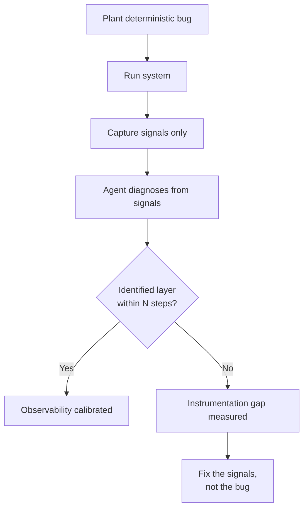

# Planted-Bug Methodology: Deliberate Bugs as Observability Calibration

> Plant deterministic bugs, then verify captured signals lead an agent to the responsible layer. Logs that exist but don't reveal cause are noise, not observability.

Planted bugs are deterministic, deliberately-injected defects whose role is to calibrate the observability stack rather than to be fixed. They are the inverse of [Incident-to-Eval Synthesis](incident-to-eval-synthesis.md): incidents validate end-to-end behaviour against known failures; planted bugs validate the instrumentation that watches it against known causes.

## Why Plant Bugs

Chaos experiments depend on observability to determine whether the system behaved acceptably — [without logs, traces, and metrics you cannot detect deviations from steady state](https://principlesofchaos.org/). That makes observability a prerequisite for every chaos experiment, but leaves the prerequisite itself untested. The question "does our observability work?" has no falsifiable answer when you only observe organic incidents.

Planted bugs convert that question into a measurable one. Each fixture has a known root cause, a known layer, and a known injection time. The signals either lead a diagnosing agent to the responsible layer or they don't — a binary pass/fail per probe, applied to the observability stack rather than the application.

This mirrors the [mutation testing](mutation-testing-quality-gate.md) mechanism — surviving mutants name the failure modes the test suite misses. Surviving planted bugs name the failure modes the observability misses.

## The Pass Criterion

A planted-bug probe passes when an agent reading *only* the captured signals — logs, metrics, traces, transcripts — identifies the responsible layer within N steps, without source-code spelunking.



Fixing the bug is not the goal — the bug exists to test the signals. If signals don't lead to it, the remediation is at the instrumentation layer, not the application layer.

## Building a Fixture Catalogue

A small catalogue of planted bugs across layers gives broad calibration coverage:

| Layer | Example fixture | Diagnosable signature |
|-------|----------------|----------------------|
| Parsing | Silent empty-chunk path for inputs >1000 chars | Input size + empty output, no exception |
| Persistence | Write succeeds, read returns prior version | Write/read pair across a transaction boundary |
| IPC | Message dropped on full queue | Producer count exceeds consumer count |
| Async race | Two writers, second wins regardless of timestamp | Concurrent writes with ordering reversal |
| Concurrency | Lock acquired but never released on a specific branch | Lock-hold duration outlier on one code path |

Each fixture should be deterministic — same input, same failure, every time — and have a signature an agent could conceivably reach from instrumentation alone. Fixtures that depend on production-only conditions (specific user, specific data volume) belong to the incident-to-eval pipeline, not here.

Rerun the catalogue on every major harness change. Instrumentation refactors, log-level changes, and new MCP server additions all shift what an agent can see — the catalogue is the regression suite for the observability stack.

## What This Catches

The anti-pattern this surfaces most often is **structured logging that exists but obscures**: a high-volume `INFO` storm that buries the one `WARN` line that matters. The signals are technically present; the calibration probe still fails because the relevant entry is invisible within N steps. [Monitoring detects the known; observability explains the unknown](https://www.simform.com/blog/observability-driven-development/) — high-volume info-level logs satisfy monitoring but fail observability when the explanation cost exceeds the diagnostic budget.

Other failures the catalogue exposes:

- Metrics aggregated at a level that hides the layer (one error counter for "the whole pipeline")
- Trace spans that close before the failure path executes
- Logs from the failing component with no correlation ID tying them to the request
- Per-component logs individually clear but producing no joint narrative when combined

## When This Backfires

- **Solo engineer with full system context** can mentally simulate the failure path and reach the same gap by reading code. Fixtures add ceremony without diagnostic value at that scale.
- **Pre-production prototype.** Every refactor breaks the catalogue; calibration shifts faster than the bugs.
- **High-fidelity production replay already in place.** Shadow traffic gives organic calibration from real signals — synthetic planted bugs are duplicative unless coverage gaps remain.
- **Observability stack itself is broken.** Planted bugs reveal the gap but offer no remediation path — the methodology surfaces the symptom without naming the fix.
- **Fixtures drift from real failure modes.** Engineers plant the bugs they already know how to instrument for. Without periodic refresh from the incident-to-eval pipeline, the catalogue calibrates against a fake distribution.

## Example

A retrieval-augmented agent silently returns empty results for inputs over a parser's character limit. The team wants to confirm the observability stack would surface the cause without anyone reading source.

```python
# planted_bugs/parser_silent_truncation.py
def parse_query(text: str) -> list[str]:
    if len(text) > 1000:
        return []  # silent empty path - planted bug
    return _real_parse(text)
```

The fixture runs behind a dev flag. A test harness submits queries straddling the 1000-character boundary and captures logs, metrics, and traces. A separate diagnosing agent receives the captured signals and the user-visible symptom ("RAG agent returns no results for some queries"), with no source access. It passes if it names "parser, input-size path" within N steps.

If the captured logs include only `INFO request received` and `INFO request complete` with no entry naming the empty-result branch, the agent cannot reach the layer from signals alone. The remediation is a `WARN` log on the empty path, a counter on truncation events, or a span attribute that records input size — not a fix to the parser. The bug stays planted; the instrumentation changes.

## Key Takeaways

- Chaos experiments depend on observability; planted bugs invert that and make observability the subject
- Pass criterion is binary per probe: an agent reading only the signals identifies the responsible layer within N steps
- A small cross-layer catalogue (parsing, persistence, IPC, async race, concurrency) gives broad calibration coverage
- Rerun on every major harness change — instrumentation refactors silently shift what agents can see
- Complement to [incident-to-eval synthesis](incident-to-eval-synthesis.md), not a replacement

## Related

- [Incident-to-Eval Synthesis](incident-to-eval-synthesis.md) — the inverse direction: real failures as the source of regression evals
- [Mutation Testing as a Quality Gate](mutation-testing-quality-gate.md) — the same shape applied to test suites; surviving mutants name what tests miss
- [Making Observability Legible to Agents](../observability/observability-legible-to-agents.md) — wiring browser, log, and metric signals into agent context so diagnosing agents have data to reason over
- [Agent Debugging](../observability/agent-debugging.md) — diagnosing agent failures using logs, traces, and tool call inspection
- [Agent Observability: OTel, Cost Tracking, and Trajectory Logging](../observability/agent-observability-otel.md) — the instrumentation substrate planted bugs calibrate against
- [Deterministic Guardrails Around Probabilistic Agents](deterministic-guardrails.md) — guardrails as another verification layer that planted bugs can probe
