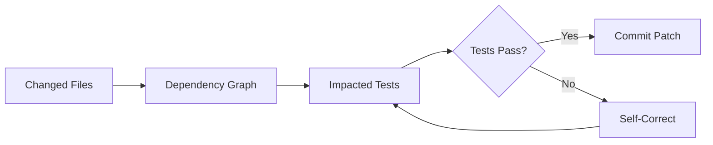

# Pre-Change Impact Analysis: Dependency Maps That Prevent Agent Regressions

> Build a graph of code-to-test dependencies and deliver it as a lightweight agent skill — agents query which tests are at risk before committing, cutting regressions by 70%.

## The Problem

AI coding agents fix issues but frequently break things that were working. On SWE-bench Verified, vanilla agent runs show a 6.08% test-level regression rate ([TDAD paper](https://arxiv.org/abs/2603.17973), Table 3). [METR's March 2026 review](https://metr.org/notes/2026-03-10-many-swe-bench-passing-prs-would-not-be-merged-into-main/) of 296 SWE-bench Verified patches found roughly half would not be merged by maintainers — with regressions and code quality cited among top rejection reasons.

Agents lack visibility into which tests exercise the code they modify.

## The Technique

Pre-change impact analysis gives agents a dependency map between source and test files. The agent queries the map before committing, runs at-risk tests, and self-corrects if any fail.

The [TDAD tool](https://github.com/pepealonso95/TDAD) (Alonso, Yovine, Braberman 2026) implements three steps:

1. **Index** — Parse source files via AST to build a dependency graph (functions, classes, imports, call targets, inheritance)
2. **Impact** — Traverse the graph from changed files to identify affected tests
3. **Verify** — Run only impacted tests; fix regressions before submission



### Graph Structure

The dependency graph maps five edge types:

| Edge Type | Example |
|-----------|---------|
| CONTAINS | `utils.py` → `parse_config()` |
| CALLS | `process()` → `validate()` |
| IMPORTS | `api.py` → `models.py` |
| TESTS | `test_api.py` → `handle_request()` |
| INHERITS | `AdminUser` → `BaseUser` |

Tests are identified via naming conventions (`test_*.py`), prefix matching, and proximity.

### Delivery as a Lightweight Skill

Deliver the dependency map as **static text files**, not a runtime API or graph database:

- **`test_map.txt`** — One line per source-to-test mapping, grep-able
- **`SKILL.md`** — 20 lines of concise guidance: fix, grep test_map, verify

The agent queries the map with `grep` — no special tools required. The skill must work within the agent's existing tool set.

## The TDD Prompting Paradox

**Procedural TDD instructions without dependency context make regressions worse, not better.**

| Approach | Regression Rate | vs. Baseline |
|----------|----------------|-------------|
| Vanilla (no intervention) | 6.08% | — |
| Procedural TDD instructions | 9.94% | +64% worse |
| Dependency map + concise guidance | 1.82% | -70% better |

Source: [TDAD paper](https://arxiv.org/abs/2603.17973), evaluated on SWE-bench Verified with Qwen3-Coder 30B (100 instances).

Why procedural TDD backfires:

- **Context consumption** — Verbose instructions consume tokens, pushing out repository knowledge needed for accurate changes
- **Unfocused ambition** — Without knowing *which* tests matter, agents touch more files and cause collateral damage
- **Procedure without information** — "Run the tests" is useless without "run *these* tests"

Simplifying from 107 lines to 20 lines of concise guidance quadrupled resolution rate (12% to 50%).

**The principle: context over procedure.** When designing agent skills, prioritize decision-relevant facts over step-by-step processes.

## Practical Implementation

### Building the Map

```bash
# Install TDAD from source (Python, MIT license)
git clone https://github.com/pepealonso95/TDAD.git
cd TDAD/tdad && pip install -e .

# Index a repository
tdad index /path/to/repo

# Query impact for changed files
tdad impact /path/to/repo --files src/module.py
```

TDAD uses Python's `ast` module. For other languages, [Tree-sitter](https://tree-sitter.github.io/tree-sitter/) provides a unified parsing interface.

### Integrating with Agent Workflows

Place both files in the repository root. For CI, run impact analysis on the diff and execute only affected tests.

### Limitations

- **Static analysis only** — Cannot capture dynamic dispatch, monkey-patching, or runtime-generated code
- **Python-focused** — AST parsing is language-specific; multi-language repos need per-language parsers
- **Sparse test suites** — Weak test-code coupling reduces effectiveness
- **Smaller model bias** — Observed with 30B models on 32K context; frontier models may differ

## Example

A developer tasks an agent with fixing a bug in `src/auth/session.py`. The agent uses TDAD to identify at-risk tests before committing:

```bash
# 1. Index the repository (run once, or on CI)
tdad index /path/to/repo

# 2. Query the test map for the changed file
grep "src/auth/session.py" test_map.txt
# => src/auth/session.py -> tests/test_session.py
# => src/auth/session.py -> tests/integration/test_auth_flow.py

# 3. Run only the impacted tests
pytest tests/test_session.py tests/integration/test_auth_flow.py

# 4. One test fails — agent self-corrects and re-runs
pytest tests/integration/test_auth_flow.py
# => PASSED
```

The `SKILL.md` the agent reads contains:

```markdown
Before committing any change:
1. Identify changed files
2. Run: grep "<changed_file>" test_map.txt
3. Run the listed tests
4. If any fail, fix and re-run before committing
```

Without the map, the agent would either skip tests entirely or run the full suite — missing regressions or wasting time.

## Key Takeaways

- **Map dependencies before agents commit** — A static text file mapping source to tests reduces regressions by 70%
- **Context beats procedure** — Targeted facts outperform prescriptive TDD workflows; verbose instructions can harm performance
- **Keep skills minimal** — 20 lines outperformed 107 lines by 4x on resolution rate
- **Use standard tools** — grep-able text files work within any agent's existing tool set

## Related

- [Test-Driven Agent Development](tdd-agent-development.md) — TDAD shows procedural TDD needs dependency context to be effective
- [Incremental Verification](incremental-verification.md) — Checkpoint patterns for catching errors close to their source
- [Golden Query Pairs as Regression Tests](golden-query-pairs-regression.md) — Regression *detection* via golden pairs; impact analysis is regression *prevention*
- [Deterministic Guardrails](deterministic-guardrails.md) — Pre-commit hooks and CI gates; impact analysis adds targeted test selection
- [Pre-Completion Checklists](pre-completion-checklists.md) — Verification gates before task completion; impact analysis provides the test list
- [Behavioral Testing for Agents](behavioral-testing-agents.md) — Dependency maps identify which behavioral tests to run
- [Red-Green-Refactor for Agents](red-green-refactor-agents.md) — Impact analysis supplies the "which tests" that TDD instructions alone lack

