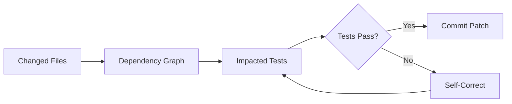

# Pre-Change Impact Analysis: Dependency Maps That Prevent Agent Regressions

> Build a graph of code-to-test dependencies and deliver it as a lightweight agent skill — agents query which tests are at risk before committing, cutting regressions by 70%.

## The Problem

AI coding agents fix issues but frequently break things that were working. On SWE-bench Verified, vanilla agent runs show a 6% test-level regression rate — tests that passed before the agent's patch now fail. Roughly half of SWE-bench-passing patches would not be merged by real maintainers due to regressions. [unverified — attributed to METR in the TDAD paper but specific source not independently verified]

The root cause: agents lack visibility into which tests exercise the code they are modifying. Without that map, they cannot verify their own changes before committing.

## The Technique

Pre-change impact analysis gives agents a dependency map between source files and test files. Before committing a patch, the agent queries the map to identify at-risk tests, runs them, and self-corrects if any fail.

The [TDAD tool](https://github.com/pepealonso95/TDAD) (Alonso, Yovine, Braberman 2026) implements this as three steps:

1. **Index** — Parse source files via AST to build a dependency graph: functions, classes, imports, call targets, inheritance
2. **Impact** — Given changed files, traverse the graph to identify affected tests via direct testing, transitive calls, coverage, and imports
3. **Verify** — Run only the impacted tests; fix regressions before submission



### Graph Structure

The dependency graph maps five relationship types:

| Edge Type | Relationship | Example |
|-----------|-------------|---------|
| CONTAINS | File → Function/Class | `utils.py` → `parse_config()` |
| CALLS | Function → Function | `process()` → `validate()` |
| IMPORTS | File → File | `api.py` → `models.py` |
| TESTS | Test → Function/Class | `test_api.py` → `handle_request()` |
| INHERITS | Class → Class | `AdminUser` → `BaseUser` |

Test identification uses naming conventions (`test_*.py`), prefix matching, and directory proximity.

### Delivery as a Lightweight Skill

The critical design choice: deliver the dependency map as **static text files**, not a runtime API or graph database.

Two artifacts:

- **`test_map.txt`** — One line per source-to-test mapping, grep-able
- **`SKILL.md`** — 20 lines of concise guidance: fix, grep test_map, verify

The agent queries the map with standard `grep` — no special tools, no API calls, no graph database. This is a key constraint: the skill must work within the agent's existing tool set.

## The TDD Prompting Paradox

The most counterintuitive finding from the TDAD research: **adding procedural TDD instructions without dependency context makes regressions worse, not better**.

| Approach | Regression Rate | vs. Baseline |
|----------|----------------|-------------|
| Vanilla (no intervention) | 6.08% | — |
| Procedural TDD instructions | 9.94% | +64% worse |
| Dependency map + concise guidance | 1.82% | -70% better |

Source: [TDAD paper](https://arxiv.org/abs/2603.17973), evaluated on SWE-bench Verified with Qwen3-Coder 30B (100 instances).

Why procedural TDD backfires:

- **Context consumption** — Verbose step-by-step instructions consume context tokens, pushing out repository knowledge the agent needs for accurate changes
- **Unfocused ambition** — Without knowing *which* tests matter, agents following TDD instructions touch more files, causing more collateral damage
- **Procedure without information** — "Run the tests" is useless without "run *these specific* tests"

The fix was dramatic: simplifying the skill file from 107 lines of detailed TDD instructions to 20 lines of concise contextual guidance quadrupled resolution rate from 12% to 50%.

**The principle: context over procedure.** Delivering targeted factual information (which tests are at risk) outperforms prescriptive workflow instructions (follow these TDD steps). This applies broadly — when designing agent skills, prioritize decision-relevant facts over step-by-step processes.

## Practical Implementation

### Building the Map

```bash
# Install TDAD (Python, MIT license)
pip install tdad

# Index a repository
tdad index /path/to/repo

# Query impact for changed files
tdad impact /path/to/repo --files src/module.py
```

TDAD uses Python's `ast` module for parsing. For other languages, [Tree-sitter](https://tree-sitter.github.io/tree-sitter/) provides a unified parsing interface.

### Integrating with Agent Workflows

Place `test_map.txt` and `SKILL.md` in the repository root or a designated skills directory. The agent reads the skill file, greps the test map for affected tests, and runs them before committing.

For CI integration, run impact analysis on the diff and execute only affected tests — faster feedback than running the full suite.

### Limitations

- **Static analysis only** — Cannot capture dynamic dispatch, monkey-patching, or runtime-generated code
- **Python-focused** — AST parsing is language-specific; multi-language repos need per-language parsers
- **Test coverage assumptions** — Sparse test suites or monorepos with weak test-code coupling reduce effectiveness
- **Smaller model bias** — The TDD prompting paradox was observed with 30B-parameter models on 32K context; frontier models with longer context windows may not exhibit the same sensitivity

## Key Takeaways

- **Map dependencies before agents commit** — A static text file mapping source files to their tests enables agents to self-verify, reducing regressions by 70%
- **Context beats procedure** — Targeted factual information (which tests are affected) outperforms prescriptive TDD workflows; verbose instructions can actively harm performance
- **Keep skills minimal** — 20 lines of concise guidance outperformed 107 lines of detailed instructions by 4x on resolution rate
- **Use standard tools** — grep-able text files work within any agent's existing tool set; no special infrastructure needed

## Related

- [Test-Driven Agent Development](tdd-agent-development.md) — TDD as a workflow for agents; TDAD shows that procedural TDD instructions need dependency context to be effective
- [Incremental Verification](incremental-verification.md) — Checkpoint patterns for catching errors close to their source
- [Golden Query Pairs as Regression Tests](golden-query-pairs-regression.md) — Regression *detection* via golden pairs; impact analysis is regression *prevention*
- [Deterministic Guardrails](deterministic-guardrails.md) — Pre-commit hooks and CI gates; impact analysis adds targeted test selection to the guardrail toolbox

## Unverified Claims

- The claim that roughly half of SWE-bench-passing patches would not be merged by real maintainers is attributed to METR in the TDAD paper but the specific source was not independently verified
