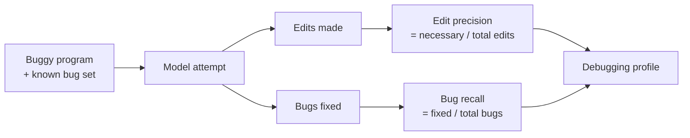

# Precise Debugging: Measure Edit Precision, Not Just Test Pass Rate

> A model that passes the unit tests may not have debugged — it may have rewritten. Pair pass rate with edit-level precision and bug-level recall to tell debugging apart from regeneration.

## The Gap a Single Pass Rate Hides

Unit-test pass rate treats "debugged" and "rewrote half the file" as the same outcome. For debugging tasks — where the job is to localise a fault and apply a targeted edit — that conflation hides a systematic failure mode: frontier models often produce correct but over-edited solutions.

On the Precise Debugging Benchmark (PDB), GPT-5.1-Codex and DeepSeek-V3.2-Thinking achieve unit-test pass rates above 76% but edit-level precision below 45% — even when instructed explicitly to perform minimal debugging ([Zhu et al., 2026](https://arxiv.org/abs/2604.17338)). Pass rate alone says both models are strong debuggers. Precision says more than half their edits were unnecessary.

## Two Metrics Instead of One

PDB constructs bugs by synthesizing verified atomic bugs and composing them into multi-bug programs, so the ground truth is known at the edit level. Two metrics score each attempt ([Zhu et al., 2026](https://arxiv.org/abs/2604.17338)):

| Metric | What it asks |
|--------|--------------|
| **Edit-level precision** | Of the edits the model made, how many were necessary? |
| **Bug-level recall** | Of the bugs that existed, how many did the model fix? |



Pass rate collapses both axes into a single pass/fail. Precision plus recall distinguishes a surgical fix from a regeneration that happened to pass.

This mirrors the stage-level precision/recall split used by [trajectory decomposition](trajectory-decomposition-diagnosis.md), applied specifically to the edit stage of debugging tasks.

## What the Evidence Shows

- **High pass, low precision is the default.** >76% pass, <45% precision on PDB-Single-Hard and PDB-Multi for frontier coding models ([Zhu et al., 2026](https://arxiv.org/abs/2604.17338)).
- **Explicit instructions do not close the gap.** Prompting for "minimal debugging" still leaves precision below 45% ([Zhu et al., 2026](https://arxiv.org/abs/2604.17338)).
- **Iterative and agentic debugging strategies do not substantially improve precision or recall.** Wrapping the same base model in multi-turn loops or delegator-worker topologies produced no meaningful lift — the authors argue the base policy itself favours regeneration over targeted edits ([Zhu et al., 2026](https://arxiv.org/abs/2604.17338)).

## Applying This to Your Own Evals

PDB is a research benchmark, but the metric pair generalises to any internal debugging eval where a reference patch is known.

### 1. Score both axes

For every debugging task with a known fix, compute two numbers against the agent's diff:

```
edit_precision = |edits ∩ reference_edits| / |edits|
bug_recall     = |bugs_fixed ∩ reference_bugs| / |reference_bugs|
```

Report them alongside pass rate, not instead of it. A run can be high-pass, high-recall, low-precision — that is the regeneration signature.

### 2. Use the precision-recall profile to diagnose

| Profile | Reading |
|---------|---------|
| High pass, high precision, high recall | Debugging as intended |
| High pass, low precision, high recall | Regenerating — tests pass but edits are wider than needed |
| High pass, high precision, low recall | Cherry-picking — fixing some bugs, silently leaving others |
| Low pass | Outcome failure; diagnose with [trajectory decomposition](trajectory-decomposition-diagnosis.md) |

### 3. Do not expect iteration to fix precision

If a model regenerates on the first attempt, wrapping it in an iterative or agentic loop is unlikely to recover precision on PDB workloads ([Zhu et al., 2026](https://arxiv.org/abs/2604.17338)). Budget the effort for changes that move the base policy — smaller context windows scoped to the suspect region, constraint-based prompting, or a different model — rather than deeper loops.

## When Edit Precision Is the Wrong Target

Precision against a reference patch is a useful signal only when a reference patch is meaningful. Skip it when:

- **No reference patch exists.** Greenfield work and exploratory changes have no ground-truth edit set. Use [outcome grading](grade-agent-outcomes.md) instead.
- **The task rewards broader rewrites.** Refactoring messy legacy code, cleaning up dead paths, or modernising idioms often benefits from wider edits than a minimal patch. A surgical diff can entrench the structure you were trying to replace.
- **Style and maintainability dominate correctness.** Edit precision does not measure code quality, readability, or review burden. Pair with [code review](../code-review/index.md) signals before acting on precision alone.

## Key Takeaways

- Pass rate alone conflates debugging with regeneration; add edit-level precision and bug-level recall when the task is debugging
- Frontier models clear 76% pass on PDB but fall below 45% precision, even when told to minimise edits ([Zhu et al., 2026](https://arxiv.org/abs/2604.17338))
- Iterative and agentic loops on the same base model do not close the precision gap — change the base policy, not the wrapper
- The "high pass, low precision, high recall" profile is the regeneration signature to watch for in your own evals
- Skip edit precision when no reference patch exists or when broader rewrites are the right answer

## Related

- [Trajectory Decomposition: Diagnose Where Coding Agents Fail](trajectory-decomposition-diagnosis.md) — stage-level precision/recall for the full search/read/edit pipeline
- [pass@k and pass^k](pass-at-k-metrics.md) — capability and consistency metrics that sit alongside edit precision
- [Grade Agent Outcomes, Not Execution Paths](grade-agent-outcomes.md) — the right default when no reference patch exists
- [Completion Failure Taxonomy](completion-failure-taxonomy.md) — categorises why code suggestions fail, complementary to edit-precision diagnosis
