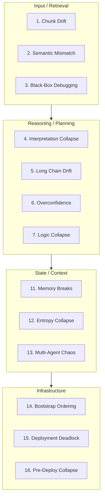

<!-- source: nibzard/awesome-agentic-patterns (Apache 2.0, https://github.com/nibzard/awesome-agentic-patterns) — retain attribution per license -->

# RAG/Agent Reliability Problem Map

> A 16-domain failure taxonomy that turns ad-hoc prompt tweaking into systematic incident classification for RAG and agent systems.

## The Problem with Ad-Hoc Debugging

The WFGY reliability problem map is a 16-domain failure taxonomy for RAG and agent systems, organized across four layers — input/retrieval, reasoning/planning, state/context, and infrastructure/deployment. Each domain names a failure mode with targeted repair actions, giving teams a shared vocabulary to classify incidents instead of guessing. [Source: [onestardao/WFGY — ProblemMap/README.md](https://github.com/onestardao/WFGY/blob/main/ProblemMap/README.md); mirror: [nibzard/awesome-agentic-patterns](https://github.com/nibzard/awesome-agentic-patterns/blob/main/patterns/wfgy-reliability-problem-map.md)]

Without that vocabulary, the default response to wrong output is a prompt tweak, then another — patches accumulate without identifying the underlying failure class, so the same failures recur under different symptoms. Classifying first turns one-off fixes into a reusable incident memory bank.

## The 16 Failure Domains

Domains organize across four layers: [IN] Input/Retrieval, [RE] Reasoning/Planning, [ST] State/Context, [OP] Infrastructure/Deployment.

| # | Domain | Layer | Failure Pattern |
|---|--------|-------|-----------------|
| 1 | Hallucination & Chunk Drift | [IN] | Retrieval returns wrong or irrelevant chunks |
| 2 | Semantic ≠ Embedding | [IN] | Cosine similarity misses true meaning |
| 3 | Debugging is a Black Box | [IN] | No visibility into which retrieval path failed |
| 4 | Interpretation Collapse | [RE] | Correct chunks, flawed reasoning |
| 5 | Long Reasoning Chains | [RE] | Multi-step tasks drift off trajectory |
| 6 | Bluffing/Overconfidence | [RE] | Confident answers without hedging |
| 7 | Logic Collapse & Recovery | [RE] | Dead-ends require controlled restart |
| 8 | Creative Freeze | [RE] | Flat literal outputs — no synthesis |
| 9 | Symbolic Collapse | [RE] | Abstract prompts fail silently |
| 10 | Philosophical Recursion | [RE] | Self-reference loops stall generation |
| 11 | Memory Breaks Across Sessions | [ST] | No continuity between agent sessions |
| 12 | Entropy Collapse | [ST] | Attention degrades over long context |
| 13 | Multi-Agent Chaos | [ST] | Agents overwrite each other's state |
| 14 | Bootstrap Ordering | [OP] | Services fire before dependencies ready |
| 15 | Deployment Deadlock | [OP] | Circular infrastructure waits block startup |
| 16 | Pre-Deploy Collapse | [OP] | Version skew or missing secrets fail first call |

## Diagnostic Workflow

Run the checklist against one failing incident — mixing failures produces ambiguous diagnoses.

1. **Capture** — isolate one failing trace, query, or conversation
2. **Classify** — run the 16-question checklist; mark active failure modes
3. **Repair** — apply targeted actions per domain (chunking, embeddings, prompt/tool contracts, ingestion order)
4. **Verify** — re-run the identical case; document which checks resolved

Skipping verify creates false confidence.

## Delta S (ΔS) as a Pre-Generation Signal

ΔS is a semantic tension metric that validates retrieval stability *before* generation — a firewall, not a post-hoc patch. WFGY lists ΔS ≤ 0.45 alongside `coverage ≥ 0.70` and `λ convergent` as fix-acceptance criteria, describing the gates as "risk-reducing heuristics, not a mathematical guarantee" with "setup-dependent" stability. [Source: [onestardao/WFGY — ProblemMap/README.md](https://github.com/onestardao/WFGY/blob/main/ProblemMap/README.md)]

- ΔS ≤ 0.45: within WFGY's acceptable range; proceed to generation
- ΔS > 0.60: diverged from query intent; intervene before generating

Supporting instruments: `lambda_observe` tracks logic directionality (convergent/divergent/chaotic); `BBMC` minimizes semantic residue; `BBCR` handles rollback and branching on dead-ends. [Source: [WFGY Global Debug Card](https://github.com/onestardao/WFGY/blob/main/ProblemMap/wfgy-rag-16-problem-map-global-debug-card.md)]

## Operational Requirements

- **Log and classify every incident** — without consistent logging the framework has no value
- **Keep repair actions stack-specific** — generic repairs don't transfer across embedding models or frameworks
- **Complement, don't replace, automated evals** — this is a diagnostic vocabulary, not an eval pipeline substitute

## When This Backfires

Prefer a team-local taxonomy — or a smaller published framework like the MAST paper's 14 categories [Source: [Why Do Multi-Agent LLM Systems Fail?, arXiv:2503.13657](https://arxiv.org/pdf/2503.13657)] — when:

- **Incidents don't cluster into WFGY's domains.** Forcing an ill-fit (e.g., labeling a prompt-injection failure as "Interpretation Collapse") obscures root cause and produces wrong repairs.
- **Your stack is narrow.** Single-agent single-turn RAG has no "Multi-Agent Chaos" or "Memory Breaks Across Sessions" surface; a smaller retrieval-plus-reasoning taxonomy is faster to apply.
- **You need validated thresholds, not heuristics.** SLA-grade reliability requires thresholds validated on your own evals, not catalog defaults.
- **Vocabulary overhead exceeds debugging time saved.** Training on 16 named domains is a real cost; low-volume teams may prefer free-form postmortems feeding a minimal local taxonomy.

## Key Takeaways

- 16 failure domains span four layers: input/retrieval, reasoning/planning, state/context, and infrastructure/deployment
- The diagnostic workflow — capture, classify, repair, verify — prevents patch accumulation and builds persistent incident memory
- ΔS is a pre-generation semantic tension check; WFGY authors treat its thresholds as setup-dependent heuristics, not validated constants
- Operational discipline is a prerequisite — the framework has no value without consistent logging
- For agent task completion failures, see [Completion Failure Taxonomy](completion-failure-taxonomy.md)

## Related

- [Completion Failure Taxonomy](completion-failure-taxonomy.md) — Three-category taxonomy of agent task completion failures (model, integration, and user override)
- [Trajectory Decomposition: Diagnose Where Coding Agents Fail](trajectory-decomposition-diagnosis.md) — Per-stage precision/recall to pinpoint where agent trajectories go wrong
- [Golden Query Pairs as Continuous Regression Tests for Agents](golden-query-pairs-regression.md) — Curated regression tests that surface retrieval and reasoning regressions automatically
- [Incident to Eval Synthesis](incident-to-eval-synthesis.md) — Convert classified failures into persistent eval cases to prevent recurrence
