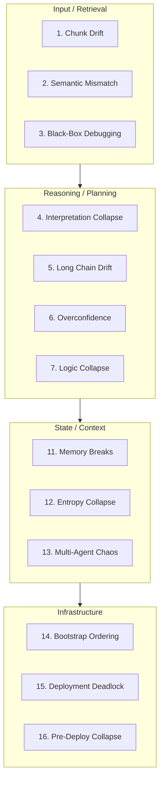

<!-- source: nibzard/awesome-agentic-patterns (Apache 2.0, https://github.com/nibzard/awesome-agentic-patterns) — retain attribution per license -->

# RAG/Agent Reliability Problem Map

> A 16-domain failure taxonomy that turns ad-hoc prompt tweaking into systematic incident classification for RAG and agent systems.

## The Problem with Ad-Hoc Debugging

When a RAG pipeline or agent produces wrong output, the default response is a prompt tweak. If that fails, another tweak. Teams accumulate patches without identifying the underlying failure class — so the same failures recur under different surface symptoms.

The WFGY reliability problem map provides a shared diagnostic vocabulary: 16 named failure domains organized across four system layers. Instead of guessing, you classify. Instead of patching, you apply targeted repairs. Classified incidents accumulate into an incident memory bank — repeated failures become recognizable patterns rather than novel problems. [Source: [nibzard/awesome-agentic-patterns — wfgy-reliability-problem-map.md](https://github.com/nibzard/awesome-agentic-patterns/blob/main/patterns/wfgy-reliability-problem-map.md)]

## The 16 Failure Domains

Domains organize across four layers: [IN] Input/Retrieval, [RE] Reasoning/Planning, [ST] State/Context, [OP] Infrastructure/Deployment.

| # | Domain | Layer | Failure Pattern |
|---|--------|-------|-----------------|
| 1 | Hallucination & Chunk Drift | [IN] | Retrieval returns wrong or irrelevant chunks |
| 2 | Semantic ≠ Embedding | [IN] | Cosine similarity matches content that misses true meaning |
| 3 | Debugging is a Black Box | [IN] | No visibility into which retrieval path failed |
| 4 | Interpretation Collapse | [RE] | Correct chunks retrieved; flawed reasoning logic applied |
| 5 | Long Reasoning Chains | [RE] | Multi-step tasks drift off trajectory over time |
| 6 | Bluffing/Overconfidence | [RE] | Confident but unfounded answers delivered without hedging |
| 7 | Logic Collapse & Recovery | [RE] | Dead-ends reached; recovery requires controlled restart |
| 8 | Creative Freeze | [RE] | Flat, literal outputs — no synthesis or reframing |
| 9 | Symbolic Collapse | [RE] | Abstract or logical prompts malfunction or fail silently |
| 10 | Philosophical Recursion | [RE] | Self-reference loops and paradox traps stall generation |
| 11 | Memory Breaks Across Sessions | [ST] | Lost threads; no continuity between agent sessions |
| 12 | Entropy Collapse | [ST] | Attention degrades over long context; output becomes incoherent |
| 13 | Multi-Agent Chaos | [ST] | Agents overwrite each other's state or misalign logic |
| 14 | Bootstrap Ordering | [OP] | Services fire before their dependencies are ready |
| 15 | Deployment Deadlock | [OP] | Circular infrastructure waits block startup |
| 16 | Pre-Deploy Collapse | [OP] | Version skew or missing secrets cause failures on first call |

## Diagnostic Workflow

Run the checklist against a single failing incident — mixing multiple failures produces ambiguous diagnoses.

1. **Capture** — isolate one failing trace, query, or conversation
2. **Classify** — run the 16-question checklist; mark all active failure modes
3. **Repair** — apply targeted actions per active domain (chunking adjustments, embedding rebuilds, prompt/tool contract corrections, ingestion reordering)
4. **Verify** — re-run the identical failure case; document which checks resolved

Do not skip step 4 — unverified repairs create false confidence.

## Delta S (ΔS) as a Pre-Generation Signal

The map includes ΔS, a semantic tension metric designed to validate retrieval stability *before* generation — acting as a semantic firewall rather than a post-hoc patch.

- ΔS ≤ 0.45: retrieval within acceptable semantic range; proceed to generation
- ΔS > 0.60: retrieval diverged from query intent; intervene before generating output

[unverified] These thresholds are defined in the pattern catalog but have no independently published validation data. Treat them as design heuristics to calibrate to your system.

Supporting instruments: lambda_observe monitors logic directionality (convergent, divergent, or chaotic); BBMC minimizes semantic residue; BBCR enables rollback and branch spawning. [unverified] These instruments are described in the catalog entry only — no independent implementation references found.

## Operational Requirements

- **Log every incident** — classify and record the failure domain before applying a fix
- **Maintain stack-specific repair actions** — generic repairs don't transfer across embedding models or orchestration frameworks
- **Build incident memory** — a classified history turns one-off fixes into reusable patterns
- **Complement automated evals** — the taxonomy does not replace evaluation pipelines

Teams that skip logging return to ad-hoc debugging after the first context switch.

## Key Takeaways

- 16 failure domains span four layers: input/retrieval, reasoning/planning, state/context, and infrastructure/deployment
- The diagnostic workflow — capture, classify, repair, verify — prevents patch accumulation and builds persistent incident memory
- ΔS provides a pre-generation semantic tension check; published thresholds are unverified heuristics
- Operational discipline is a prerequisite — the framework has no value without consistent logging
- For agent task completion failures, see [Completion Failure Taxonomy](completion-failure-taxonomy.md)

## Unverified

- ΔS thresholds (≤0.45 healthy, >0.60 failure) are defined in the WFGY pattern only — no independent validation found
- lambda_observe, BBMC, and BBCR instrument behavior — described in the catalog entry only; no independent implementation documentation found

## Related

- [Completion Failure Taxonomy](completion-failure-taxonomy.md) — Three-category taxonomy of agent task completion failures (model, integration, and user override)
- [Trajectory Decomposition: Diagnose Where Coding Agents Fail](trajectory-decomposition-diagnosis.md) — Per-stage precision/recall to pinpoint where agent trajectories go wrong
- [Golden Query Pairs as Continuous Regression Tests for Agents](golden-query-pairs-regression.md) — Curated regression tests that surface retrieval and reasoning regressions automatically
- [Incident to Eval Synthesis](incident-to-eval-synthesis.md) — Convert classified failures into persistent eval cases to prevent recurrence
