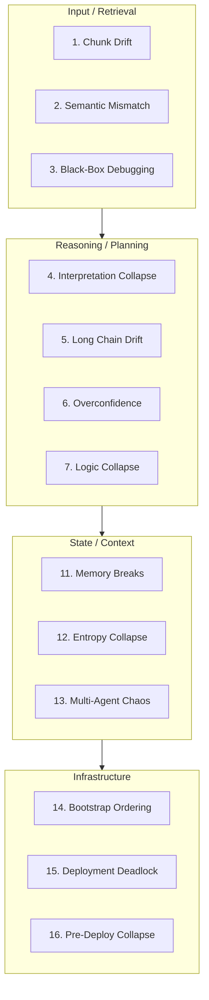

<!-- source: nibzard/awesome-agentic-patterns (Apache 2.0, https://github.com/nibzard/awesome-agentic-patterns) — retain attribution per license -->

# RAG/Agent Reliability Problem Map

> A 16-domain failure taxonomy that turns ad-hoc prompt tweaking into systematic incident classification for RAG and agent systems.

## The problem with ad-hoc debugging

The WFGY reliability problem map is a 16-domain failure taxonomy for RAG and agent systems. It sorts failures across four layers: input/retrieval, reasoning/planning, state/context, and infrastructure/deployment. Each domain names a failure mode and its targeted repair actions. This gives teams a shared vocabulary to classify incidents instead of guessing. [Source: [onestardao/WFGY — ProblemMap/README.md](https://github.com/onestardao/WFGY/blob/main/ProblemMap/README.md); mirror: [nibzard/awesome-agentic-patterns](https://github.com/nibzard/awesome-agentic-patterns/blob/main/patterns/wfgy-reliability-problem-map.md)]

Without that vocabulary, the default response to wrong output is a prompt tweak, then another. Patches pile up without naming the underlying failure class, so the same failures recur under different symptoms. Classifying first turns one-off fixes into a reusable incident memory bank.

## The 16 failure domains

The domains sort across four layers: [IN] input/retrieval, [RE] reasoning/planning, [ST] state/context, and [OP] infrastructure/deployment.

| # | Domain | Layer | Failure pattern |
|---|--------|-------|-----------------|
| 1 | Hallucination & Chunk Drift | [IN] | Retrieval returns wrong or irrelevant chunks |
| 2 | Semantic ≠ Embedding | [IN] | Cosine similarity misses true meaning |
| 3 | Debugging is a Black Box | [IN] | No visibility into which retrieval path failed |
| 4 | Interpretation Collapse | [RE] | Correct chunks, flawed reasoning |
| 5 | Long Reasoning Chains | [RE] | Multi-step tasks drift off trajectory |
| 6 | Bluffing/Overconfidence | [RE] | Confident answers without hedging |
| 7 | Logic Collapse & Recovery | [RE] | Dead-ends require controlled restart |
| 8 | Creative Freeze | [RE] | Flat literal outputs — no synthesis |
| 9 | Symbolic Collapse | [RE] | Abstract prompts fail silently |
| 10 | Philosophical Recursion | [RE] | Self-reference loops stall generation |
| 11 | Memory Breaks Across Sessions | [ST] | No continuity between agent sessions |
| 12 | Entropy Collapse | [ST] | Attention degrades over long context |
| 13 | Multi-Agent Chaos | [ST] | Agents overwrite each other's state |
| 14 | Bootstrap Ordering | [OP] | Services fire before dependencies ready |
| 15 | Deployment Deadlock | [OP] | Circular infrastructure waits block startup |
| 16 | Pre-Deploy Collapse | [OP] | Version skew or missing secrets fail first call |

```mermaid
graph TD
    subgraph IN[Input / Retrieval]
        D1[1. Chunk Drift]
        D2[2. Semantic Mismatch]
        D3[3. Black-Box Debugging]
    end
    subgraph RE[Reasoning / Planning]
        D4[4. Interpretation Collapse]
        D5[5. Long Chain Drift]
        D6[6. Overconfidence]
        D7[7. Logic Collapse]
    end
    subgraph ST[State / Context]
        D11[11. Memory Breaks]
        D12[12. Entropy Collapse]
        D13[13. Multi-Agent Chaos]
    end
    subgraph OP[Infrastructure]
        D14[14. Bootstrap Ordering]
        D15[15. Deployment Deadlock]
        D16[16. Pre-Deploy Collapse]
    end
    IN --> RE --> ST --> OP
```

## Diagnostic workflow

Run the checklist against one failing incident. Mixing failures produces ambiguous diagnoses.

1. Capture one failing trace, query, or conversation.
2. Classify it: run the 16-question checklist and mark the active failure modes.
3. Repair it with targeted actions per domain, such as chunking, embeddings, prompt and tool contracts, or ingestion order.
4. Verify by re-running the identical case, and record which checks resolved it.

Skipping the verify step creates false confidence.

## Delta S (ΔS) as a pre-generation signal

ΔS is a semantic tension metric. It checks retrieval stability before generation, so it acts as a firewall rather than an after-the-fact patch. WFGY lists ΔS ≤ 0.45 alongside `coverage ≥ 0.70` and `λ convergent` as fix-acceptance criteria. It describes these gates as "risk-reducing heuristics, not a mathematical guarantee" with "setup-dependent" stability. [Source: [onestardao/WFGY — ProblemMap/README.md](https://github.com/onestardao/WFGY/blob/main/ProblemMap/README.md)]

- ΔS ≤ 0.45: within WFGY's acceptable range, so proceed to generation
- ΔS > 0.60: diverged from query intent, so intervene before generating

Three instruments support this check. `lambda_observe` tracks logic directionality (convergent, divergent, or chaotic). `BBMC` minimizes semantic residue. `BBCR` handles rollback and branching on dead-ends. [Source: [WFGY Global Debug Card](https://github.com/onestardao/WFGY/blob/main/ProblemMap/wfgy-rag-16-problem-map-global-debug-card.md)]

## Operational requirements

The framework rests on three practices:

- log and classify every incident, because without consistent logging the framework has no value
- keep repair actions stack-specific, because generic repairs do not transfer across embedding models or frameworks
- treat this as a complement to automated evals, not a replacement, because it is a diagnostic vocabulary rather than an eval pipeline

## When this backfires

Prefer a team-local taxonomy, or a smaller published framework like the MAST paper's 14 categories [Source: [Why Do Multi-Agent LLM Systems Fail?, arXiv:2503.13657](https://arxiv.org/pdf/2503.13657)], when one of these holds:

- Incidents do not cluster into WFGY's domains. Forcing an ill-fit, for example labeling a prompt-injection failure as "Interpretation Collapse", hides the root cause and produces wrong repairs.
- Your stack is narrow. Single-agent single-turn RAG has no "Multi-Agent Chaos" or "Memory Breaks Across Sessions" surface, so a smaller retrieval-plus-reasoning taxonomy is faster to apply.
- You need validated thresholds, not heuristics. SLA-grade reliability needs thresholds validated on your own evals, not catalog defaults.
- Vocabulary overhead exceeds the debugging time saved. Training on 16 named domains is a real cost, so low-volume teams may prefer free-form postmortems that feed a minimal local taxonomy.

## Key Takeaways

- 16 failure domains span four layers: input/retrieval, reasoning/planning, state/context, and infrastructure/deployment
- The diagnostic workflow — capture, classify, repair, verify — prevents patch accumulation and builds persistent incident memory
- ΔS is a pre-generation semantic tension check; WFGY authors treat its thresholds as setup-dependent heuristics, not validated constants
- Operational discipline is a prerequisite — the framework has no value without consistent logging
- For agent task completion failures, see [Completion Failure Taxonomy](completion-failure-taxonomy.md)

## Related

- [Completion Failure Taxonomy](completion-failure-taxonomy.md) — Three-category taxonomy of agent task completion failures (model, integration, and user override)
- [LLM Agent Bug Fix Taxonomy](agent-bug-fix-taxonomy.md) — Empirical 23-pattern taxonomy of real agent bug fixes; complements this diagnostic framework with repair-side data
- [Trajectory Decomposition: Diagnose Where Coding Agents Fail](trajectory-decomposition-diagnosis.md) — Per-stage precision/recall to pinpoint where agent trajectories go wrong
- [Golden Query Pairs as Continuous Regression Tests for Agents](golden-query-pairs-regression.md) — Curated regression tests that surface retrieval and reasoning regressions automatically
- [Incident to Eval Synthesis](incident-to-eval-synthesis.md) — Convert classified failures into persistent eval cases to prevent recurrence
