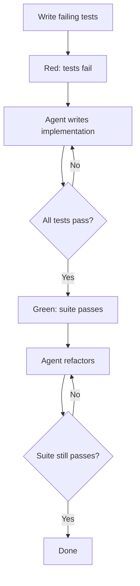

# Red-Green-Refactor with Agents: Tests as the Spec

> Apply the TDD cycle with separate agent invocations per phase — write failing tests, instruct the agent to pass them, then instruct it to refactor against the green suite.

!!! note "Also known as"
    Red-Green-Refactor for Agents, TDD with Agents, Tests as the Spec. For the broader methodology of using TDD when developing with AI agents, see [Test-Driven Agent Development](tdd-agent-development.md).

## The Cycle

Red-green-refactor structures agent-driven development into three distinct phases, each with a different instruction and a different exit condition.

**Red** — write failing tests that define the required behavior. The agent has not written any implementation yet. The tests fail because there is nothing to run them against. This is the expected state.

**Green** — instruct the agent to write the minimum implementation to pass the suite. The constraint "do not change the tests" prevents the agent from satisfying tests by weakening them. The exit condition is deterministic: all tests pass.

**Refactor** — instruct the agent to improve the implementation without changing behavior. The green test suite is the safety net. If the agent introduces a regression during refactoring, the suite catches it immediately.



## Why Separate Invocations

Mixed-phase instructions produce mixed-phase output. An agent told to "write tests and implement the feature" writes tests that match its implementation, not tests that define correct behavior independently. Separate invocations keep each phase honest [unverified — no formal study, but consistent with TDD literature on test-first discipline].

## The Refactor Phase Is Where Agents Excel

With a green suite, the agent can restructure freely — rename across the codebase, extract utilities, swap imperative code for declarative patterns, change internal data structures. Human review focuses on whether the refactored code is better structured, not on whether it still works — the suite answers that question.

## Integration with Plan Mode

[The plan-first loop](../workflows/plan-first-loop.md) pairs with the green phase: before writing implementation, the agent reads the failing tests, proposes an approach, and waits for approval. Tests are a more precise spec than prose — the resulting plan is more reliable than one built against a description of intent.

## Constraints That Make This Work

- **"Do not change the tests"** — the most important constraint in the green phase. Without it, the agent will sometimes modify tests to make them pass more easily.
- **"Minimum code to pass"** — prevents the agent from over-engineering in the green phase. Save complexity for the refactor phase, where it can be evaluated against known-good behavior.
- **"Tests must still pass when you're done"** — the exit condition for the refactor phase. The agent knows when it is done.

## When to Use This Technique

Red-green-refactor with agents is most effective when:

- The required behavior can be expressed as executable tests
- The tests can be run quickly enough for the agent to iterate (seconds, not minutes)
- The refactor phase has a clear goal (performance, readability, structure)

It is less effective for UI behavior that is difficult to test programmatically, behaviors requiring external state without mocking, or tasks where the specification itself is unclear.

## Example

The following shows three separate Claude Code invocations for a Python function that validates an email address. Each phase uses a different instruction.

**Red phase** — write tests with no implementation yet:

```python
# tests/test_validate_email.py
import pytest
from myapp.validators import validate_email

def test_valid_email_returns_true():
    assert validate_email("user@example.com") is True

def test_missing_at_sign_returns_false():
    assert validate_email("userexample.com") is False

def test_missing_domain_returns_false():
    assert validate_email("user@") is False

def test_empty_string_returns_false():
    assert validate_email("") is False
```

Running `pytest` now produces four failures — `validate_email` does not exist yet. This is the expected red state.

**Green phase** — invoke the agent with one constraint:

```
Make these tests pass with the minimum implementation. Do not modify the tests.
```

The agent produces a minimal implementation and nothing more:

```python
# myapp/validators.py
import re

def validate_email(address: str) -> bool:
    return bool(re.match(r"^[^@]+@[^@]+\.[^@]+$", address))
```

All four tests now pass.

**Refactor phase** — invoke the agent with the green suite as the safety net:

```
Improve this implementation. The tests must still pass when you are done.
Replace the raw regex with email.utils.parseaddr and add a docstring.
```

The agent restructures without touching the tests. If it introduces a regression, `pytest` reports it in the same run, and the agent iterates until green again. Human review focuses on whether the refactored code is better structured, not on whether it still works.

## Key Takeaways

- Keep red, green, and refactor as separate agent invocations with separate instructions
- "Do not change the tests" is a load-bearing constraint in the green phase
- The refactor phase enables aggressive restructuring because the suite catches regressions immediately
- Exit conditions are deterministic: red = suite fails, green = suite passes, done = suite still passes after refactor

## Unverified Claims

- Mixed-phase instructions produce mixed-phase output; the phases must be kept separate [unverified — no formal study, but consistent with TDD literature on test-first discipline]

## Related

- [Test-Driven Agent Development: Tests as Spec and Guardrail](tdd-agent-development.md)
- [Incremental Verification: Check at Each Step, Not at the End](incremental-verification.md)
- [Deterministic Guardrails Around Probabilistic Agents](deterministic-guardrails.md)
- [Behavioral Testing for Agents](behavioral-testing-agents.md)
- [Pre-Completion Checklists](pre-completion-checklists.md)
- [Pass@k Metrics](pass-at-k-metrics.md)
