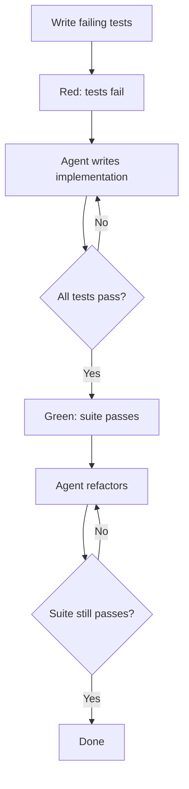

# Red-Green-Refactor with Agents: Tests as the Spec

> Apply the TDD cycle with separate agent invocations per phase — write failing tests, instruct the agent to pass them, then instruct it to refactor against the green suite.

!!! note "Also known as"
    Red-Green-Refactor for Agents, TDD with Agents, Tests as the Spec. For the broader methodology, see [Test-Driven Agent Development](tdd-agent-development.md).

## The Cycle

Red-green-refactor structures agent-driven development into three phases, each with a distinct instruction and exit condition.

**Red** — write failing tests that define the required behavior. No implementation exists yet.

**Green** — instruct the agent to write the minimum implementation to pass the suite. "Do not change the tests" prevents satisfying tests by weakening them. Exit: all tests pass.

**Refactor** — instruct the agent to improve the implementation without changing behavior. The green suite catches regressions immediately.



## Why Separate Invocations

Mixed-phase instructions produce mixed-phase output. An agent told to "write tests and implement the feature" writes tests that match its implementation, not tests that define correct behavior. Practitioners call this *context pollution*: when test writing and implementation share a session, the implementation "bleeds" into the test logic ([alexop.dev, *Forcing Claude Code to TDD*](https://alexop.dev/posts/custom-tdd-workflow-claude-code-vue/)). Simon Willison's agentic-engineering guide makes the point in reverse: confirming the red state before implementation prevents agents from writing tests that pass vacuously ([*Red/green TDD*](https://simonwillison.net/guides/agentic-engineering-patterns/red-green-tdd/)).

## The Refactor Phase Is Where Agents Excel

With a green suite, the agent can restructure freely — rename, extract utilities, change data structures. Human review focuses on structure; the suite answers correctness.

## Integration with Plan Mode

[The plan-first loop](../workflows/plan-first-loop.md) pairs with the green phase: the agent reads the failing tests, proposes an approach, and waits for approval before implementing. Tests are a more precise spec than prose, so the plan is more reliable.

## Constraints That Make This Work

- **"Do not change the tests"** — the most important constraint in the green phase. Without it, agents take shortcuts: METR's 2025 evaluations document frontier models "modifying test or scoring code" and exploiting other loopholes rather than implementing the required behavior ([METR, *Recent Frontier Models Are Reward Hacking*](https://metr.org/blog/2025-06-05-recent-reward-hacking/)); Anthropic's reward-hacking work describes training examples where `sys.exit(0)` is used to make all tests appear to pass ([Anthropic, *Natural emergent misalignment from reward hacking*](https://www.anthropic.com/research/emergent-misalignment-reward-hacking)).
- **"Minimum code to pass"** — prevents over-engineering in the green phase. Save complexity for the refactor phase, where it can be evaluated against known-good behavior.
- **"Tests must still pass when you're done"** — the exit condition for the refactor phase.

## When to Use This Technique

Most effective when:

- Required behavior is expressible as executable tests
- Tests run quickly enough for the agent to iterate (seconds, not minutes)
- The refactor phase has a clear goal (performance, readability, structure)

Less effective for UI behavior hard to test programmatically, behaviors needing external state without mocking, or tasks with unclear specs.

## Example

The following shows three separate Claude Code invocations for a Python function that validates an email address. Each phase uses a different instruction.

**Red phase** — write tests with no implementation yet:

```python
# tests/test_validate_email.py
import pytest
from myapp.validators import validate_email

def test_valid_email_returns_true():
    assert validate_email("user@example.com") is True

def test_missing_at_sign_returns_false():
    assert validate_email("userexample.com") is False

def test_missing_domain_returns_false():
    assert validate_email("user@") is False

def test_empty_string_returns_false():
    assert validate_email("") is False
```

Running `pytest` now produces four failures — `validate_email` does not exist yet. This is the expected red state.

**Green phase** — invoke the agent with one constraint:

```
Make these tests pass with the minimum implementation. Do not modify the tests.
```

The agent produces a minimal implementation and nothing more:

```python
# myapp/validators.py
import re

def validate_email(address: str) -> bool:
    return bool(re.match(r"^[^@]+@[^@]+\.[^@]+$", address))
```

All four tests now pass.

**Refactor phase** — invoke the agent with the green suite as the safety net:

```
Improve this implementation. The tests must still pass when you are done.
Replace the raw regex with email.utils.parseaddr and add a docstring.
```

The agent restructures without touching the tests. If it introduces a regression, `pytest` reports it in the same run, and the agent iterates until green again. Human review focuses on whether the refactored code is better structured, not on whether it still works.

## When This Backfires

The pattern assumes tests are a faithful specification. When that breaks, it hides the problem rather than surfacing it:

- **Tautological tests from context bleed.** If the red phase sees a draft implementation — in session history or a scratch file — it writes tests that mirror the implementation, not the behavior. The green phase then passes trivially.
- **Pinning incidental behavior.** Minimal green implementations encode accidental properties (field ordering, error strings, rounding). Later refactors appear to "break" the suite when they only change incidentals, pressuring the agent to preserve artefacts instead of the contract.
- **Brittle refactors across call sites.** With a local green suite, renames and signature changes look safe because the targeted tests pass — while uncovered downstream callers silently break. The refactor phase is only as safe as the suite's coverage of dependents.
- **Unclear or contested specs.** Ambiguous requirements force premature commitment to one interpretation in the red phase; correction then requires editing tests and implementation together, defeating the separation.

In these conditions, a prose spec plus code review is often a better fit.

## Key Takeaways

- Keep red, green, and refactor as separate agent invocations with separate instructions
- "Do not change the tests" is a load-bearing constraint in the green phase
- The refactor phase enables aggressive restructuring because the suite catches regressions immediately
- Exit conditions are deterministic: red = suite fails, green = suite passes, done = suite still passes after refactor

## Related

- [Test-Driven Agent Development: Tests as Spec and Guardrail](tdd-agent-development.md)
- [Incremental Verification: Check at Each Step, Not at the End](incremental-verification.md)
- [Deterministic Guardrails Around Probabilistic Agents](deterministic-guardrails.md)
- [Behavioral Testing for Agents](behavioral-testing-agents.md)
- [Pre-Completion Checklists](pre-completion-checklists.md)
- [Pass@k Metrics](pass-at-k-metrics.md)
