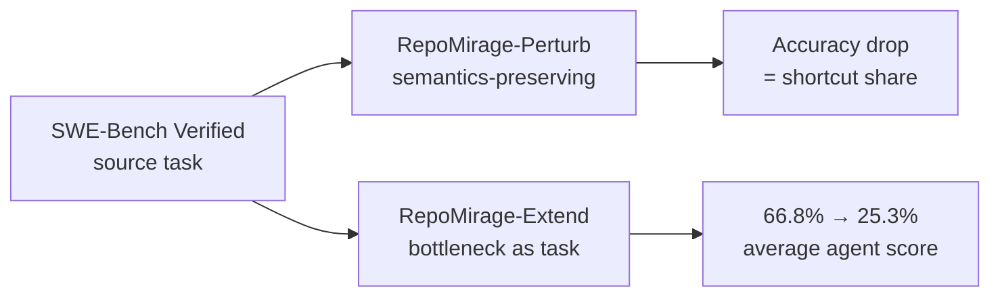

# Repository Perturbation as Context-Reasoning Diagnosis (RepoMirage)

> Perturb the repository in semantics-preserving ways before the agent sees it — the accuracy drop measures shortcut share in an issue-resolution score.

Repository perturbation wraps an issue-resolution benchmark (typically SWE-Bench Verified) with semantics-preserving transformations of the repository before the agent runs, then attributes the accuracy drop to multi-file context reasoning ([Li et al., 2026](https://arxiv.org/abs/2605.26177)). The task and ground-truth patch are unchanged; only the surface form differs, so the drop is the share of the original score reachable without genuine context reasoning.

## Why end-to-end scores conflate two capabilities

Issue resolution on SWE-Bench-style benchmarks collapses two capabilities into one number: identifying which files and relations matter, and producing a correct patch. A high score can be reached by shortcutting the first — via training-set memorization, issue-description leakage, or pattern-matching on repository-specific surface tokens. A manual review of the original SWE-Bench found 32.67% of model-marked "successful" cases had the answer in the issue description or comments ([UTBoost, 2026](https://arxiv.org/pdf/2506.09289)). Perturbation invalidates these shortcuts while keeping the reference patch correct, so the residual score reflects context reasoning alone.

## The two-stage diagnostic

RepoMirage-Perturb applies three classes of semantics-preserving repository-level perturbation to the source benchmark; RepoMirage-Extend converts the perturbation-targeted bottlenecks into explicit context-reasoning tasks beyond issue resolution ([Li et al., 2026](https://arxiv.org/abs/2605.26177)).



Average agent performance falls from 66.8% on the source task to 25.3% on RepoMirage-Extend's explicit-task formulation — a 41.5-point gap that the paper attributes to "exploration drift," where agents access broader repository context but fail to convert it into effective structural information ([Li et al., 2026](https://arxiv.org/abs/2605.26177)).

## Why it works

The causal mechanism is shortcut invalidation. A model that scored 66.8% by combining genuine reasoning with surface-token memorization cannot repeat it against a repository whose tokens are renamed or restructured while the call graph holds. The reference patch still applies; only the lookup pattern breaks. The accuracy delta is therefore a lower bound on the original score's shortcut share.

Independent work probes the same gap with different instrumentation. TRAJEVAL decomposes agent trajectories into search, read, and edit stages and reports that outcome-only metrics cannot reveal where agents fail ([TRAJEVAL, 2026](https://arxiv.org/pdf/2603.24631)). SWE-EVO shows GPT-5 with OpenHands scoring 21% on long-horizon evolution tasks versus 65% on SWE-Bench Verified — the same shortfall reached without perturbation, by removing the shortcuts the benchmark allowed ([SWE-EVO, 2026](https://arxiv.org/html/2512.18470v1)).

## When this backfires

Perturbation diagnostics over-predict failure or measure the wrong thing under several specific conditions:

- Shallow-multi-file repositories: when most issues resolve within one file, the diagnostic measures what the deployed agent never hits at scale, and the pipeline cost is not repaid.
- Proprietary surfaces unlikely to be in training corpora: [contamination](benchmark-contamination-eval-risk.md) is already low, so perturbation buys little signal beyond a static custom benchmark.
- No oracle to confirm semantics preservation: a perturbation that subtly changes behavior produces an artifact, not a signal. Without a passing reference test suite on both the original and the perturbed repo, the diagnostic is unreliable.
- Production agents pinned to a known repository set: when the agent only sees one or two well-mapped codebases, structural exploration amortizes across runs and perturbation over-predicts failure.
- Intermediate gold-context labels already exist: ContextBench-style annotated contexts answer the same question more directly ([ContextBench, 2026](https://arxiv.org/pdf/2602.05892)).

Other sources of inflated scores also confound it. Test-suite inadequacy lets 31.08% of accepted patches pass because the tests cannot reject incorrect or incomplete solutions ([UTBoost, 2026](https://arxiv.org/pdf/2506.09289)) — a gap that remains even after perturbation removes shortcut leakage.

A second confound cuts the other way. Meaning-preserving perturbations degrade LLM accuracy even on tasks with no multi-file context to reason about — answer-flip rates of 28.8–45.1% are reported on semantically equivalent arithmetic variants ([Fragile Reasoning, 2026](https://arxiv.org/abs/2604.01639)). Part of RepoMirage's drop is therefore generic surface-form brittleness rather than invalidated shortcuts, inflating the attributed share. The lower-bound framing holds only if you net out brittleness with a no-context perturbation baseline; without one, the drop conflates two effects.

## Composing with the sibling family

Repository perturbation is one of three approaches to the same question; match the probe to where the failure likely lives:

| Approach | Probe shape | Independence from training | Cost |
|---|---|---|---|
| Repository perturbation (RepoMirage) | Transform the input, measure score drop | High — invalidates surface shortcuts | High — perturbation pipeline + oracle |
| Trajectory decomposition (TRAJEVAL) | Instrument the agent's stages with precision/recall | Medium — relies on reference annotations | Medium — per-stage IR metrics |
| Intermediate gold contexts (ContextBench) | Compare agent's retrieved context to human-annotated gold | Medium — requires gold context labels | High — human annotation upfront |

## Example

A team evaluating a code agent on SWE-Bench Verified reports a 60% resolve rate and is considering shipping. Before shipping, they run a perturbation diagnostic across three semantics-preserving transformations of the same benchmark instances:

```
Source SWE-Bench Verified:           60.0%
+ Identifier-rename perturbation:    42.1%   (-17.9)
+ File-restructure perturbation:     33.6%   (-26.4)
+ Combined (Extend-style):           24.2%   (-35.8)
```

The 35.8-point drop tells the team that more than half their headline score was reachable without genuine multi-file reasoning. They route shipping decisions through the lower number, fund a structural-scaffolding mitigation (the paper proposes RepoAnchor, which separates repository exploration from problem-solving ([Li et al., 2026](https://arxiv.org/abs/2605.26177))), and add the perturbation suite to their regression eval so future model updates are scored against shortcut-resistant numbers, not the headline.

The example numbers are illustrative; the methodology is the load-bearing contribution.

## Key Takeaways

- Repository perturbation isolates context reasoning from issue-resolution scores by invalidating surface-token shortcuts while preserving the reference solution path.
- The published average drop is 41.5 points (66.8% → 25.3%) on RepoMirage-Extend — a lower bound on the shortcut share of agents' headline numbers ([Li et al., 2026](https://arxiv.org/abs/2605.26177)).
- The diagnostic is most informative when training-set overlap with the benchmark is plausible and the production environment exposes the agent to unfamiliar repositories.
- It is the wrong tool for shallow-multi-file codebases, proprietary surfaces with no contamination risk, or teams without an oracle to verify semantics preservation.
- Compose it with trajectory decomposition and intermediate-context metrics rather than treating it as a replacement — each probes the same gap with different cost and sensitivity.

## Related

- [Trajectory Decomposition: Diagnose Where Coding Agents Fail](trajectory-decomposition-diagnosis.md) — same diagnostic goal via per-stage precision/recall instead of input perturbation
- [Tool-Use Sim-to-Real Perturbation Taxonomy](tool-use-sim-to-real-perturbation-taxonomy.md) — perturbation diagnostic for tool-use agents, partitioned by POMDP component
- [Benchmark Contamination as Eval Risk](benchmark-contamination-eval-risk.md) — the leakage problem perturbation is one mitigation for
- [Controlled Benchmark Rewriting for Agent Safety Judgment](controlled-benchmark-rewriting-safety-judgment.md) — same perturbation logic applied to safety judgment instead of code-agent context reasoning
- [Constraint Decay in Backend Code Generation](constraint-decay-backend-agents.md) — independent evidence of multi-file reasoning degradation as constraints accumulate
