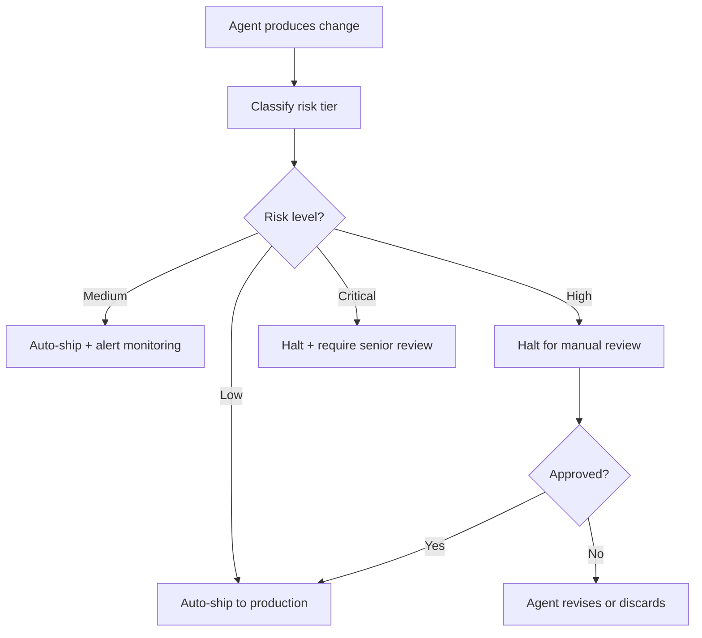

# Risk-Based Shipping: Review by Risk Matrix, Not by Default

> Use a risk matrix to decide which agent-generated changes auto-ship and which require manual review — graduated oversight replaces blanket review or blanket trust.

## The Problem with Blanket Review

Two common defaults in agent-driven pipelines:

- **Review everything** — every agent change gets manual review. Safe, but slow. The human becomes the bottleneck, and review fatigue degrades quality over time.
- **Trust everything** — agent changes ship without review. Fast, but one bad change reaches production unchecked.

Neither scales. Teams that review everything abandon the workflow when the volume exceeds their review capacity. Teams that trust everything learn the hard way when an agent introduces a breaking change.

## The Risk Matrix

Risk-based shipping assigns each change type a risk tier. The tier determines whether the change auto-ships or requires manual review.

| Change Type | Risk Tier | Action |
|------------|-----------|--------|
| Content/copy edits | Low | Auto-ship |
| UI layout changes | Low | Auto-ship |
| Application logic (non-auth) | Medium | Auto-ship with monitoring |
| API endpoint changes | Medium | Auto-ship with monitoring |
| Database schema migrations | High | Halt for manual review |
| Authentication/authorization changes | High | Halt for manual review |
| Dependency updates (major version) | High | Halt for manual review |
| Infrastructure/deployment config | Critical | Halt for manual review |

The matrix is project-specific. A content site might auto-ship everything except deployment config. A payments platform might halt for review on any logic change.

## Classification Approaches

The agent harness needs to classify each change before deciding how to ship it. Three approaches:

**File-path heuristics** — map file paths to risk tiers. Changes to `auth/`, `migrations/`, or `infrastructure/` are high risk. Changes to `content/`, `docs/`, or `styles/` are low risk. Simple, deterministic, easy to audit.

**Diff analysis** — analyze the diff content. Schema alterations, permission changes, or new environment variables signal higher risk. More accurate than path heuristics but requires parsing logic.

**Agent self-classification** — ask the coding agent to classify its own change risk. Cheap and context-aware, but the agent may underestimate risk. Use as a signal combined with heuristics, not as the sole classifier.

## On the Loop, Not In the Loop

Risk-based shipping changes the developer's supervision mode. Instead of reviewing every change (in the loop), the developer monitors the stream of shipped changes and intervenes when something looks wrong (on the loop).

Geoffrey Huntley describes this supervision model ([source](https://x.com/GeoffreyHuntley/status/2030683143360119292)): "When I want something built, I just open up my phone and watch the output get made. I'm supervising it. I'm on the loop, not in the loop."

This connects to [human-in-the-loop placement](../workflows/human-in-the-loop.md) — the risk matrix determines *where* the gates go, and the supervision mode determines *how* the human engages.

## Implementation

A minimal risk-based shipping pipeline:



## Example

A Python classifier maps file paths to risk tiers before a CI step decides whether to auto-merge or halt for review:

```python
import re

RISK_TIERS = {
    "critical": [r"^infra/", r"^\.github/workflows/", r"^deploy/"],
    "high":     [r"^auth/", r"migrations/", r"^db/schema"],
    "medium":   [r"^api/", r"^src/.*\.(ts|py)$"],
    "low":      [r"^content/", r"^docs/", r"^styles/", r"\.md$"],
}

def classify(changed_files: list[str]) -> str:
    """Return the highest risk tier across all changed files."""
    tier_order = ["critical", "high", "medium", "low"]
    result = "low"
    for path in changed_files:
        for tier in tier_order:
            if any(re.match(pat, path) for pat in RISK_TIERS[tier]):
                if tier_order.index(tier) < tier_order.index(result):
                    result = tier
                break
    return result

# In CI (e.g., GitHub Actions):
# tier = classify(changed_files)
# if tier in ("critical", "high"):
#     sys.exit(1)  # halt — requires manual approval
# else:
#     subprocess.run(["gh", "pr", "merge", "--auto", "--squash"])
```

The classifier returns the most severe tier across all changed files. The CI step auto-merges on `low`/`medium` and exits non-zero on `high`/`critical`, blocking the merge until a reviewer approves.

## Relationship to Existing Patterns

Risk-based shipping connects to several established patterns:

- **[Circuit breakers](../observability/circuit-breakers.md)** — if auto-shipped changes trigger errors above a threshold, halt all auto-shipping until the issue is resolved
- **[Blast radius containment](../security/blast-radius-containment.md)** — limit what any single auto-shipped change can affect (e.g. feature flags, canary deployments)
- **[Diff-based review](../code-review/diff-based-review.md)** — when manual review is triggered, review the diff, not the full output
- **[Deterministic guardrails](deterministic-guardrails.md)** — automated checks (tests, linting, type checking) run on all tiers, not just high-risk ones

## Key Takeaways

- Assign each change type a risk tier; let the tier determine whether it auto-ships or halts for review
- File-path heuristics are the simplest classifier; combine with diff analysis for accuracy
- Low-risk changes (content, styling) auto-ship; high-risk changes (schema, auth, infra) halt for review
- The developer supervises the output stream (on the loop) rather than approving each change (in the loop)
- Complement with circuit breakers and blast radius containment to limit damage from auto-shipped errors

## Related

- [Human-in-the-Loop Placement](../workflows/human-in-the-loop.md)
- [Risk-Based Task Sizing](risk-based-task-sizing.md)
- [Diff-Based Review](../code-review/diff-based-review.md)
- [Deterministic Guardrails](deterministic-guardrails.md)
- [Circuit Breakers](../observability/circuit-breakers.md)
- [Blast Radius Containment](../security/blast-radius-containment.md)
