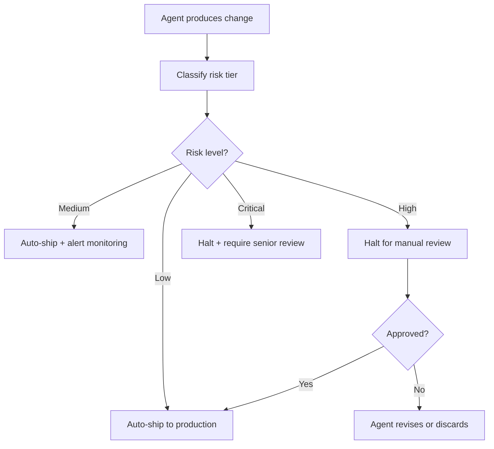

# Risk-Based Shipping: Review by Risk Matrix, Not by Default

> Use a risk matrix to decide which agent-generated changes auto-ship and which require manual review — graduated oversight replaces blanket review or blanket trust.

## The problem with blanket review

Agent-driven pipelines tend to fall into one of two defaults:

- Review everything — every agent change gets manual review. Safe, but slow. Review quality is tied to coverage and reviewer participation ([McIntosh et al. 2016](https://link.springer.com/article/10.1007/s10664-015-9381-9)). As changeset volume grows, both decline.
- Trust everything — agent changes ship without review ([trust without verify](../anti-patterns/trust-without-verify.md)). Fast, but one bad change reaches production unchecked.

Neither default scales. Review-everything teams drop the workflow when volume exceeds capacity. Trust-everything teams learn the hard way when an agent ships a breaking change.

## The risk matrix

Risk-based shipping assigns each change type a tier, the same tiering logic [risk-based task sizing](risk-based-task-sizing.md) applies to verification depth. The tier decides whether the change auto-ships or needs manual review.

| Change Type | Risk Tier | Action |
|------------|-----------|--------|
| Content/copy edits | `low` | Auto-ship |
| UI layout changes | `low` | Auto-ship |
| Application logic (non-auth) | `medium` | Auto-ship with monitoring |
| API endpoint changes | `medium` | Auto-ship with monitoring |
| Database schema migrations | `high` | Halt for manual review |
| Authentication/authorization changes | `high` | Halt for manual review |
| Dependency updates (major version) | `high` | Halt for manual review |
| Infrastructure/deployment config | `critical` | Halt for manual review |

The matrix is project-specific. A content site might auto-ship everything except deployment config; a payments platform might halt on any logic change. Stripe's "Minions" agents apply a related tier philosophy — local lint, selective CI on only tests relevant to the diff, and a hard cap of two self-healing CI rounds before surfacing to a human — to merge 1,000+ PRs per week unattended ([Stripe Engineering, 2026](https://stripe.dev/blog/minions-stripes-one-shot-end-to-end-coding-agents)).

## Classification approaches

The harness classifies each change before shipping it. There are three approaches.

File-path heuristics map paths to tiers. `auth/`, `migrations/`, and `infrastructure/` are high risk; `content/`, `docs/`, and `styles/` are low. This is simple, deterministic, and auditable.

Diff analysis parses the diff itself. Schema alterations, permission changes, or new environment variables signal higher risk. This is more accurate than paths, but it needs parsing logic — the same diff inspection [diff-based review](../code-review/diff-based-review.md) relies on.

Agent self-classification asks the agent to tier its own change. This is cheap and context-aware, but the agent may underestimate risk. Use it as a signal alongside heuristics, not as the sole classifier.

## When this backfires

The matrix is only as safe as its classifier. Some conditions flip the pattern net-negative:

- Misclassified diffs slip through — a change that touches `auth/` via an indirect import, or a schema-adjacent change in `api/`, gets tagged medium. Path heuristics are blind to dependency graphs.
- Cross-cutting interactions — two low-risk edits combine into a broken state, or a string change breaks a downstream parser. Per-diff tiering misses defects in the interaction.
- Monitoring decays — if the medium-tier alert channel is noisy or on-call ignores it, "auto-ship with monitoring" collapses into "auto-ship". Pair it with [circuit breakers](../observability/circuit-breakers.md) so error spikes halt shipping automatically.
- Tier-boundary gaming — an agent that learns schema changes block auto-merge may split one logical change into two diffs that each stay under the threshold.
- Small teams in high-consequence domains — on a two-engineer team in a regulated codebase (medical, financial, safety-critical), blanket-review overhead is tolerable. One bad auto-shipped change dwarfs the throughput gain.

Use the matrix when volume is the bottleneck and a misclassification is recoverable, not catastrophic.

## On the loop, not in the loop

Risk-based shipping changes the supervision mode. Instead of reviewing every change (in the loop), you monitor the shipped stream and step in when something looks wrong (on the loop). Geoffrey Huntley puts it this way: "I just open up my phone and watch the output get made. I'm on the loop, not in the loop" ([source](https://x.com/GeoffreyHuntley/status/2030683143360119292)). See [humans and agents in software engineering loops](../workflows/humans-agents-development-loops.md) for the full in/on/out framework.

This connects to [human-in-the-loop placement](../workflows/human-in-the-loop.md). The matrix decides where the gates go; the supervision mode decides how the human engages.

## Implementation

A minimal pipeline:


```mermaid
graph TD
    A[Agent produces change] --> B[Classify risk tier]
    B --> C{Risk level?}
    C -->|Low| D[Auto-ship to production]
    C -->|Medium| E[Auto-ship + alert monitoring]
    C -->|High| F[Halt for manual review]
    C -->|Critical| G[Halt + require senior review]
    F --> H{Approved?}
    H -->|Yes| D
    H -->|No| I[Agent revises or discards]
```

## Example

A Python classifier maps file paths to risk tiers before a CI step decides whether to auto-merge or halt for review:

```python
import re

RISK_TIERS = {
    "critical": [r"^infra/", r"^\.github/workflows/", r"^deploy/"],
    "high":     [r"^auth/", r"migrations/", r"^db/schema"],
    "medium":   [r"^api/", r"^src/.*\.(ts|py)$"],
    "low":      [r"^content/", r"^docs/", r"^styles/", r"\.md$"],
}

def classify(changed_files: list[str]) -> str:
    """Return the highest risk tier across all changed files."""
    tier_order = ["critical", "high", "medium", "low"]
    result = "low"
    for path in changed_files:
        for tier in tier_order:
            if any(re.match(pat, path) for pat in RISK_TIERS[tier]):
                if tier_order.index(tier) < tier_order.index(result):
                    result = tier
                break
    return result

# In CI (e.g., GitHub Actions):
# tier = classify(changed_files)
# if tier in ("critical", "high"):
#     sys.exit(1)  # halt — requires manual approval
# else:
#     subprocess.run(["gh", "pr", "merge", "--auto", "--squash"])
```

The classifier returns the most severe tier across all changed files. CI auto-merges on `low`/`medium` and exits non-zero on `high`/`critical`, blocking the merge until a reviewer approves.

## Relationship to existing patterns

- [Circuit breakers](../observability/circuit-breakers.md) — if auto-shipped changes trigger errors above a threshold, halt auto-shipping until resolved
- [Blast radius containment](../security/blast-radius-containment.md) — limit what any single auto-shipped change can affect (feature flags, canary deploys)
- [Diff-based review](../code-review/diff-based-review.md) — when manual review is triggered, review the diff, not the full output
- [Deterministic guardrails](deterministic-guardrails.md) — automated checks run on all tiers, not only high-risk ones

## Key Takeaways

- Assign each change type a risk tier; let the tier determine whether it auto-ships or halts for review
- File-path heuristics are the simplest classifier; combine with diff analysis for accuracy
- Low-risk changes (content, styling) auto-ship; high-risk changes (schema, auth, infra) halt for review
- The developer supervises the output stream (on the loop) rather than approving each change (in the loop)
- Complement with circuit breakers and blast radius containment to limit damage from auto-shipped errors

## Related

- [Human-in-the-Loop Placement](../workflows/human-in-the-loop.md)
- [Risk-Based Task Sizing](risk-based-task-sizing.md)
- [Diff-Based Review](../code-review/diff-based-review.md)
- [Deterministic Guardrails](deterministic-guardrails.md)
- [Circuit Breakers](../observability/circuit-breakers.md)
- [Blast Radius Containment](../security/blast-radius-containment.md)
