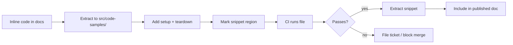

# Runnable Documentation

> Convert inline code examples into standalone files that CI executes on every build — catching doc rot with the same signals that catch broken code, and cutting stale-context failures in agents that retrieve docs via RAG.

## The Mechanism

Every inline code example is a hidden assertion that the API works as shown — only checked when a reader copies the snippet and finds it broken. Runnable documentation promotes that assertion to a test.

The pipeline has four steps ([LangChain: How We Made Our Docs Test Themselves](https://blog.langchain.com/our-docs-test-themselves/)):

1. **Extract** inline snippets into standalone source files with setup and teardown that make them executable
2. **Mark** the documentation-visible region with snippet delineators (for example, Bluehawk's `:snippet-start:` / `:snippet-end:` with `:remove-start:` / `:remove-end:` for test-only code)
3. **Inject** the extracted snippet back into the published doc via an include mechanism (Mintlify snippets, MDX partials, reStructuredText includes)
4. **Run** the source files in CI and file a ticket when a run fails

"The same principle that applies to application code — automate checks, catch changes and regressions, fail the build when something breaks — applies to docs: treat code samples as code that must pass tests" ([LangChain](https://blog.langchain.com/our-docs-test-themselves/)).

## Prior Art

The pattern predates agents. Python's `doctest` "searches for pieces of text that look like interactive Python sessions, and then executes those sessions to verify that they work exactly as shown" ([Python docs](https://docs.python.org/3/library/doctest.html)). `sphinx.ext.doctest` runs code blocks embedded in reStructuredText ([Sphinx docs](https://www.sphinx-doc.org/en/master/usage/extensions/doctest.html)); `pytest --doctest-glob` applies the same mechanism to arbitrary text files ([pytest docs](https://docs.pytest.org/en/stable/how-to/doctest.html)).

Doctest-style tools cover single-expression examples and short REPL transcripts. They do not cover multi-step flows that spin up clients, call tools, and assert on structured output. The agent-era shift is making the extract-and-test pipeline worth the setup cost for those longer examples — because agents that retrieve docs as context inherit every stale snippet.

## Why This Matters for Agents

Agents that retrieve docs over RAG pull whatever the retriever scores highest. A stale doc that semantically matches the query still scores near the top — relevance grading does not detect staleness ([kapa.ai: RAG Gone Wrong](https://www.kapa.ai/blog/rag-gone-wrong-the-7-most-common-mistakes-and-how-to-avoid-them)). The agent then generates code from the stale snippet.

Runnable documentation is the upstream fix: the stale snippet never ships, because CI fails the build when its source file stops running. It complements [continuous documentation](../workflows/continuous-documentation.md) — agent-driven drift detection — by preventing drift from accumulating between audit runs.

## Pipeline



Extraction is the expensive step. LangChain offloaded it to a `docs-code-samples` Deep Agents skill that moves inline code, adds setup and teardown, inserts delineators, runs the tests, and wires up the include ([SKILL.md](https://github.com/langchain-ai/docs/blob/main/.deepagents/skills/docs-code-samples/SKILL.md)). The upfront cost is the reason most teams skip this pattern: "setting up code samples to be testable is not trivial and requires some upfront investment. This setup cost can feel so daunting that the project never happens" ([LangChain](https://blog.langchain.com/our-docs-test-themselves/)). Agent-assisted migration is how teams adopt the pattern across an existing doc set.

## CI Integration

Two trigger patterns cover the update cadence:

- **Push trigger on source or doc change** — run the affected sample immediately so broken snippets cannot reach `main`. Narrow scope, fast feedback
- **Scheduled trigger (daily or weekly)** — run the full suite to catch breakage from upstream dependency updates, model-API deprecations, or third-party endpoint changes that do not correspond to a commit in this repo

A failed scheduled run should open an issue tagged for the docs team, not silently fail a CI badge. This keeps the cost of drift visible.

## Example

Concrete LangChain structure from the published skill ([SKILL.md](https://github.com/langchain-ai/docs/blob/main/.deepagents/skills/docs-code-samples/SKILL.md)):

```python
# src/code-samples/langchain/return-a-string.py
# :snippet-start: tool-return-values-py
from langchain.tools import tool

@tool
def get_weather(city: str) -> str:
    """Get weather for a city."""
    return f"It is currently sunny in {city}."
# :snippet-end:

# :remove-start:
if __name__ == "__main__":
    result = get_weather.invoke({"city": "San Francisco"})
    assert result == "It is currently sunny in San Francisco."
    print("Tool works as expected")
# :remove-end:
```

The file runs as a real Python script in CI via `make test-code-samples`. Bluehawk strips the `:remove-start:` / `:remove-end:` block when extracting the snippet, so the published doc shows only the tool definition. The assertion guarantees the snippet's visible behaviour matches what the docs claim.

## When This Backfires

The pattern is not universally net-positive. It degrades or inverts in several conditions:

- **Small doc surface with rare API changes** — the extraction, delineator, and CI cost exceeds the drift it catches. Direct edits and a manual smoke-test pass before release win on total cost
- **Non-executable content** — style guides, architectural narratives, and decision records have no code to assert against. Forcing every page through the pipeline produces zero test signal and real maintenance cost
- **Environment-dependent examples** — snippets that need real API keys, paid third-party services, or production data either fail in CI without mocks (constant noise) or use mocks that themselves drift (the stale-docs problem relocated one layer out)
- **Long-running or streaming flows** — multi-minute agent runs, streaming responses, and human-in-the-loop examples are expensive to exercise on every push. The test cadence falls behind the change cadence and the signal decays
- **Prose that paraphrases output** — when the doc text describes behaviour rather than quoting exact output, equality assertions are brittle. Assertion churn fatigues reviewers, who start rubber-stamping, which recreates the failure the pattern was meant to prevent

Tested docs do not guarantee freshness at the retrieval layer — a RAG system indexing last week's version still returns last week's example. Runnable documentation fixes the upstream source; cache invalidation and embedding refresh are separate problems ([kapa.ai: RAG Gone Wrong](https://www.kapa.ai/blog/rag-gone-wrong-the-7-most-common-mistakes-and-how-to-avoid-them)).

## Key Takeaways

- Every inline code example is an implicit assertion — runnable documentation promotes it to a CI-enforced one
- The pipeline is extract, mark, inject, run; the expensive step is extraction, which is a good fit for agent-assisted migration
- Prior art (doctest, sphinx-doctest, pytest doctest) covers single-expression examples; the agent-era extension covers multi-step tool-using examples
- Stale docs feed agent RAG pipelines the wrong context; upstream testing closes that failure mode before retrieval indexes the broken snippet
- Skip the pattern when the doc surface is small, examples are non-executable, or test runtime outpaces the change cadence

## Related

- [Continuous Documentation](../workflows/continuous-documentation.md) — agent-driven drift detection that complements upstream snippet testing
- [Pre-Completion Checklists](pre-completion-checklists.md) — another pattern that promotes implicit assertions to explicit verification gates
- [Deterministic Guardrails Around Probabilistic Agents](deterministic-guardrails.md) — hard CI checks as the enforcement layer for agent output
- [Test Harness Design for LLM Context Windows](llm-context-test-harness.md) — keeping test output useful when agents consume it as context
