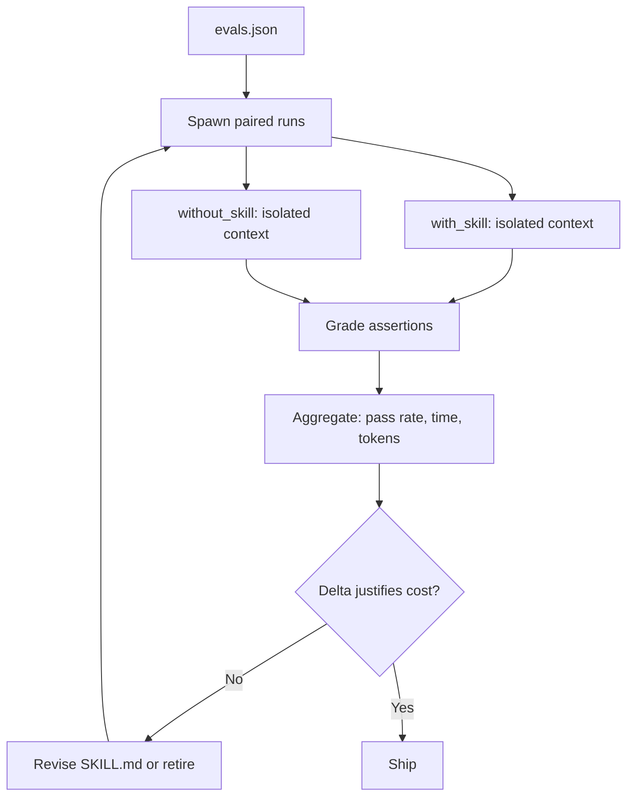

# Skill Evals

> Treat each skill as an evaluable unit: a small labelled dataset, explicit assertions, paired with-skill and baseline runs, and a benchmark that quantifies pass-rate, time, and token trade-offs.

Skills are edited far more often than the agent harness, yet most teams have no objective signal that a skill still works after an edit, a description tweak, or a model upgrade. Eval discipline applied to the skill itself closes that gap. [Source: [Improving skill-creator](https://claude.com/blog/improving-skill-creator-test-measure-and-refine-agent-skills)]

## Two Failure Axes

Skills fail on two axes that require separate evals: [Source: [Improving skill-creator](https://claude.com/blog/improving-skill-creator-test-measure-and-refine-agent-skills)]

- **Output quality** — does the skill produce the right result when loaded?
- **Trigger precision** — does the description activate the skill on the prompts it should, and stay dormant on the prompts it should not?

Output-only evals leave trigger failures invisible; trigger-only evals leave silent output regressions unreported.

## Dataset Shape

A skill eval dataset is small, hand-labelled, and version-controlled alongside `SKILL.md`. The agentskills.io spec stores test cases in `evals/evals.json` next to the skill. Each case has a **prompt** (realistic user message with concrete paths, columns, and context), an **expected output** description, optional **input files**, and **assertions** — verifiable statements about what the output must contain. [Source: [Evaluating skill output quality](https://agentskills.io/skill-creation/evaluating-skills)]

Start with 2-3 cases. Add assertions after the first run — defining "good" before seeing what the skill produces leads to weak checks. Assertions must be specific and observable: `"The output file is valid JSON"` and `"The chart has labeled axes"` discriminate; `"The output is good"` does not. Brittle exact-phrase checks fail on correct outputs that use different wording. [Source: [Evaluating skill output quality](https://agentskills.io/skill-creation/evaluating-skills)]

## Runner Shape

Each test case runs twice per iteration: **with the skill** and **without it** (or against the previous version). Runs execute in isolated agent contexts so state from earlier cases does not bleed into later ones — sequential single-session evaluation introduces cross-run contamination that biases grading. [Source: [Improving skill-creator](https://claude.com/blog/improving-skill-creator-test-measure-and-refine-agent-skills)]

The benchmark records three metrics per configuration: pass rate, duration, token count. The **delta** between configurations quantifies what the skill costs and what it buys. A 13-second overhead for a 50-point pass-rate gain is a different trade-off than doubling token usage for a 2-point gain. [Source: [Evaluating skill output quality](https://agentskills.io/skill-creation/evaluating-skills)]

## Model Upgrade Strategy

Skills split into two categories that upgrade differently: [Source: [Improving skill-creator](https://claude.com/blog/improving-skill-creator-test-measure-and-refine-agent-skills)]

- **Capability uplift** — encodes techniques the base model cannot do consistently. On upgrades, run evals on raw and skill-augmented model. If raw matches or exceeds, retire the skill — the technique has been absorbed.
- **Encoded preference** — sequences capabilities according to team workflows. Durable across model generations because the model cannot infer your process. Upgrade evals should verify workflow fidelity (step order, output format, required checks), not raw quality.

## Grading Pitfalls

**Same-model LLM-as-judge.** Grader agents sharing the target model inherit its biases and inflate pass rates on outputs the model itself would not critique. Prefer code-based assertions for mechanical checks (valid JSON, row counts, file existence) and human spot-checks for subjective quality. [Source: [Demystifying evals for AI agents](https://www.anthropic.com/engineering/demystifying-evals-for-ai-agents)]

**Blind A/B judging.** When comparing skill versions, sequential grading anchors the second version to the first. Present both outputs to a judge without labels so holistic qualities are scored free from which version "should" be better. [Source: [Improving skill-creator](https://claude.com/blog/improving-skill-creator-test-measure-and-refine-agent-skills)]

**Assertion patterns to fix each iteration:** [Source: [Evaluating skill output quality](https://agentskills.io/skill-creation/evaluating-skills)]

- Always pass in both configurations — not discriminating; remove
- Always fail in both — broken assertion or impossible task; fix before re-running
- Pass with skill, fail without — where the skill earns its cost
- High variance across runs — ambiguous instructions; add examples

## When Skill Evals Pay Off — and When They Do Not

Skill eval setup (dataset authoring, workspace plumbing, grading harness) amortises only across repeated use. Three conditions where it does not pay off:

- **Single-author, single-user skills** used a handful of times — harness cost exceeds runtime value; manual smoke checks suffice.
- **Highly subjective output** (writing style, visual design, taste) — pass/fail assertions force-fit creative judgment; a green benchmark tells you nothing. [Source: [Evaluating skill output quality](https://agentskills.io/skill-creation/evaluating-skills)]
- **Skills under active rewrite** — eval dataset and skill instructions co-evolve, so pass-rate changes mix skill improvement with dataset drift.

Evals pay off when the skill ships to multiple users, its value is capability uplift at risk of model obsolescence, or it is load-bearing enough that a silent regression is expensive.

## Example

A CSV-analysis skill gets an `evals/evals.json` with two cases — a "top 3 months by revenue" chart and a "clean missing emails" transform — each with input files, an expected output description, and four specific assertions. The first run with no assertions produces `outputs/` directories paired per case; after review, assertions like `"The chart shows exactly 3 months"` and `"Both axes are labeled"` are added. A benchmark across both cases and both configurations reports `with_skill` pass rate 0.83 vs `without_skill` 0.33 — a 50-point delta at 13 seconds and 1,700 tokens of overhead, making the skill's cost-benefit explicit before shipping. [Source: [Evaluating skill output quality](https://agentskills.io/skill-creation/evaluating-skills)]

## Key Takeaways

- Evaluate skills on two axes — output quality and trigger precision — each with its own dataset
- Store `evals/evals.json` with the skill; start with 2-3 cases and add assertions after the first run
- Run with-skill and baseline in isolated parallel contexts to prevent cross-run contamination
- Use code-based assertions for mechanical checks and blind A/B judging for subjective comparison
- Split skills into capability uplift (retire if the model catches up) and encoded preference (check workflow fidelity) for model-upgrade evals
- Skip evals for single-user, subjective, or mid-rewrite skills — harness cost exceeds the signal

## Related

- [Skill Eval Loop](../tools/claude/skill-eval-loop.md) — Claude-specific implementation using skill-creator
- [Skill Authoring Patterns](../tool-engineering/skill-authoring-patterns.md) — description craft and authoring context
- [The Eval-First Development Loop](../training/eval-driven-development/eval-first-loop.md) — general eval-first workflow
- [Eval-Driven Development for Agent Tools](../workflows/eval-driven-tool-development.md) — tool-level parallel to the skill-level loop
- [Agent Skills Standard](../standards/agent-skills-standard.md) — the portable skill format this technique applies to
