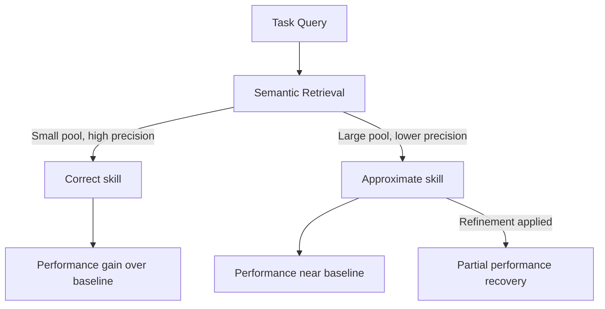

# Skill Retrieval Realism Gap

> Benchmark results for skill-augmented agents overstate real-world gains. Performance degrades systematically as retrieval conditions become realistic, approaching the no-skill baseline at scale.

## The Benchmarking Problem

Studies of skill-augmented agents — those that retrieve domain-specific knowledge artifacts before acting — typically evaluate under idealized conditions: one hand-crafted skill is provided per task, skill quality is perfect, and the collection is small. In practice, agents retrieve from pools of thousands of skills using semantic search, and retrieval precision falls as pool size grows.

A study benchmarking LLM skill usage across [34,000 real-world skills](https://arxiv.org/abs/2604.04323) systematically varied three axes of realism:

1. **Skill relevance** — from perfectly matched to approximate or noisy
2. **Collection size** — from small curated sets to the full 34k pool
3. **Selection method** — from oracle selection to automatic retrieval

Performance degraded consistently along each axis. When all three combined — approximate relevance, large collection, automatic retrieval — gains over the no-skill baseline effectively disappeared. Teams that adopt skills based on idealized benchmark results will find real-world performance significantly lower.

## The Retrieval Tax

As the skill pool grows, retrieval precision falls even with state-of-the-art embedding-based retrieval. The agent receives a skill that partially overlaps with the task rather than one designed for it. A skill written for "deploying a Python Flask app to AWS ECS" retrieved for a "deploy a FastAPI service to AWS ECS" query contains correct structural knowledge but wrong specifics — environment variables, container definitions, health check paths. The agent uses it anyway, applying the wrong details with misplaced confidence.

The degradation is not gradual: precision drops faster than pool size grows because the density of near-duplicates and misleading near-matches increases with scale.

## Query-Specific Skill Refinement

When the initially retrieved skill is relevantly related but not precisely matched, refining it to the specific query before injecting it into context recovers a substantial portion of the performance lost to retrieval imprecision. [Source: [arxiv.org/abs/2604.04323](https://arxiv.org/abs/2604.04323)]

The technique prompts the agent (or a separate refinement step) to adapt the retrieved skill to the actual query — stripping irrelevant sections, substituting correct specifics, and surfacing the relevant portions — before the main agent uses it. The result is a task-specific skill synthesized from a general retrieved one. [unverified — implementation details would be in the paper]

Validation on Terminal-Bench 2.0 showed Claude Opus 4.6 pass rate improving from 57.7% to 65.5% when query-specific refinement was applied, confirming the technique transfers to real agentic task settings beyond the study's primary benchmarks. [Source: [arxiv.org/abs/2604.04323](https://arxiv.org/abs/2604.04323)]

**The technique has a floor**: refinement cannot recover performance when retrieval quality is very poor. If the retrieved skill is unrelated to the query, there is nothing to refine. Retrieval quality sets the ceiling; refinement works within that ceiling.

## When to Apply Refinement

| Retrieval situation | Action |
|---------------------|--------|
| High-precision retrieval (small, curated pool) | Inject skill directly — refinement adds latency without benefit |
| Moderate-precision retrieval (large pool, on-topic result) | Apply query-specific refinement before injection |
| Low-precision retrieval (irrelevant result) | Do not inject — use no-skill baseline or improve retrieval |

The threshold between "moderate" and "low" precision is task-dependent. A practical check: if the retrieved skill's title and first paragraph are relevant to the query, refinement is worth applying. If neither is relevant, skip.

## Practical Implications

**Re-evaluate skill libraries against realistic retrieval.** If your eval suite provides one curated skill per test task, you are measuring an upper bound, not expected production performance. Re-run evals with retrieval from the full collection to get an honest number.

**Measure retrieval precision independently.** Track what fraction of retrievals are "good enough to refine" vs. "irrelevant." This metric predicts where you will recover with refinement and where you will not.

**Apply refinement as a preprocessing step.** For Claude Code sub-agents, this means a dedicated refinement agent or prompt stage that adapts the retrieved `.md` skill file to the current task before the main agent runs. The refinement step is short — it operates on the skill text, not the full codebase.

**Treat skill collection size as a retrieval cost.** Larger skill collections require better retrieval to deliver the same precision. A 500-skill collection with 90% retrieval precision outperforms a 5,000-skill collection with 60% retrieval precision for most tasks.

## Example

The paper's Terminal-Bench 2.0 result illustrates both the degradation and the recovery. Without skills, Claude Opus 4.6 passes 57.7% of terminal tasks. Adding skills under idealized conditions raises this; under realistic retrieval from the 34k skill pool, gains erode toward the baseline. Applying query-specific refinement on top of realistic retrieval raises the pass rate to 65.5% — a 7.8 percentage-point gain over baseline that survives realistic retrieval conditions. [Source: [arxiv.org/abs/2604.04323](https://arxiv.org/abs/2604.04323)]

The pattern this demonstrates: idealized eval gains disappear in production retrieval, but refinement recovers a substantial portion. The technique is most valuable precisely where large skill collections are deployed — the setting where the retrieval tax is highest.

## Key Takeaways

- Skill-augmented agent benchmarks under idealized conditions overstate production gains — performance degrades systematically with realistic retrieval
- The three axes of realism (relevance, collection size, selection method) each degrade performance independently and compound together
- Query-specific skill refinement recovers a substantial portion of the precision loss when initial retrieval is relevantly related but not precisely matched
- Terminal-Bench 2.0 showed a 7.8 percentage-point improvement (57.7% → 65.5%) with refinement applied to Claude Opus 4.6
- Refinement has a floor — it cannot recover performance when the retrieved skill is unrelated to the query

## Related

- [Benchmark Contamination as Eval Risk](benchmark-contamination-eval-risk.md) — idealized eval conditions inflate scores in coding agent benchmarks by a similar mechanism
- [Benchmark-Driven Tool Selection for Code Generation](benchmark-driven-tool-selection.md) — use realistic, telemetry-derived benchmarks rather than synthetic setups
- [Grade Agent Outcomes, Not Execution Paths](grade-agent-outcomes.md) — measure final task success to detect skill retrieval failures that do not show in trajectory logs
- [pass@k and pass^k Metrics](pass-at-k-metrics.md) — report consistency across trials to surface flakiness introduced by variable retrieval quality

## Unverified Claims

- The 34,000-skill collection was drawn from real-world skill repositories; the exact provenance is stated as "real-world skills" in the paper but the specific source is not detailed in the abstract [unverified]
- The query-specific refinement implementation involves prompting an LLM to adapt the retrieved skill text to the query before injection; the exact prompt format is in the paper [unverified]
