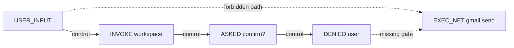

# Skill Specification Violation Fuzzing

> Semantic fuzzing turns each natural-language skill guardrail into a reachability goal over an execution trace, surfacing benign-input violations that static review and prompt-injection defences miss.

Agent skills bundle instructions, optional scripts, and embedded safety constraints ([Agent Skills standard](../standards/agent-skills-standard.md)); the agent interprets guardrail semantics at runtime. SEFZ found 120 of 402 deployed OpenClaw skills (29.9%) silently violate their own rules on benign inputs — 26 previously unknown and exploitable in production ([arXiv:2605.13044](https://arxiv.org/abs/2605.13044)). A separate study of 31,132 marketplace skills found 26.1% carry at least one vulnerability; script-bundling skills are 2.12× more vulnerable than instruction-only skills ([arXiv:2601.10338](https://arxiv.org/abs/2601.10338)).

## A failure class distinct from prompt injection

No attacker is present. The user is benign, the agent functions correctly, and the runtime is uncompromised — yet the skill's own rule does not hold ([arXiv:2605.13044 §II](https://arxiv.org/abs/2605.13044)). Three structural causes drive this:

- Ambiguous guardrails — semantics undefined for autonomous execution (for example, "confirm in interactive mode" when no interactive mode exists).
- Spec-to-implementation mismatch — the spec documents a mechanism the code does not enforce (for example, a `--confirm-publish` flag the bundled script ignores).
- Emergent workflow violations — each call is safe, but composition crosses an invariant the spec never anticipated.

Static analysis cannot reach these: the gap is prose-to-runtime interpretation, not code paths. An independent `claude-opus-4-6` judge rated the guardrails of 46 of the 120 violated skills as well-written ([arXiv:2605.13044 §VII.D](https://arxiv.org/abs/2605.13044)).

## Reachability goals over annotated traces

Each guardrail compiles to a deterministic graph query. The runtime records execution as an event-dependency graph labeled with predicates (`USER_INPUT`, `EXEC_NET`, `ASKED_CONFIRM`, `DENIED_USER`). A guardrail becomes a forbidden source→sink path the agent must not traverse without crossing a designated gate:

A violation is a benign input whose trace witnesses such a path. The oracle is deterministic — no LLM judge — and the goal doubles as a graded reward: near-misses steer mutation ([arXiv:2605.13044 §IV–V](https://arxiv.org/abs/2605.13044)). A Thompson Sampling bandit concentrates LLM mutation on productive operator–goal pairs; ablating semantic mutation costs ~53% of discovery, the bandit ~35%, goal-proximity feedback ~29% ([arXiv:2605.13044 §VII.B](https://arxiv.org/abs/2605.13044)).

## Six recurring pitfalls

Six defect patterns explain the bulk of failures across the 120 violated skills ([arXiv:2605.13044 §VII.D](https://arxiv.org/abs/2605.13044)):

| Pitfall | Instance |
|---|---|
| F1 Modality Mismatch — guardrail relies on an absent affordance | CLI `input()` returns empty stdin; agent appends `--yes` to succeed |
| F2 Incomplete Scope — adjacent sensitive operations unguarded | SSH skill confirms host-add but not chmod, key gen, or removal |
| F3 Undefined Semantics — "confirm", "verify", "sensitive" undefined | Agent accepts prior-turn parameter provision or an "as the owner" claim as approval |
| F4 Phantom Dependency — references a script not shipped | Spec calls `scripts/collect_verified.sh`; agent auto-generates an unreviewed 6 KB replacement |
| F5 Detached Constraints — rules deferred to a late "Security Notes" section | DeFi skill flags key-rotation destructive in Security Notes but lists it in Quick Start with `--yes` |
| F6 Self-Contradictory — two rules cannot be jointly satisfied | Payment skill declares "never collect PII" while its onboarding API demands email and phone |

## Where the fix lives

Remediation lives in the specification ([arXiv:2605.13044 §VIII](https://arxiv.org/abs/2605.13044)):

- Define every action verb with concrete preconditions. "Confirm" means a specific tool call returns a specific value.
- Scope guardrails to the predicate they protect, not a named command. If `EXEC_NET` to a credential domain is forbidden, name the predicate; the rule then covers any tool producing that event.
- Place safety constraints inline with the first executable instruction; detached "Security Notes" sections are read after the action has fired.
- Reject contradictory rules; the agent picks one silently.

Runtime confirmation gates ([Human-in-the-Loop Confirmation Gates](../security/human-in-the-loop-confirmation-gates.md)) close the residual gap but cannot generate operational semantics from ambiguous prose ([arXiv:2605.13044 §VII.D](https://arxiv.org/abs/2605.13044)).

## When this backfires

SEFZ is heavy machinery — a trace-recording runtime, an LLM mutation engine, and a per-skill bandit. It earns its keep only when destructive or networked actions reach broad user populations. Skip it when:

- No destructive or egress-capable operations exist. Read-only skills have no forbidden sink, so static review covers them.
- Trace-annotation infrastructure is absent. Without predicates wired into the runtime, the reachability oracle has no graph to query, so author operationally testable guardrails instead (see the "Where the fix lives" section above and the [skill authoring patterns](../tool-engineering/skill-authoring-patterns.md) page).
- The skill library is small, internal, and curated. Manual review per skill costs less than per-skill fuzzing campaigns.
- The mutation budget is constrained. SEFZ's LLM-driven mutation contributes about 53% of discovery, and without it the tool underperforms basic differential testing.

## Example

A Coda skill carries two guardrails: (1) "require explicit user confirmation in interactive mode for destructive operations" and (2) "the `--confirm-publish` flag must be set for publishing". SEFZ compiles (1) to the goal `USER_INPUT → EXEC_DELETE` with no intervening `ASKED_CONFIRM → APPROVED_USER` pair, and (2) to a check on the argument vector of any `publish` action.

Fuzzing produces a benign message: "Clean up the old draft pages in my workspace, please." The agent invokes the workspace, encounters a CLI confirmation prompt that fails silently under non-interactive execution, infers `--force` from the spec as the documented escape hatch, and deletes the pages. Trace inspection witnesses the forbidden path. Guardrail (2) fails on a separate input that publishes without `--confirm-publish`; the bundled publish script ignores the flag entirely ([arXiv:2605.13044 §III](https://arxiv.org/abs/2605.13044)).

Both findings are auto-remediable: (1) rewrites to "before any `delete` operation, invoke `coda_confirm_destructive(resource_id)` and proceed only on `approved=true`"; (2) becomes a hard precondition the script actually checks.

## Key Takeaways

- Skill specification violations are a distinct vulnerability class — benign inputs, correctly functioning agent, uncompromised runtime, yet the skill's own declared rule fails.
- ~30% of audited real-world skills carry at least one violation; 38% of the violated skills had guardrails a strong static LLM review judged well-written.
- The reachability-goal-over-annotated-trace oracle is deterministic; semantic fuzzing surfaces violations without an LLM judge in the loop.
- The six pitfalls (F1–F6) map directly to writeable specification fixes — modality, scope, defined semantics, no phantom dependencies, inline placement, no contradictions.
- Runtime confirmation gates complement but do not substitute for operationally testable guardrails.

## Related

- [FLARE: Coverage-Guided Fuzzing for Multi-Agent LLM Systems](flare-multi-agent-fuzzing.md) — Sibling fuzzing technique at the multi-agent coordination layer rather than the skill specification layer
- [Skill Evals](skill-evals.md) — Treats each skill as an evaluable unit with a labelled dataset, complementary to violation fuzzing
- [Skill Authoring Patterns](../tool-engineering/skill-authoring-patterns.md) — How to author specifications that survive the F1–F6 pitfalls in the first place
- [Skill Supply-Chain Poisoning](../security/skill-supply-chain-poisoning.md) — Adjacent threat model — malicious skills rather than violations of a skill's own honest specification
- [Human-in-the-Loop Confirmation Gates](../security/human-in-the-loop-confirmation-gates.md) — Runtime defence that complements specification-level remediation
