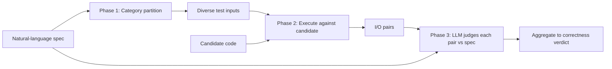

# Spec-Derived Execution as a Correctness Oracle

> Ground the spec-conformance oracle in real execution traces — judge `(input, output)` pairs against the spec, not the code itself.

Spec-derived execution judging is a post-hoc correctness oracle for code that already exists. The judge derives test inputs from the natural-language spec via category partitioning, executes them against the candidate, and scores each `(input, output)` pair against the spec; per-input scores aggregate into a code-level verdict ([Tambon & Papadakis, 2026](https://arxiv.org/abs/2605.29822)). It swaps the model's hardest task — simulating dynamic behaviour from static code — for its easiest: paraphrase-and-compare against a description.

## When to Reach For It

Use this oracle when **all four** hold:

- You have a candidate (an LLM sample, an agent-authored function, a refactor) and need a yes/no against the spec.
- A natural-language spec exists; tests do not.
- The candidate runs in isolation — no heavy setup, no service dependencies.
- A persistent test suite is not worth authoring (e.g., judging many candidates against one spec in an eval pipeline).

When a real test suite already exists, run the candidate against it instead — same execution evidence, durable assertions, no LLM in the verdict path.

## The Three-Phase Loop

**Phase 1 — Derive inputs from the spec.** The LLM partitions the spec into input categories (valid ranges, edge cases, error conditions) and emits concrete inputs covering each partition ([Tambon & Papadakis, 2026](https://arxiv.org/abs/2605.29822)). The candidate code is not visible here.

**Phase 2 — Execute.** The harness runs each input against the candidate and captures the output or exception — the only step touching the code, and the only deterministic one.

**Phase 3 — Judge I/O pairs against the spec.** The LLM receives each `(input, output)` pair plus the spec and answers whether the output is consistent with the spec for that input. Per-input scores aggregate into the code-level verdict ([Tambon & Papadakis, 2026](https://arxiv.org/abs/2605.29822)).

## Why It Works

When handed code and spec together, LLMs systematically over-correct correct implementations as non-conforming — and detailed prompting makes the misjudgment rate worse, not better ([Jin & Chen, ASE 2025](https://arxiv.org/abs/2508.12358); [Jin & Chen, 2026](https://arxiv.org/abs/2603.00539)). HoarePrompt — the prior static-reasoning baseline using strongest-postcondition calculus — opens with the observation that LLMs "are ineffective in this task" when judging code directly against a spec ([Bouras et al., 2025](https://arxiv.org/abs/2503.19599)).

Spec-derived execution judging takes the code out of the judge's hands entirely. The model never sees the source; it sees concrete observed I/O and judges it against the spec — a paraphrase-and-compare task instead of a conformance verdict over code. The swap raises Matthew Correlation Coefficient by up to 39% over Zero-Shot CoT and consistently outperforms HoarePrompt across LiveCodeBench and CoCoClaNeL on three open-weight models (Qwen3Coder-30B, Devstral-Small-24B, Olmo3.1-Instruct), with greater stability across seeded runs ([Tambon & Papadakis, 2026](https://arxiv.org/abs/2605.29822)).

## When This Backfires

- **The bug lives outside the derivable partitions.** Concurrency hazards and state-dependent edge cases the spec does not enumerate produce no execution evidence — a fault on an unstated input class is invisible to the judge.
- **Aggregation hides safety-critical failure.** A candidate that passes 90 of 100 inputs but fails the one safety-critical input still scores well; the rare-but-load-bearing case washes out. Aggregation is the failure mode, not the per-input judgment.
- **The candidate is not cheap to execute.** Database-, network-, or GUI-bound code needs harness investment that competes with writing a real test suite — and once built, the suite is the higher-leverage artifact.
- **The spec is too vague for partitioning.** Phase 1 inherits the spec's ambiguity: if a human cannot enumerate input categories, neither can the LLM.

## Where It Sits Among Verification Techniques

| Technique | What it judges | Oracle |
|-----------|----------------|--------|
| **Spec-derived execution judging** | An existing candidate vs spec | LLM judge over real I/O pairs |
| [Static spec-conformance verification](llm-static-verification-natural-language-requirements.md) | An existing candidate vs spec | LLM reasoning over code (two-stage rule miner + auditor) |
| [TDD for agents](tdd-agent-development.md) | New code being written | Human-authored tests run during generation |
| [Test-driven intent clarification](test-driven-intent-clarification.md) | The spec itself, before code | Human validates AI-generated tests |
| [Multi-agent RAG spec-to-test](multi-agent-rag-spec-to-test.md) | Produces a reusable test suite | Generator + validator + human reviewer |

This oracle stands up on demand for code that already exists, without producing a durable artifact. The other four either gate generation, clarify intent before generation, produce a persistent suite, or reason statically.

## Example

A coding-agent eval pipeline grades 500 candidate implementations of one function. Each candidate has the same spec; authoring a unit-test suite per candidate is wasted work.

| Phase | Action | Output |
|-------|--------|--------|
| 1 | LLM partitions the spec | 20 inputs covering valid range, boundary values, error conditions |
| 2 | Harness runs the 20 inputs against each of 500 candidates | 10,000 `(input, output_or_exception)` pairs |
| 3 | LLM scores each pair vs the spec; per-candidate scores aggregated | 500 correctness verdicts |

Phase 1 amortises across all 500 candidates. Phase 3 is per-pair, but each call is paraphrase-and-compare — cheap and stable across seeds ([Tambon & Papadakis, 2026](https://arxiv.org/abs/2605.29822)). Pair with [pass@k metrics](pass-at-k-metrics.md) for a capability-ceiling number across the candidate set.

## Key Takeaways

- Treat the LLM as a judge of *observed I/O*, not as a simulator of code execution — paraphrase-and-compare is reliable; trace simulation is not.
- The mechanism only pays off when execution is cheap and no persistent test suite exists; otherwise, a real suite is strictly stronger.
- Aggregation across partition inputs is the safety hazard — a high score does not mean the rare safety-critical case is covered.
- The partition step inherits all the limitations of LLM-driven test input generation; pair it with hand-authored boundary cases for any contract surface that must not fail silently.

## Related

- [LLM Static Verification Against Natural-Language Requirements](llm-static-verification-natural-language-requirements.md) — the static-reasoning alternative; two-stage rule miner + auditor for the same input shape.
- [Test-Driven Intent Clarification](test-driven-intent-clarification.md) — clarifies the spec via AI-generated tests *before* code exists; complementary at a different point in the lifecycle.
- [Test-Driven Agent Development](tdd-agent-development.md) — when you can author a durable test suite, it dominates this oracle.
- [Multi-Agent RAG for Spec-to-Test Automation](multi-agent-rag-spec-to-test.md) — when the desired output is a reusable test suite rather than a one-shot verdict.
- [Mutation Testing as a Quality Gate](mutation-testing-quality-gate.md) — assesses whether a derived test set would actually catch regressions, addressing this oracle's aggregation blind spot.
