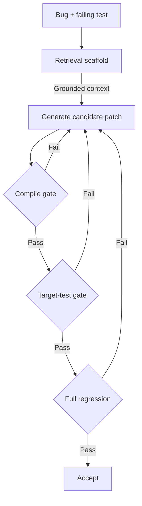

# Staged Evidence Gates for Agentic Program Repair

> Stage cheap evidence gates ahead of expensive ones in repair loops so costly checks run only on candidates that already cleared cheaper signals.

Related lesson: [Check at Each Step](https://learn.agentpatterns.ai/verification/check-at-each-step/) — this concept features in a hands-on lesson with quizzes.

## When this pattern applies

The pattern only pays off when three conditions hold. Check these first: the headline gains disappear when any one fails.

1. The bug's target test meaningfully constrains intent. Test-driven gates approve overfitting patches when tests under-specify behavior. On SWE-bench Verified, 7.8% of plausible (test-passing) patches fail the developer-written suite and 29.6% induce behavioral divergences ([SWE-ABS, 2026](https://arxiv.org/pdf/2603.00520); ["Are 'Solved Issues' in SWE-bench Really Solved Correctly?", 2025](https://arxiv.org/html/2503.15223v1)).
2. The compile gate is cheap relative to the test gate, and the test gate cheap relative to full regression. The staging only saves cost when the cost ratio holds. In slow-link C++ monorepos or container-coupled CI, the compile step can dominate, inverting the ordering.
3. The retrieval scaffold's corpus is in-distribution for the bug. Cross-cutting refactors, repairs that require non-repository knowledge, or sparse-context bugs degrade retrieval — the [Skill Retrieval Realism Gap](eval-blind-spots.md) reports that realistic retrieval drops accuracy well below benchmark numbers.

If any one of these fails, the gates either become noise sources (flaky-test failures), cost theater (slow gates run first), or actively misleading (retrieval grounds the agent in the wrong place).

## The pattern

An agentic automated-program-repair loop generates and validates candidate patches. The naive design runs the full regression suite on every candidate — accurate but slow, and most candidates fail on cheaper signals first, the case for [incremental verification](incremental-verification.md). Staged evidence gates re-order the checks by cost. Every gate below fires on a candidate that already exists; for the complementary control that holds the edit until the agent has made the observations it depends on, see [evidence-conditioned execution](evidence-conditioned-execution.md).

Each gate is one evidence channel. The retrieval scaffold grounds generation in repository context to cut invalid candidates upstream, subject to the [skill retrieval realism gap](eval-blind-spots.md). The compile gate filters edits that do not type-check or parse — the dominant class of invalid edits at near-zero cost. The target-test gate confirms the originally failing test recovers before paying for a full regression pass.

The [EviACT framework](https://arxiv.org/abs/2605.27238v1) instantiates exactly this staging and reports a 1.6–6.0 percentage-point resolve-rate gain over comparable baselines and 70.1–88.6% lower API cost where cost data exists ([Meng et al., 2026](https://arxiv.org/abs/2605.27238v1)).

## Why it works

Verification cost varies, and APR failures concentrate in cheaply detectable categories. Compilation rejects type-incoherent patches at a fraction of test-execution cost. The target test confirms symptom relief before the full suite runs. These are the compile and test gates of [deterministic guardrails](deterministic-guardrails.md). Staging in cost-ascending order converts the latency-dominant "run full regression" step from an unconditional cost into one paid only by candidates that already cleared cheaper signals. The retrieval scaffold reduces this further by cutting how often invalid candidates arise.

The mechanism generalizes beyond EviACT. The broader neuro-symbolic-APR literature reports the same compounding: a base ReAct agent solves 28.5% of agentic repair tasks; static analysis and test-execution feedback lift it to 42.3%, with multiple trials reaching 61.0% ([Agentic Program Repair from Test Failures at Scale, 2025](https://arxiv.org/pdf/2507.18755)). Each channel addresses a known failure of feedback-only loops, which without grounded execution context struggle with silent failures ([RepairAgent, Bouzenia et al., 2024](https://arxiv.org/abs/2403.17134)). The causal claim is narrow: cheap checks that filter dominant failure classes shift the loop's cost curve downward.

## When this backfires

- Test-suite overfitting: a target-test gate using only the bug's failing test cannot detect plausible-but-incorrect patches; benchmark tests under-specify intent. [SWE-ABS, 2026](https://arxiv.org/pdf/2603.00520) reports an estimated 6.4-point inflation in resolution rates from this effect alone.
- Inverted cost ordering: in toolchains where compilation is slow (large C++ monorepos, full-link rebuilds, complex container start-up), the "cheap gate first" assumption inverts and staging adds latency without saving cost.
- Flaky regressions: APR literature cites test flakiness and missing isolated environments as primary failure modes ([RepairAgent, 2024](https://arxiv.org/pdf/2403.17134)). A gate that fires on flaky tests becomes a noise source, not a filter.
- Out-of-distribution retrieval: cross-cutting refactors and bugs requiring non-repository knowledge degrade the retrieval leg; the scaffold grounds the agent in misleading context. The [Skill Retrieval Realism Gap](eval-blind-spots.md) quantifies the production degradation.
- Noise that survives validation: even with staged gates, layered abstention and patch-validation policies yield up to 39 percentage-point gains on human-reported bugs ([Abstain and Validate, 2025](https://arxiv.org/abs/2510.03217)). The gates filter dominant invalid-edit classes but not all of them.
- Verification overhead at scale: in multi-agent verification configurations, verification turns consume 72% of tokens ([AgentTaxo, 2025](https://openreview.net/pdf?id=0iLbiYYIpC)). Gates that run on every candidate without short-circuiting lose to a single finalist pass.

A reasonable practitioner could argue the gains attributed to "evidence-driven guardrails" reduce to the orthogonal cost-ordering insight — "order verifications by cost." Treat the staged-gate idea as a default starting point, not a load-bearing architecture commitment.

## Key Takeaways

- Stage repair-loop verifications in cost-ascending order: retrieval, compile, target test, full regression. Pay full-suite cost only for candidates that already cleared cheaper signals.
- The retrieval scaffold reduces invalid candidates upstream; the compile gate rejects syntactically incoherent patches; the target-test gate confirms symptom relief before paying for the full suite — three stacked checkpoints in the [layered accuracy defense](layered-accuracy-defense.md) sense.
- The pattern is Qualified: it works only when target tests meaningfully constrain intent, when the cost-ratio assumption holds, and when retrieval grounding is in-distribution. Verify each before adopting.
- Pair gates with abstention and patch validation when noise matters at scale — the gates alone do not address overfitting or specification gaming.

## Related

- [Incremental Verification: Check at Each Step, Not at the End](incremental-verification.md) — The general principle that staged gates instantiate for repair loops.
- [Layered Accuracy Defense](layered-accuracy-defense.md) — Defense-in-depth framing for stacking independent verification checkpoints.
- [Deterministic Guardrails Around Probabilistic Agents](deterministic-guardrails.md) — Where compile and test gates fit on the deterministic-vs-prompt spectrum.
- [Precise Debugging: Measure Edit Precision, Not Just Test Pass Rate](precise-debugging-benchmark.md) — Why pass rate is not enough — even gated patches can be over-edits.
- [Multi-Agent RAG for Spec-to-Test Automation](multi-agent-rag-spec-to-test.md) — The retrieval-grounded analogue in the spec-to-test direction.
- [Layered Oracle Stack for Agent IaC Security Repair (TerraProbe)](layered-oracle-iac-security-repair.md) — The cost-ascending gate ordering applied to IaC security repair instead of bug repair.
- [Bounded Repair-Loop Iterations](bounded-repair-loop-iterations.md) — Caps how many repair rounds run; staged gates order what happens inside each round.
