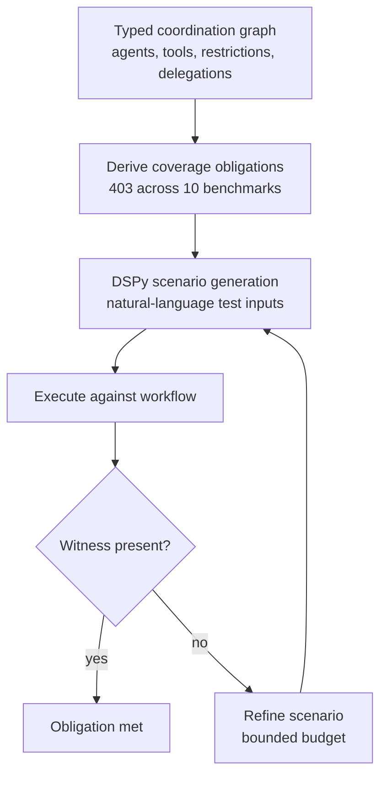

# Structural Coverage Criteria for Agent Workflows

> Derive coverage obligations from a typed coordination graph of agents, tools, restrictions, and delegations — then check whether the test suite actually exercises declared structure.

Structural coverage represents a multi-agent system as a typed coordination graph and treats every reachable agent, allowed tool edge, restricted tool edge, and delegation edge as a coverage obligation the test suite must witness ([Kahani & Bagherzadeh, arXiv:2605.26521](https://arxiv.org/abs/2605.26521)). It is a test-adequacy layer, not a correctness oracle: it answers "have I exercised the declared coordination structure?", not "did the workflow produce the right answer?".

## When this applies

This pays off when three conditions hold:

- The workflow declares explicit restrictions or delegation rules. Obligations come from the graph. Uniform allowlists with no delegation constraints leave nothing to test beyond reachability.
- The spec is stable enough to amortize. Scenarios run against declared edges. Rapid churn invalidates witnesses faster than the suite regenerates them.
- The workflow is large enough that happy-path E2E tests miss declared edges. The benchmarks held 49 agents, 47 tools, and 403 obligations across 10 workflows, of which 248 were restricted-tool obligations.

When these hold, structural coverage exposes failures end-to-end scores hide. Otherwise the spec is maintenance burden without signal.

## The four coverage criteria

Four criteria run over the typed coordination graph:

| Criterion | Obligation | Witness |
|---|---|---|
| Reachable-agent | Every reachable agent is entered | A trace entering its frame |
| Allowed-tool-edge | Every (agent, allowed-tool) edge is exercised | A trace invoking the tool |
| Restricted-tool-edge | Every (agent, restricted-tool) edge is probed adversarially | A scenario eliciting the call; witness records if it held |
| Delegation-edge | Every (caller, callee) handoff is witnessed | A trace handing control to the callee |

The first three are positive obligations: a witness proves the edge fires. Restricted-tool coverage is adversarial. It generates a scenario that should induce the restricted call, then records whether the restriction held. That criterion found 23 of 248 restricted-call violations (9.3%) — concrete misrouting failures prompt-level checks had missed.

## How scenario generation works

The graph fixes what must be covered. DSPy-based generation produces the natural-language test inputs, and runtime checks confirm each witness:

The budget is bounded. Scenarios witnessed 54 of 75 allowed-tool obligations (72%) and 36 of 48 delegation obligations (75%). Unwitnessed obligations are not always bugs. They may mark dead spec, infeasible edges, or unrealizable scenarios. Triage them; do not fail the build on them. (All figures: [arXiv:2605.26521](https://arxiv.org/abs/2605.26521).)

## Independent corroboration

Agentproof ([arXiv:2603.20356](https://arxiv.org/abs/2603.20356)) reaches a similar conclusion from a different angle. It extracts unified graph models from LangGraph, CrewAI, AutoGen, and Google ADK workflows, then applies six structural checks plus temporal safety policies compiled to deterministic finite automata. Agentproof verifies the graph statically; Kahani & Bagherzadeh generate dynamic witnesses. Both treat declared structure as a first-class testable artifact, not something to infer from end-to-end traces.

## When this backfires

Structural coverage shares the failure modes of traditional code coverage ([Bullseye](https://www.bullseye.com/coverage.html)), plus several specific to agent workflows:

- Errors of omission are invisible. Obligations derive from the declared graph, so a missing tool edge or restriction never shows up as unmet. A workflow that forgets to declare a sensitive tool as restricted still gets a clean report.
- Coverage targets corrupt scenario design. High targets push teams to hit edges without realistic preconditions ([Code4IT](https://www.code4it.dev/blog/code-coverage-must-not-be-the-target/)). Calling a tool once under trivial state proves the edge fires, not that it works under load.
- The 9.3% hit rate misleads. Reading "restricted-tool coverage passed" as "restrictions hold" understates the risk: within the bounded budget most negative cases stay unprobed.
- Spec churn defeats the criterion. If the graph changes weekly, restricted-tool witnesses decay and the report becomes a treadmill of false negatives. The criterion assumes the graph is slow-moving.
- E2E already covers small workflows. Below ~10 agents with few restrictions, a few happy-path tests touch most edges as a side-effect, and the maintenance cost exceeds the marginal find-rate.

The authors frame it as a complement to semantic and end-to-end evaluation, not a replacement.

## Why it works

End-to-end task-success metrics aggregate over the full workflow, masking which declared edges fire. A typed coordination graph turns the author's intent — this agent has these tools, that one is restricted, agent A delegates to agent B — into testable obligations, and scenario generation produces a witness against each. The role matches branch coverage's ([Bullseye](https://www.bullseye.com/coverage.html)): an adequacy floor, not a correctness oracle.

## Key Takeaways

- Structural coverage of a typed coordination graph is a test-adequacy layer, not a correctness oracle.
- The four criteria are reachable-agent, allowed-tool-edge, restricted-tool-edge, and delegation-edge coverage. Allowed and delegation edges have positive witnesses; restricted edges have adversarial probes.
- It earns its keep when the workflow declares restrictions or delegation rules, the spec is stable, and the system is large enough that E2E tests miss declared edges.
- Errors of omission are invisible — coverage cannot tell you the graph is missing an edge that should exist. Pair it with semantic evaluation and [handoff-contract](../patterns/multi-agent/agent-handoff-protocols.md) audits.
- Treat unwitnessed obligations as findings to triage (dead spec? infeasible edge? generator limit?), not as build failures.

## Related

- [FLARE: Coverage-Guided Fuzzing for Multi-Agent LLM Systems](flare-multi-agent-fuzzing.md) — Complementary approach: fuzz the interaction-path space when the declared graph is too sparse to drive coverage.
- [Behavioral Testing for Non-Deterministic AI Agents](behavioral-testing-agents.md) — End-state and decision-quality testing; structural coverage answers a different question and sits beneath it.
- [Independent Test Generation in Multi-Agent Code Systems](../patterns/multi-agent/independent-test-generation-multi-agent.md) — A different multi-agent testing concern (test-writer bias) at a different layer.
- [Agent Handoff Protocols](../patterns/multi-agent/agent-handoff-protocols.md) — Declared handoff contracts; structural coverage tests whether those contracts actually fire.
- [Skill Test Coverage as a Release Gate](skill-test-coverage-release-gate.md) — The same adequacy idea where no coordination graph exists: obligations are extracted from a skill's natural-language prose, then used to gate release.
