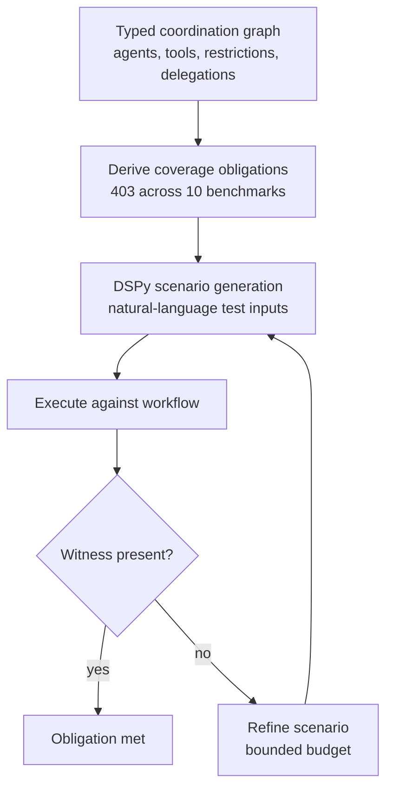

# Structural Coverage Criteria for Agent Workflows

> Derive coverage obligations from a typed coordination graph of agents, tools, restrictions, and delegations — then check whether the test suite actually exercises declared structure.

Structural coverage for agent workflows represents a multi-agent system as a typed coordination graph and treats every reachable agent, allowed tool edge, restricted tool edge, and delegation edge as a coverage obligation a test suite must witness ([Kahani & Bagherzadeh, arXiv:2605.26521](https://arxiv.org/abs/2605.26521)). It is a test-adequacy layer, not a correctness oracle — it answers "have I exercised the declared coordination structure?" rather than "did the workflow produce the right answer?".

## When This Applies

The pattern earns its keep under three conditions ([arXiv:2605.26521](https://arxiv.org/abs/2605.26521)):

- **The workflow declares explicit restrictions or delegation rules.** Coverage obligations come from the graph; a workflow with uniform tool allowlists and no delegation constraints gives the criterion nothing to test beyond reachability.
- **The spec is stable enough to amortize.** Scenarios are realized against declared edges; rapid spec churn invalidates witnesses faster than the suite regenerates them.
- **The workflow is large enough that happy-path E2E tests miss declared edges.** The evaluated benchmarks contained 49 agents, 47 tools, and 403 structural obligations across 10 workflows — restricted-tool obligations alone numbered 248, beyond the reach of hand-written E2E scenarios ([arXiv:2605.26521](https://arxiv.org/abs/2605.26521)).

When these hold, structural coverage exposes failures end-to-end success scores hide. When they do not, the typed-graph spec is maintenance burden without compensating signal.

## The Four Coverage Criteria

The paper defines four structural criteria over the typed coordination graph ([arXiv:2605.26521](https://arxiv.org/abs/2605.26521)):

| Criterion | Obligation | Witness |
|---|---|---|
| **Reachable-agent coverage** | Every agent the graph declares as reachable must be entered by at least one scenario | A trace that enters the agent's frame |
| **Allowed-tool-edge coverage** | Every (agent, allowed-tool) edge must be exercised | A trace where the agent invokes the tool successfully |
| **Restricted-tool-edge coverage** | Every (agent, restricted-tool) edge must be probed adversarially | A scenario designed to elicit the restricted call; coverage records whether the restriction held |
| **Delegation-edge coverage** | Every (caller-agent, callee-agent) handoff must be witnessed | A trace where the caller hands control to the callee |

Allowed-tool, delegation, and reachable-agent coverage are positive obligations — a witness trace proves the edge fires. Restricted-tool coverage is adversarial — a scenario that *should* induce the restricted call is generated, and the witness records whether the restriction enforced. The adversarial criterion elicited **23/248 restricted-call violations (9.3%)** — concrete misrouting failures prompt-level checks had not caught ([arXiv:2605.26521](https://arxiv.org/abs/2605.26521)).

## How Scenario Generation Works

The graph fixes what must be covered; DSPy-based scenario realization produces natural-language test scenarios whose witnesses are checked at runtime ([arXiv:2605.26521](https://arxiv.org/abs/2605.26521)).

The refinement budget is bounded: in evaluation, scenarios witnessed **54/75 allowed-tool obligations (72%)** and **36/48 delegation obligations (75%)** within the budget ([arXiv:2605.26521](https://arxiv.org/abs/2605.26521)). Unwitnessed obligations are not necessarily bugs — they may indicate dead spec, infeasible edges, or scenarios the generator could not realize. They are findings to triage, not failures to fail the build on.

## Independent Corroboration

An adjacent paper, **Agentproof** ([arXiv:2603.20356](https://arxiv.org/abs/2603.20356)), reaches a similar conclusion from a different angle: it extracts unified abstract graph models from LangGraph, CrewAI, AutoGen, and Google ADK workflows, then applies six structural checks plus temporal safety policies compiled to deterministic finite automata. Agentproof verifies the graph statically; Kahani & Bagherzadeh generate dynamic witnesses. Both treat declared workflow structure as a first-class testable artifact rather than something to infer from end-to-end traces.

## When This Backfires

Structural coverage shares the failure modes of traditional code coverage ([Bullseye — Code Coverage Analysis](https://www.bullseye.com/coverage.html)), plus several specific to agent workflows:

- **Errors of omission are invisible.** Coverage obligations are derived from the declared graph. A missing tool edge or a missing restriction will never show up as an unmet obligation — there is no obligation to miss ([Bullseye — Code Coverage Analysis](https://www.bullseye.com/coverage.html)). A workflow that forgets to declare a sensitive tool as restricted gets a clean coverage report.
- **Coverage targets corrupt scenario design.** Teams that adopt high-coverage targets often write tests that hit edges without exercising realistic preconditions ([Code4IT — Why reaching 100% Code Coverage must NOT be your testing goal](https://www.code4it.dev/blog/code-coverage-must-not-be-the-target/)). A scenario that "witnesses" an allowed-tool edge by calling the tool once under trivial state tells you the edge fires, not that it works under realistic load.
- **The 9.3% restricted-call hit rate misleads.** The adversarial criterion fired 23/248 (9.3%) in the paper's bounded refinement budget ([arXiv:2605.26521](https://arxiv.org/abs/2605.26521)). A team that reads "restricted-tool coverage passed" as "restrictions hold" understates the risk: most negative cases remain unprobed.
- **Spec churn defeats the criterion.** If the declared graph changes weekly, witness scenarios for restricted-tool obligations decay continuously, and the coverage report becomes a treadmill of false negatives. The criterion assumes the graph is the slow-moving artifact in the workflow.
- **End-to-end tests already cover small workflows.** For workflows below ~10 agents with few restrictions, a handful of happy-path E2E tests touch most declared edges as a side-effect. The typed-graph maintenance cost exceeds the marginal find-rate.

Structural coverage is a complement to semantic and end-to-end evaluation — the paper's authors say so explicitly ([arXiv:2605.26521](https://arxiv.org/abs/2605.26521)). Reading it as the primary adequacy claim reproduces the same anti-pattern that "100% line coverage means tested" produced in traditional software.

## Why It Works

End-to-end task-success metrics aggregate over the full workflow, masking which declared coordination edges actually fire. A typed coordination graph reifies the workflow author's intent — this agent has these tools, that agent is restricted from this tool, agent A delegates to agent B — into testable obligations, and coverage-driven scenario generation produces witness traces against each obligation ([arXiv:2605.26521](https://arxiv.org/abs/2605.26521)). When a restricted-tool obligation fires, the witness trace is concrete evidence of a misrouting failure, not a fuzzy quality signal.

The role is the same as branch coverage in traditional software ([Bullseye — Code Coverage Analysis](https://www.bullseye.com/coverage.html)): not a correctness oracle, but an adequacy floor. You cannot claim your suite exercises a declared restriction if no scenario probes it. The 23/248 restricted-tool violations in the paper are exactly the value the criterion provides — they separate workflows whose restrictions hold under adversarial probing from workflows with concrete violations.

## Key Takeaways

- Structural coverage of a typed coordination graph is a **test-adequacy layer**, not a correctness oracle ([arXiv:2605.26521](https://arxiv.org/abs/2605.26521)).
- The four criteria are reachable-agent, allowed-tool-edge, restricted-tool-edge, and delegation-edge coverage. Allowed and delegation edges have positive witnesses; restricted edges have adversarial probes.
- The pattern earns its keep when the workflow declares restrictions or delegation rules, the spec is stable, and the system is large enough that E2E tests miss declared edges.
- Errors of omission are invisible — coverage cannot tell you the graph is missing an edge that should exist. Pair structural coverage with semantic evaluation and handoff-contract audits, not as a replacement.
- Treat unwitnessed obligations as findings to triage (dead spec? infeasible edge? generator limit?), not as build failures.

## Related

- [FLARE: Coverage-Guided Fuzzing for Multi-Agent LLM Systems](flare-multi-agent-fuzzing.md) — Complementary approach: fuzz the interaction-path space when the declared graph is too sparse to drive coverage.
- [Behavioral Testing for Non-Deterministic AI Agents](behavioral-testing-agents.md) — End-state and decision-quality testing; structural coverage answers a different question and sits beneath it.
- [Independent Test Generation in Multi-Agent Code Systems](../multi-agent/independent-test-generation-multi-agent.md) — A different multi-agent testing concern (test-writer bias) at a different layer.
- [Agent Handoff Protocols](../multi-agent/agent-handoff-protocols.md) — Declared handoff contracts; structural coverage tests whether those contracts actually fire.
- [Audit Handoff Protocols](../agent-readiness/audit-handoff-protocols.md) — The agent-readiness audit that asks whether handoff contracts exist; structural coverage is the test discipline that verifies they execute.
