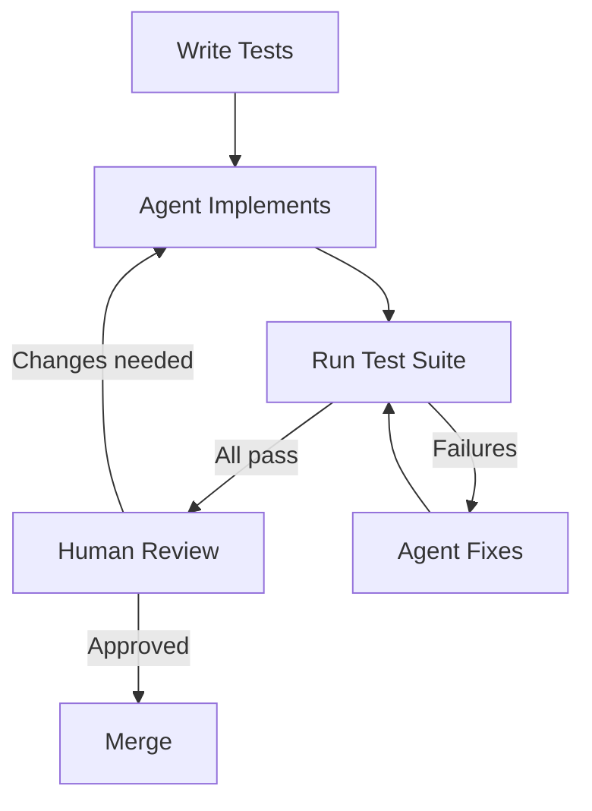

# Test-Driven Agent Development: Tests as Spec and Guardrail

> Write tests first, then let agents implement against them — tests define what the code must do and verify that the agent did it correctly.

!!! note "Also known as"
    TDD with Agents, Tests as the Spec, Red-Green-Refactor for Agents. For the specific red-green-refactor cycle adapted for agent workflows, see [Red-Green-Refactor with Agents](red-green-refactor-agents.md).

## The Technique

When you ask an agent to "implement a function that sorts users by activity," the agent interprets the requirement. When you give it a test file with five test cases defining exact expected behavior, the agent's output is constrained by the tests. Ambiguity is eliminated at the specification stage, not during review.

Tests serve two roles simultaneously:

- **Specification** — executable, unambiguous definition of expected behavior
- **Guardrail** — automated verification the agent can run without human involvement

The agent loop that follows is tight: implement → run tests → fix failures → repeat until green. Human review is still required, but the mechanical "does it work?" question is answered automatically.

## The Agent Loop



You write the tests. The agent writes the implementation. The test suite is the contract between them. Claude Code's [common workflows documentation](https://code.claude.com/docs/en/common-workflows) recommends asking Claude to "run tests and fix any failures" — the agent reads test output and fixes issues in a tight feedback loop.

## Test Types and Their Roles

**Unit tests with explicit assertions** — define exact expected outputs for specific inputs. Each test case is a constraint the implementation must satisfy. Write tests for happy paths, edge cases, and error conditions before any implementation exists.

**Property-based tests** — define invariants the implementation must always satisfy (e.g., "sort output length equals input length"). These are harder to satisfy accidentally than example-based tests.

**Snapshot tests** — define exact expected output for known inputs. Useful when the output format matters as much as the values. The agent cannot pass a snapshot test by producing a plausible-looking but different output.

**Integration tests** — verify the agent's output works with the rest of the system, not just in isolation. These catch the "implementation is internally consistent but incompatible with the calling code" failure mode.

## What You Control, What the Agent Controls

You write the tests. The agent writes the implementation. This separation matters:

- You control the specification — what the code must do
- The agent handles the labor — how to satisfy the specification
- The test suite is the verification layer — neither you nor the agent decides if it works; the suite does

If you ask the agent to write both tests and implementation, the tests verify nothing. The agent will write tests that pass its own implementation, not tests that define correct behavior independently.

## Anti-Patterns

**Agent writes tests and implementation** — tests are written to match the implementation, not to specify correct behavior. The suite passes but verifies the wrong thing.

**No tests** — verification is manual review only. Review quality is inconsistent, review fatigue accumulates, and subtle errors pass undetected.

**Tests written after implementation** — the agent writes tests to match what it already built. Edge cases it didn't handle aren't tested.

**Overly broad tests** — tests that pass even when the implementation is wrong (e.g., `assert result is not None`). Precision in test assertions correlates directly with precision in the implementation the agent produces.

## Example

The following pytest file defines the specification for a user-sorting function before any implementation exists. You write this file; the agent writes `sort_users.py` to make it pass.

```python
# tests/test_sort_users.py
import pytest
from sort_users import sort_users_by_activity

def test_sorts_descending_by_last_active():
    users = [
        {"id": 1, "last_active": "2024-01-10"},
        {"id": 2, "last_active": "2024-03-01"},
        {"id": 3, "last_active": "2024-02-15"},
    ]
    result = sort_users_by_activity(users)
    assert [u["id"] for u in result] == [2, 3, 1]

def test_empty_list_returns_empty():
    assert sort_users_by_activity([]) == []

def test_single_user_returned_unchanged():
    users = [{"id": 99, "last_active": "2024-01-01"}]
    assert sort_users_by_activity(users) == users

def test_ties_preserve_original_order():
    users = [
        {"id": 1, "last_active": "2024-01-01"},
        {"id": 2, "last_active": "2024-01-01"},
    ]
    result = sort_users_by_activity(users)
    assert [u["id"] for u in result] == [1, 2]
```

Hand this file to Claude Code with the prompt:

```
Implement `sort_users.py` so that all tests in `tests/test_sort_users.py` pass. Run `pytest tests/test_sort_users.py` after each change and fix any failures before stopping.
```

The agent cannot pass the tie-ordering test by sorting carelessly — the test encodes a specific stable-sort requirement that forces a precise implementation choice. The suite is the specification; `pytest` is the verifier.

## Key Takeaways

- Tests written before implementation are an unambiguous specification the agent cannot misinterpret
- The agent can self-verify by running the test suite — the feedback loop is tight and doesn't require human review at each iteration
- Separate who writes tests (you) from who writes implementation (agent) — the separation is load-bearing
- Property-based and snapshot tests constrain agent output more tightly than hand-wavy assertions
- Precision in test assertions drives precision in agent output

## Related

- [Test-Driven Intent Clarification: Tests as Intermediate Alignment Artifacts](test-driven-intent-clarification.md)
- [Incremental Verification: Check at Each Step, Not at the End](incremental-verification.md)
- [Behavioral Testing for Non-Deterministic AI Agents](behavioral-testing-agents.md)
- [Trust Without Verify](../anti-patterns/trust-without-verify.md)
- [Agent-Assisted Code Review: Agents as PR First Pass](../code-review/agent-assisted-code-review.md)
- [Empowerment Over Automation](../agent-design/empowerment-over-automation.md)
- [Coverage-Guided Agents for Fuzz Harness Generation](coverage-guided-fuzz-harness-generation.md)
- [Golden Query Pairs as Continuous Regression Tests for Agents](golden-query-pairs-regression.md)
- [Multi-Agent RAG for Spec-to-Test Automation](multi-agent-rag-spec-to-test.md)
- [Pre-Completion Checklists](pre-completion-checklists.md)
