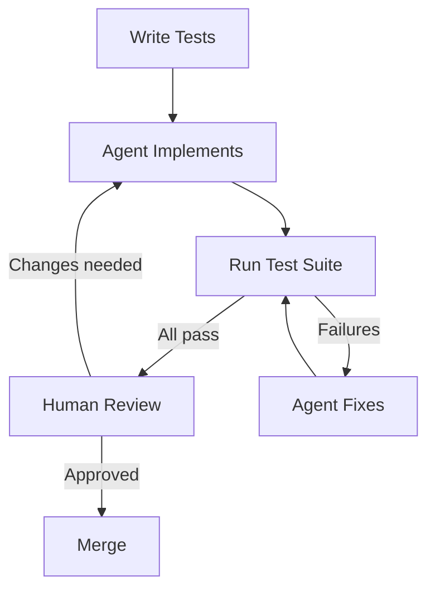

# Test-Driven Agent Development: Tests as Spec and Guardrail

> Write tests first, then let agents implement against them — tests define what the code must do and verify that the agent did it correctly.

Related lesson: [Red-Green for Agents](https://learn.agentpatterns.ai/verification/red-green-for-agents/) covers this concept in a hands-on lesson with quizzes.

!!! note "Also known as"
    TDD with Agents, Tests as the Spec, Red-Green-Refactor for Agents. For the specific red-green-refactor cycle adapted for agent workflows, see [Red-Green-Refactor with Agents](red-green-refactor-agents.md).

## The technique

Ask an agent to "implement a function that sorts users by activity" and it interprets the requirement. Hand it a test file with five cases that define the exact expected behavior, and the tests constrain the output. You resolve ambiguity at specification time, not during review. This is the same shift toward executable specs covered in [test-driven intent clarification](test-driven-intent-clarification.md).

Tests serve two roles at once:

- Specification: an executable, unambiguous definition of the expected behavior
- Guardrail: automated verification the agent can run without a human

The agent loop that follows is tight: implement, run tests, fix failures, and repeat until green. You still need human review, but the mechanical "does it work?" question is answered automatically.

## The agent loop


```mermaid
graph TD
    A[Write Tests] --> B[Agent Implements]
    B --> C[Run Test Suite]
    C -->|All pass| D[Human Review]
    C -->|Failures| E[Agent Fixes]
    E --> C
    D -->|Approved| F[Merge]
    D -->|Changes needed| B
```

You write the tests, the agent writes the implementation, and the suite is the contract between them. Claude Code's [common workflows documentation](https://code.claude.com/docs/en/common-workflows) recommends asking Claude to "run tests and fix any failures". The agent reads the test output and iterates without a human in each cycle. Anthropic's own benchmark methodology relies on the same loop: prompted to "implement your own tests first before attempting the problem," Claude Sonnet 4.5 scored 77.2% on the 500-task SWE-bench Verified set ([Anthropic](https://www.anthropic.com/news/claude-sonnet-4-5)). That iteration isn't unbounded — when a [Stop hook](https://code.claude.com/docs/en/best-practices) gates the turn on the test suite, Claude Code overrides it and ends the turn after 8 consecutive blocks, so a persistently red suite still surfaces to a human instead of looping forever.

## Test types and their roles

Unit tests with explicit assertions define exact expected outputs for specific inputs through `assert` statements. Each test case is a constraint the implementation must satisfy. Write tests for happy paths, edge cases, and error conditions before any implementation exists.

Property-based tests define invariants the implementation must always satisfy, for example "sort output length equals input length". These are harder to satisfy by accident than example-based tests, and they suit the variance-tolerant style described in [behavioral testing for non-deterministic agents](behavioral-testing-agents.md).

Snapshot tests define the exact expected output for known inputs. They help when the output format matters as much as the values. The agent cannot pass a snapshot test by producing a plausible-looking but different output.

Integration tests verify that the agent's output works with the rest of the system, not just in isolation. This is the same end-to-end concern behind [golden query pairs as regression tests](golden-query-pairs-regression.md). They catch the "implementation is internally consistent but incompatible with the calling code" failure mode.

## What you control, what the agent controls

- You control the specification: what the code must do
- The agent handles the labor: how to satisfy the specification
- The test suite is the verification layer: neither party decides if it works, the suite does

If the agent writes both the tests and the implementation, the tests verify nothing. They pass its own code, not behavior you defined independently.

## Anti-patterns

Agent writes tests and implementation: the agent writes tests to match the implementation, not to specify correct behavior. The suite passes but verifies the wrong thing.

No tests: verification is manual review only. Review quality is inconsistent, review fatigue accumulates, and subtle errors pass undetected. This is the [trust-without-verify](../patterns/anti-patterns/trust-without-verify.md) failure mode.

Tests written after implementation: the agent writes tests to match what it already built. Edge cases it did not handle are not tested.

Overly broad tests: tests that pass even when the implementation is wrong, for example `assert result is not None`. Precision in test assertions correlates directly with precision in the implementation the agent produces.

## When this backfires

Tests-first is not always the right move. The Exploring Gen AI series on martinfowler.com questions whether the practice delivers value inside an agent loop or is only theater ([TDD inside the agent loop - theater or actual value?](https://martinfowler.com/articles/exploring-gen-ai/tdd-in-the-agent-loop.html)). The pattern degrades under specific conditions:

- Exploratory or research code where the problem shape is unclear: writing tests first locks in a premature interface. When the goal is to learn what the correct behavior should be, tests written up front encode guesses, and the agent optimizes toward those guesses instead of the underlying question.
- Regression risk beyond the focal tests: an agent that makes the target tests green can still break unrelated behavior in the same codebase, which is the case for [golden query pairs as continuous regression tests](golden-query-pairs-regression.md). Anthropic's own guidance warns about the "trust-then-verify gap": a "plausible-looking implementation that doesn't handle edge cases" ([Claude Code best practices](https://code.claude.com/docs/en/best-practices)). A green focal suite is not the same as a green full suite, so run the whole regression set, not just the new tests.
- Fuzzy or evolving requirements where precise assertions are expensive: property-based and snapshot tests cost more to author, and hand-written examples for every edge case do not scale when the spec is still in flux. Enforced TDD here slows the feedback loop it was meant to tighten.
- Behaviors that resist cheap oracles: unit-style assertions capture UI polish, performance under load, and stochastic output (LLM responses, ML model outputs) poorly. This is the non-determinism handled in [behavioral testing for non-deterministic agents](behavioral-testing-agents.md). Tests pass without confirming the thing you actually care about.
- Handing the whole cycle to the agent: this page describes tests you author. Prompting an agent to run red-green-refactor on its own tests is a different workflow with different evidence, covered in [prescribing TDD inside the agent loop](../patterns/anti-patterns/tdd-inside-the-agent-loop.md).

## Example

The following pytest file defines the specification for a user-sorting function before any implementation exists. You write this file; the agent writes `sort_users.py` to make it pass.

```python
# tests/test_sort_users.py
import pytest
from sort_users import sort_users_by_activity

def test_sorts_descending_by_last_active():
    users = [
        {"id": 1, "last_active": "2024-01-10"},
        {"id": 2, "last_active": "2024-03-01"},
        {"id": 3, "last_active": "2024-02-15"},
    ]
    result = sort_users_by_activity(users)
    assert [u["id"] for u in result] == [2, 3, 1]

def test_empty_list_returns_empty():
    assert sort_users_by_activity([]) == []

def test_single_user_returned_unchanged():
    users = [{"id": 99, "last_active": "2024-01-01"}]
    assert sort_users_by_activity(users) == users

def test_ties_preserve_original_order():
    users = [
        {"id": 1, "last_active": "2024-01-01"},
        {"id": 2, "last_active": "2024-01-01"},
    ]
    result = sort_users_by_activity(users)
    assert [u["id"] for u in result] == [1, 2]
```

Hand this file to Claude Code with the prompt:

```
Implement `sort_users.py` so that all tests in `tests/test_sort_users.py` pass. Run `pytest tests/test_sort_users.py` after each change and fix any failures before stopping.
```

The agent cannot pass the tie-ordering test by sorting carelessly. The test encodes a specific stable-sort requirement that forces a precise implementation choice. The suite is the specification, and `pytest` is the verifier.

## FAQ

**Does a green test suite mean the agent's change is safe?**

Not on its own. An agent that makes the target tests green can still break unrelated behavior elsewhere in the same codebase. Anthropic's guidance names this the trust-then-verify gap: a plausible-looking implementation that does not handle edge cases. A green focal suite is not a green full suite, so run the whole regression set rather than only the new tests.

**What stops the implement-run-fix loop from running forever?**

A turn-level ceiling. When a Stop hook gates the turn on the test suite, Claude Code overrides that hook and ends the turn after eight consecutive blocks, so a persistently red suite surfaces to a human instead of looping indefinitely. The self-verification loop is tight, but repeated failure escalates to review rather than continuing unbounded.

**When is writing tests first the wrong move?**

On exploratory or research code, where the problem shape is unclear and tests written up front encode guesses the agent then optimizes toward. Also when requirements are still in flux, since property-based and snapshot tests are expensive to author and hand-written examples do not scale. And for UI polish, load performance, and stochastic output, which unit-style assertions capture poorly.

## Key Takeaways

- Tests written before implementation are an unambiguous specification the agent cannot misinterpret
- The agent can self-verify by running the test suite — the feedback loop is tight and doesn't require human review at each iteration
- Separate who writes tests (you) from who writes implementation (agent) — the separation is load-bearing
- Property-based and snapshot tests constrain agent output more tightly than hand-wavy assertions
- Precision in test assertions drives precision in agent output

## Related

- [Test-Driven Intent Clarification: Tests as Intermediate Alignment Artifacts](test-driven-intent-clarification.md)
- [Incremental Verification: Check at Each Step, Not at the End](incremental-verification.md)
- [Behavioral Testing for Non-Deterministic AI Agents](behavioral-testing-agents.md)
- [Trust Without Verify](../patterns/anti-patterns/trust-without-verify.md)
- [Agent-Assisted Code Review: Agents as PR First Pass](../code-review/agent-assisted-code-review.md)
- [Golden Query Pairs as Continuous Regression Tests for Agents](golden-query-pairs-regression.md)
- [Multi-Agent RAG for Spec-to-Test Automation](multi-agent-rag-spec-to-test.md)
- [Pre-Completion Checklists](pre-completion-checklists.md)
