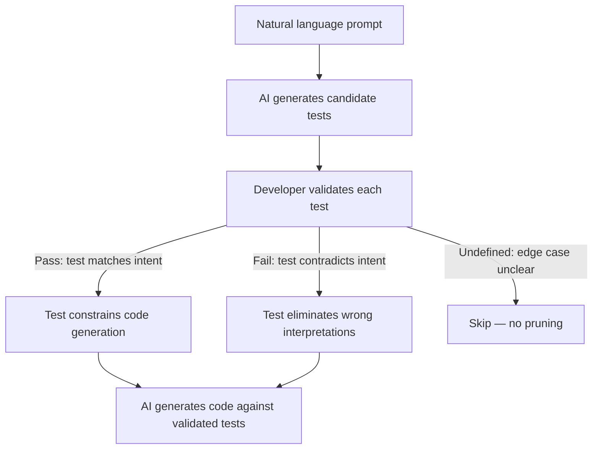

# Test-Driven Intent Clarification: Tests as Intermediate Alignment Artifacts

> Ask the AI to generate tests that expose ambiguity in your specification, validate those tests, then use them to constrain code generation — reviewing tests is cheaper and more precise than reviewing code.

## The Intent Gap

"Sort users by activity" could mean descending by last-active timestamp, ascending by total actions, or weighted by recency. When an LLM interprets your prompt, it picks one reading. If that reading differs from your intent, you discover the mismatch during code review — the most expensive place to find it.

The gap between what you mean and what the model generates is a specification failure, not a generation failure. Improving the model does not close it — clarifying the specification does.

## The Technique

Instead of reviewing generated code directly, use AI-generated tests as an intermediate artifact to surface and resolve ambiguity *before* code is written.



The cognitive shift: instead of asking "is this 50-line function correct?" you answer "should `sort_users(['alice', 'bob'])` return `['bob', 'alice']`?" The second question is simpler, faster, and more precise.

### Why Tests, Not Code

A test case has one input, one expected output, and one assertion. There is no ambiguity in `assert sort_users(input) == expected` — either the output matches your intent or it does not. Code review requires understanding implementation logic, control flow, and edge cases simultaneously. Test validation requires understanding one input-output pair at a time.

The TiCoder workflow measured a 38% reduction in cognitive load (NASA-TLX) when developers validated tests instead of reviewing code, with no increase in task completion time. ([Fakhoury et al., IEEE TSE 2024](https://arxiv.org/abs/2404.10100))

## Discriminative Test Selection

Not all tests are equally useful. A test that every candidate implementation passes provides zero information. The highest-value tests are *discriminative* — they split candidates into groups that disagree on expected output.

Ranking heuristic: score each test by how evenly it divides passing and failing candidates. A 50/50 split provides maximum information gain — your response eliminates roughly half the candidate space. ([Fakhoury et al., IEEE TSE 2024](https://arxiv.org/abs/2404.10100)) In practice, the AI surfaces tests at the *points of ambiguity* — exactly where different reasonable interpretations produce different behavior.

## Quantitative Evidence

**User study (n=15)**: Code review achieved 40% task correctness; test validation achieved 84% (p=0.001). Cognitive load dropped from 45.46 to 28.00 on NASA-TLX (p=0.012). ([Fakhoury et al., IEEE TSE 2024](https://arxiv.org/abs/2404.10100))

**Benchmark (7 LLMs, 2 Python datasets)**: 45.97% average absolute improvement in pass@1 across MBPP and HumanEval within 5 rounds. Smaller models with validated tests outperformed larger baselines — CodeGen-6B (69.55% on MBPP) beat baseline GPT-3.5-turbo (61.91%). ([Fakhoury et al., IEEE TSE 2024](https://arxiv.org/abs/2404.10100))

**Tests outperform prompt-based specification**: Adding all tests to the prompt reached 80.88% pass@1 (GPT-4-32k, MBPP). Execution-based pruning reached 81.56% with pass/fail alone — LLMs do not reliably satisfy tests given as prompt context. ([Fakhoury et al., IEEE TSE 2024](https://arxiv.org/abs/2404.10100))

**Limitations**: 15 participants across 3 tasks (small sample). Benchmark uses an idealized oracle (upper bound). Tasks are single-function Python; generalization to multi-file codebases is unproven.

## How This Differs from TDD with Agents

[Test-driven agent development](tdd-agent-development.md): *developer writes tests, agent implements*. The developer knows the spec and encodes it as tests. Test-driven intent clarification inverts this: *agent generates tests, developer validates*. The developer does not yet have a precise spec — the AI-generated tests surface ambiguity, and validation responses formalize the specification incrementally.

| Dimension | TDD with Agents | Intent Clarification |
|-----------|----------------|----------------------|
| Who writes tests | Developer | AI |
| Purpose of tests | Constrain implementation | Clarify specification |
| When to use | Spec is known | Spec is ambiguous |
| Developer reviews | Code (after tests pass) | Tests (before code exists) |

The two are complementary. Use intent clarification when the spec is fuzzy; use TDD when it is precise.

## Applying the Technique Today

No mainstream AI coding assistant has a built-in TiCoder-style interactive test validation workflow [unverified]. You can approximate the technique manually:

1. **Prompt for tests first**: "Before implementing, generate 5-10 test cases that cover the expected behavior, including edge cases where the specification is ambiguous."
2. **Review the tests**: For each test, decide: does this match your intent? Mark tests that contradict your intent and explain why.
3. **Refine and constrain**: "Here are the approved tests. Implement the function so all approved tests pass. Remove the tests I rejected."
4. **Iterate**: If the implementation reveals new ambiguity, repeat — ask for additional discriminative tests targeting the unclear behavior.

The key discipline: review the tests *before* seeing any implementation. Once you have seen code, your evaluation is anchored to the implementation rather than your intent.

## Example

A developer prompts: "Write a function that extracts email addresses from text."

**Without intent clarification** — the AI generates an implementation. During review, the developer discovers it does not handle emails in angle brackets (`<user@example.com>`), does not deduplicate, and includes `mailto:` prefixed addresses. Each issue is a specification gap discovered during code review.

**With intent clarification** — the developer first asks for discriminative tests:

```python
# AI-generated tests surfacing ambiguity points
def test_plain_email():
    assert extract_emails("contact user@example.com") == ["user@example.com"]

def test_angle_bracket_email():
    # Ambiguity: should bracketed emails be extracted?
    assert extract_emails("send to <user@example.com>") == ["user@example.com"]

def test_duplicate_emails():
    # Ambiguity: deduplicate or preserve all occurrences?
    assert extract_emails("a@b.com and a@b.com") == ["a@b.com"]

def test_mailto_prefix():
    # Ambiguity: strip mailto: prefix or include it?
    assert extract_emails("link: mailto:a@b.com") == ["a@b.com"]

def test_invalid_tld():
    # Ambiguity: validate TLD or accept any format?
    assert extract_emails("user@localhost") == []
```

The developer reviews each test in seconds. "Yes, extract from brackets. Yes, deduplicate. Yes, strip mailto. No, accept `user@localhost` — change that test to include it." The specification is now precise. The AI implements against validated tests, and code review focuses on implementation quality rather than specification correctness.

## Key Takeaways

- Natural language prompts are ambiguous; tests surface the specific points where interpretations diverge
- Validating tests is cognitively cheaper than reviewing code — research shows 38% lower cognitive load with no time increase
- Discriminative tests (those that split candidate implementations) provide the most information per interaction
- The technique is complementary to TDD: use intent clarification when the spec is ambiguous, TDD when the spec is known
- Smaller models with validated tests outperform larger models without them — test-based constraints compensate for model capability gaps

## Unverified Claims

- No mainstream AI coding assistant currently has a built-in TiCoder-style interactive test validation workflow [unverified]

## Related

- [Test-Driven Agent Development: Tests as Spec and Guardrail](tdd-agent-development.md)
- [Red-Green-Refactor with Agents: Letting Tests Drive Dev](red-green-refactor-agents.md)
- [Incremental Verification: Check at Each Step, Not at the End](incremental-verification.md)
- [The Eval-First Development Loop](../training/eval-driven-development/eval-first-loop.md)
- [Human-in-the-Loop Placement](../workflows/human-in-the-loop.md)
- [Pre-Completion Checklists](pre-completion-checklists.md)
