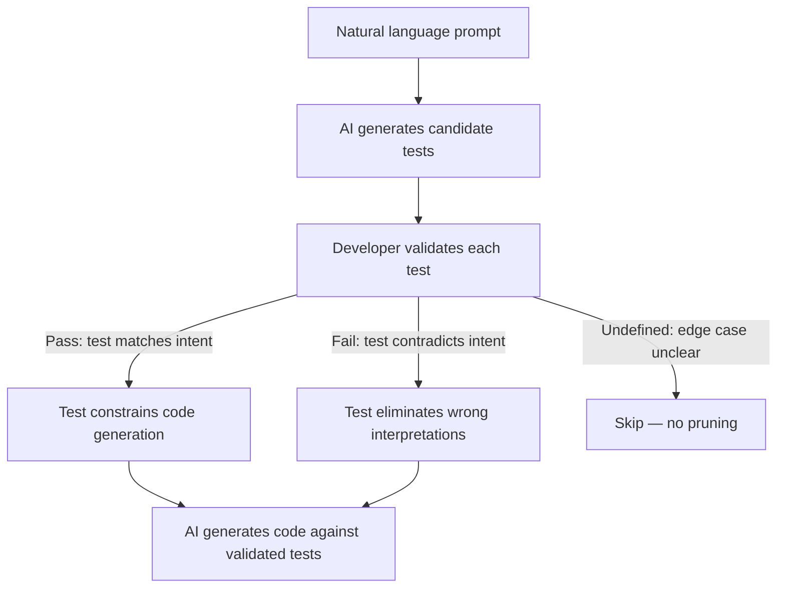

# Test-Driven Intent Clarification: Tests as Intermediate Alignment Artifacts

> Ask the AI to generate tests that expose ambiguity in your specification, validate those tests, then use them to constrain code generation — reviewing tests is cheaper and more precise than reviewing code.

## The Intent Gap

"Sort users by activity" could mean descending by last-active timestamp, ascending by total actions, or weighted by recency. An LLM picks one reading; if it differs from your intent, you discover the mismatch during code review — the most expensive place to catch it.

The gap between what you mean and what the model generates is a specification failure, not a generation failure. Better models do not close it — clearer specs do.

## The Technique

Use AI-generated tests as an intermediate artifact to surface and resolve ambiguity *before* code is written.



The cognitive shift: instead of "is this 50-line function correct?" you answer "should `sort_users(['alice', 'bob'])` return `['bob', 'alice']`?"

### Why Tests, Not Code

A test case is one input, one expected output, one assertion. `assert sort_users(input) == expected` either matches your intent or it doesn't. Code review requires reasoning about implementation logic, control flow, and edge cases at once; test validation is one input-output pair at a time. TiCoder measured a 38% reduction in cognitive load (NASA-TLX) with no increase in completion time. ([Fakhoury et al., IEEE TSE 2024](https://arxiv.org/abs/2404.10100))

## Discriminative Test Selection

Not all tests are useful. A test every candidate passes carries zero information. The highest-value tests are *discriminative*: they split candidates into groups that disagree on expected output. Score each test by how evenly it splits candidates — a 50/50 split maximizes information gain. ([Fakhoury et al., IEEE TSE 2024](https://arxiv.org/abs/2404.10100)) The AI targets *points of ambiguity* where reasonable interpretations diverge.

## Quantitative Evidence

**User study (n=15)**: code review scored 40% correctness; test validation scored 84% (p=0.001). NASA-TLX load dropped from 45.46 to 28.00 (p=0.012). ([Fakhoury et al., IEEE TSE 2024](https://arxiv.org/abs/2404.10100))

**Benchmark (7 LLMs, 2 Python datasets)**: 45.97% average absolute pass@1 improvement on MBPP and HumanEval within 5 rounds. CodeGen-6B with validated tests (69.55% on MBPP) beat baseline GPT-3.5-turbo (61.91%). ([Fakhoury et al., IEEE TSE 2024](https://arxiv.org/abs/2404.10100))

**Tests beat prompt-based specification**: adding tests to the prompt reached 80.88% pass@1 (GPT-4-32k, MBPP). Execution-based pruning reached 81.56% using pass/fail alone — LLMs do not reliably satisfy tests given only as prompt context. ([Fakhoury et al., IEEE TSE 2024](https://arxiv.org/abs/2404.10100))

## When This Backfires

- **Developers misjudge tests.** The TiCoder study found participants sometimes approved incorrect surfaced tests, formalizing wrong intent into code. Validation is only cheaper than code review when the reviewer can recognize wrong expected outputs. ([Fakhoury et al., IEEE TSE 2024](https://arxiv.org/abs/2404.10100))
- **Shared blind spots.** When one model both drafts tests and interprets the prompt, tests inherit its misreading. An alternative is having the model ask a clarifying question rather than commit to tests. ([Wu et al., 2025](https://arxiv.org/abs/2504.16331))
- **Unfamiliar domain.** If the developer doesn't yet know the right answer (new subsystem, unfamiliar library), the loop encodes guesses as ground truth.
- **Out of scope.** Evidence covers single-function Python with an idealized oracle; multi-file refactors and stateful systems are untested.

Prefer TDD or spec-first review when the spec is precise, or when you cannot verify expected outputs in isolation.

## How This Differs from TDD with Agents

[Test-driven agent development](tdd-agent-development.md) is *developer writes tests, agent implements* — the spec is already known. Intent clarification inverts the roles: *agent generates tests, developer validates*, formalizing the spec incrementally as tests are approved or rejected.

| Dimension | TDD with Agents | Intent Clarification |
|-----------|----------------|----------------------|
| Who writes tests | Developer | AI |
| Purpose of tests | Constrain implementation | Clarify specification |
| When to use | Spec is known | Spec is ambiguous |
| Developer reviews | Code (after tests pass) | Tests (before code exists) |

Use intent clarification when the spec is fuzzy, TDD when it is precise.

## Applying the Technique Today

No mainstream AI assistant ships a TiCoder-style test-validate-then-generate loop. Approximate it manually:

1. **Prompt for tests first**: "Generate 5-10 test cases covering expected behavior, including ambiguous edge cases. Do not implement yet."
2. **Review each test**: does it match your intent? Reject ones that don't and say why.
3. **Constrain generation**: "Implement the function so all approved tests pass; discard the rejected ones."
4. **Iterate**: if implementation reveals new ambiguity, ask for more discriminative tests targeting it.

Key discipline: review tests *before* seeing any implementation — once you've seen code, your judgment anchors to it, not your intent.

## Example

A developer prompts: "Write a function that extracts email addresses from text."

**Without intent clarification** — the AI generates an implementation. During review, the developer discovers it does not handle emails in angle brackets (`<user@example.com>`), does not deduplicate, and includes `mailto:` prefixed addresses. Each issue is a specification gap discovered during code review.

**With intent clarification** — the developer first asks for discriminative tests:

```python
# AI-generated tests surfacing ambiguity points
def test_plain_email():
    assert extract_emails("contact user@example.com") == ["user@example.com"]

def test_angle_bracket_email():
    # Ambiguity: should bracketed emails be extracted?
    assert extract_emails("send to <user@example.com>") == ["user@example.com"]

def test_duplicate_emails():
    # Ambiguity: deduplicate or preserve all occurrences?
    assert extract_emails("a@b.com and a@b.com") == ["a@b.com"]

def test_mailto_prefix():
    # Ambiguity: strip mailto: prefix or include it?
    assert extract_emails("link: mailto:a@b.com") == ["a@b.com"]

def test_invalid_tld():
    # Ambiguity: validate TLD or accept any format?
    assert extract_emails("user@localhost") == []
```

The developer reviews each test in seconds. "Yes, extract from brackets. Yes, deduplicate. Yes, strip mailto. No, accept `user@localhost` — change that test to include it." The specification is now precise. The AI implements against validated tests, and code review focuses on implementation quality rather than specification correctness.

## Key Takeaways

- Natural language prompts are ambiguous; tests surface the specific points where interpretations diverge
- Validating tests is cognitively cheaper than reviewing code — research shows 38% lower cognitive load with no time increase
- Discriminative tests (those that split candidate implementations) provide the most information per interaction
- The technique is complementary to TDD: use intent clarification when the spec is ambiguous, TDD when the spec is known
- Smaller models with validated tests outperform larger models without them — test-based constraints compensate for model capability gaps

## Related

- [Test-Driven Agent Development: Tests as Spec and Guardrail](tdd-agent-development.md)
- [Red-Green-Refactor with Agents: Letting Tests Drive Dev](red-green-refactor-agents.md)
- [Incremental Verification: Check at Each Step, Not at the End](incremental-verification.md)
- [The Eval-First Development Loop](../training/eval-driven-development/eval-first-loop.md)
- [Human-in-the-Loop Placement](../workflows/human-in-the-loop.md)
- [Pre-Completion Checklists](pre-completion-checklists.md)
