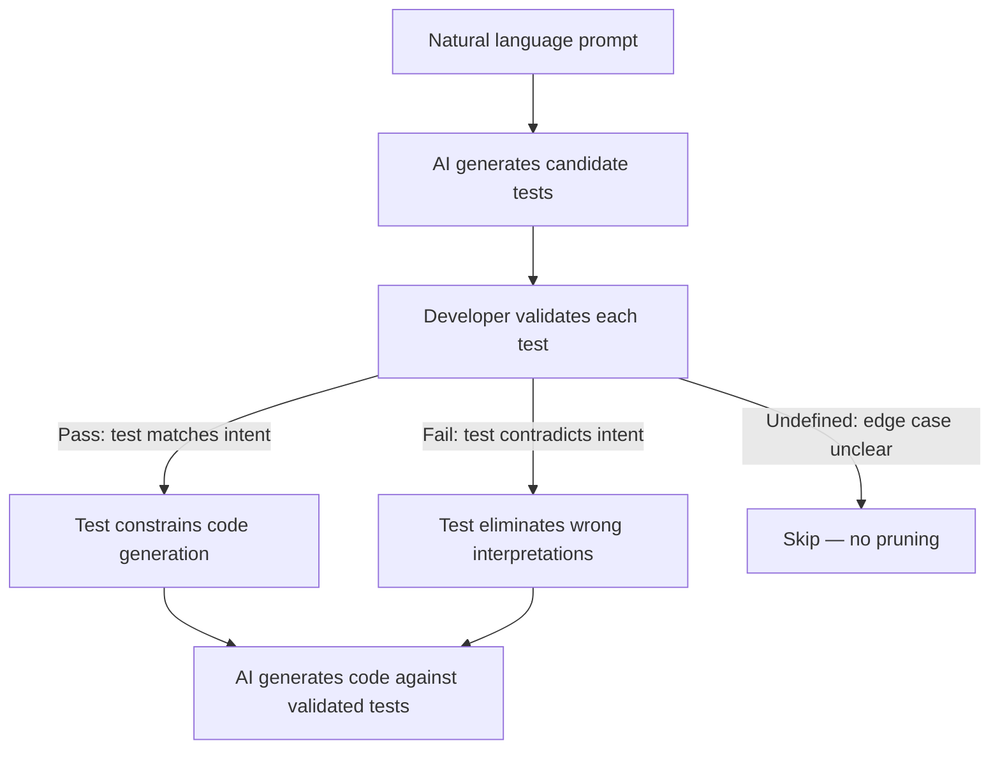

# Test-Driven Intent Clarification: Tests as Intermediate Alignment Artifacts

> Generate tests that expose specification ambiguity, validate them against your intent, then constrain code generation — validating tests is cheaper and more precise than review.

## The intent gap

"Sort users by activity" could mean descending by last-active timestamp, ascending by total actions, or weighted by recency. An LLM picks one reading. If it differs from your intent, you discover the mismatch during [code review](../code-review/diff-based-review.md) — the most expensive place to catch it.

The gap between what you mean and what the model generates is a specification failure, not a generation failure. Better models do not close it — clearer specs do.

## The technique

Use AI-generated tests as an intermediate artifact to surface and resolve ambiguity before code is written.


```mermaid
graph TD
    A[Natural language prompt] --> B[AI generates candidate tests]
    B --> C[Developer validates each test]
    C -->|Pass: test matches intent| D[Test constrains code generation]
    C -->|Fail: test contradicts intent| E[Test eliminates wrong interpretations]
    C -->|Undefined: edge case unclear| F[Skip — no pruning]
    D --> G[AI generates code against validated tests]
    E --> G
```

The cognitive shift: instead of "is this 50-line function correct?" you answer "should `sort_users(['alice', 'bob'])` return `['bob', 'alice']`?"

### Why tests, not code

A test case is one input, one expected output, one assertion. `assert sort_users(input) == expected` either matches your intent or it does not. Code review reasons about implementation logic, control flow, and edge cases at once. Test validation handles one input-output pair at a time. ([Fakhoury et al., IEEE TSE 2024](https://arxiv.org/abs/2404.10100))

## Discriminative test selection

A test every candidate passes carries zero information. The highest-value tests are discriminative: they split candidates into groups that disagree on expected output. Score each test by how evenly it splits candidates — a 50/50 split maximizes information gain at points of ambiguity where reasonable interpretations diverge. ([Fakhoury et al., IEEE TSE 2024](https://arxiv.org/abs/2404.10100))

## Quantitative evidence

User study (n=15): code review scored 40% correctness; test validation scored 84% (p=0.001). NASA-TLX load dropped from 45.46 to 28.00 (p=0.012). ([Fakhoury et al., IEEE TSE 2024](https://arxiv.org/abs/2404.10100))

Benchmark (7 LLMs, 2 Python datasets): pass@1 improved by 45.97% on average across MBPP and HumanEval within 5 rounds. CodeGen-6B with validated tests (69.55% on MBPP) beat baseline GPT-3.5-turbo (61.91%). ([Fakhoury et al., IEEE TSE 2024](https://arxiv.org/abs/2404.10100))

Tests beat prompt-based specification. Adding tests to the prompt reached 80.88% pass@1 (GPT-4-32k, MBPP). Execution-based pruning reached 81.56% using pass/fail alone — LLMs do not reliably satisfy tests given only as prompt context. ([Fakhoury et al., IEEE TSE 2024](https://arxiv.org/abs/2404.10100))

## When this backfires

- Developers misjudge tests. The TiCoder study found participants sometimes approved incorrect surfaced tests, formalizing wrong intent into code. Validation is only cheaper than code review when the reviewer can recognize wrong expected outputs. ([Fakhoury et al., IEEE TSE 2024](https://arxiv.org/abs/2404.10100))
- Shared blind spots. When one model both drafts tests and interprets the prompt, tests inherit its misreading. An alternative is having the model ask a clarifying question rather than commit to tests. ([Wu et al., 2025](https://arxiv.org/abs/2504.16331))
- Unfamiliar domain. If the developer does not yet know the right answer (new subsystem, unfamiliar library), the loop encodes guesses as ground truth.
- Out of scope. Evidence covers single-function Python with an idealized oracle. Multi-file refactors and stateful systems are untested.

## How this differs from TDD with agents

In [test-driven agent development](tdd-agent-development.md), the developer writes the tests and the agent implements — the spec is already known. Intent clarification inverts the roles: the agent generates tests and the developer validates them, formalizing the spec incrementally as tests are approved or rejected.

| Dimension | TDD with Agents | Intent Clarification |
|-----------|----------------|----------------------|
| Who writes tests | Developer | AI |
| Purpose of tests | Constrain implementation | Clarify specification |
| When to use | Spec is known | Spec is ambiguous |
| Developer reviews | Code (after tests pass) | Tests (before code exists) |

Use intent clarification when the spec is fuzzy, TDD when it is precise.

## Applying the technique today

No mainstream AI assistant ships a TiCoder-style test-validate-then-generate loop. Approximate it manually:

1. Prompt for tests first. Ask the assistant to "generate 5-10 test cases covering expected behavior, including ambiguous edge cases. Do not implement yet."
2. Review each test. Decide whether it matches your intent. Reject the ones that do not and say why.
3. Constrain generation. Ask the assistant to "implement the function so all approved tests pass; discard the rejected ones."
4. Iterate. If the implementation reveals new ambiguity, ask for more discriminative tests targeting it.

Review tests before you see any implementation. Once you have seen code, your judgment anchors to it, not to your intent.

## Example

A developer prompts: "Write a function that extracts email addresses from text."

Without intent clarification, the AI generates an implementation. During review, the developer discovers it does not handle emails in angle brackets (`<user@example.com>`), does not deduplicate, and includes `mailto:` prefixed addresses. Each issue is a specification gap discovered during code review.

With intent clarification, the developer first asks for discriminative tests:

```python
# AI-generated tests surfacing ambiguity points
def test_plain_email():
    assert extract_emails("contact user@example.com") == ["user@example.com"]

def test_angle_bracket_email():
    # Ambiguity: should bracketed emails be extracted?
    assert extract_emails("send to <user@example.com>") == ["user@example.com"]

def test_duplicate_emails():
    # Ambiguity: deduplicate or preserve all occurrences?
    assert extract_emails("a@b.com and a@b.com") == ["a@b.com"]

def test_mailto_prefix():
    # Ambiguity: strip mailto: prefix or include it?
    assert extract_emails("link: mailto:a@b.com") == ["a@b.com"]

def test_invalid_tld():
    # Ambiguity: validate TLD or accept any format?
    assert extract_emails("user@localhost") == []
```

The developer reviews each test in seconds — the validation path that scored 84% correctness in the user study. "Yes, extract from brackets. Yes, deduplicate. Yes, strip mailto. No, accept `user@localhost` — change that test to include it." The specification is now precise. The AI implements against validated tests, and code review focuses on implementation quality rather than specification correctness.

## Key Takeaways

- Natural language prompts are ambiguous; tests surface the specific points where interpretations diverge
- Validating tests is cognitively cheaper than reviewing code — research shows 38% lower cognitive load with no time increase
- Discriminative tests (those that split candidate implementations) provide the most information per interaction
- The technique is complementary to TDD: use intent clarification when the spec is ambiguous, TDD when the spec is known
- Smaller models with validated tests outperform larger models without them — test-based constraints compensate for model capability gaps

## Related

- [Test-Driven Agent Development: Tests as Spec and Guardrail](tdd-agent-development.md)
- [Red-Green-Refactor with Agents: Letting Tests Drive Dev](red-green-refactor-agents.md)
- [Incremental Verification: Check at Each Step, Not at the End](incremental-verification.md)
- [Multi-Agent RAG for Spec-to-Test Automation](multi-agent-rag-spec-to-test.md)
- [LLM Static Verification Against Natural-Language Requirements](llm-static-verification-natural-language-requirements.md)
- [Test Evolution Blind Spot in Coding Agents](eval-blind-spots.md)
- [Human-in-the-Loop Placement](../workflows/human-in-the-loop.md)
- [Pre-Completion Checklists](pre-completion-checklists.md)
