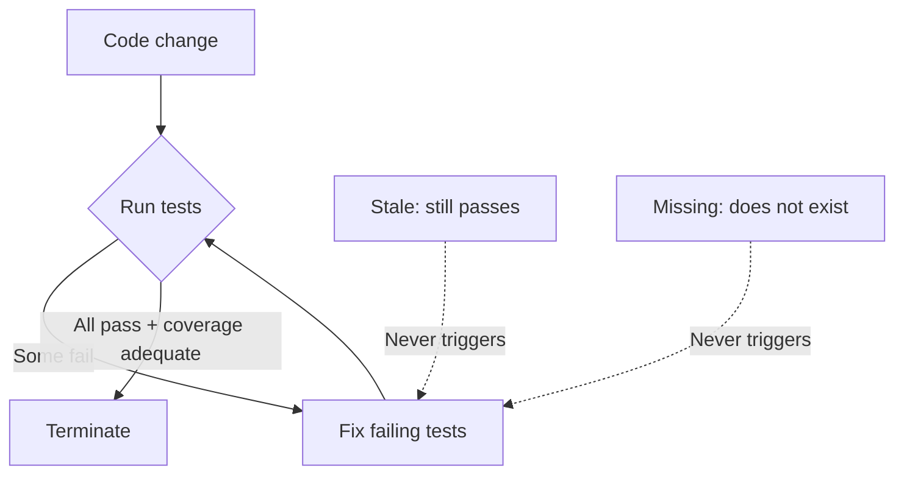

# Test Evolution Blind Spot in Coding Agents

> When production code changes, the test suite must co-evolve — but the execute-fail-fix loop that powers Claude Code, Codex CLI, and OpenCode hits a shared performance ceiling because no execution signal flags semantically stale tests.

## The Three Evolution Types

A code-changing commit produces three kinds of test work, formalised by TEBench, the first project-level test evolution benchmark. [Source: [TEBench (arxiv:2605.06125)](https://arxiv.org/abs/2605.06125)]

- **Test-Breaking** — an existing test fails to compile or execute after the change; the developer modifies it to restore correctness
- **Test-Stale** — an existing test still passes after the change but no longer meaningfully validates the updated behavior; the developer revises it to reflect the new semantics
- **Test-Missing** — newly introduced behavior has no corresponding test; the developer adds one

In TEBench's 314 Java tasks drawn from 10 Defects4J projects, 69.7% carry multiple labels and 14.3% exhibit all three simultaneously. Real-world test evolution is predominantly multi-faceted, not a single flavour. [Source: [TEBench §2.3](https://arxiv.org/abs/2605.06125)]

## The Shared Performance Ceiling

TEBench evaluated seven configurations spanning Claude Code, Codex CLI, and OpenCode across six base models (Claude Sonnet 4.6, ChatGPT 5.3 Codex, Qwen3.5, GLM-5, Kimi-K2.5, DeepSeek-V3.2). All seven converge on identification F1 between 45.7% and 49.4% — less than four points apart. Five OpenCode backbones span 3.6 F1 points; the same Claude Sonnet 4.6 backbone across Claude Code and OpenCode differs by 1.2 points. The convergence is the load-bearing finding: the bottleneck is the task formulation, not the framework or the model. [Source: [TEBench §4.1, Table 5](https://arxiv.org/abs/2605.06125)]

| Configuration | Overall F1 | Test-Stale F1 |
|---------------|-----------:|--------------:|
| Heuristic (one-hop AST) | 4.0 | 3.0 |
| Claude Code (Sonnet 4.6) | 47.1 | 35.0 |
| Codex CLI (ChatGPT 5.3 Codex) | 49.4 | 37.4 |
| OpenCode (DeepSeek-V3.2) | 45.7 | 33.4 |
| OpenCode best (GLM-5) | 49.3 | 37.1 |

[Source: [TEBench Table 5](https://arxiv.org/abs/2605.06125)]

## Why the Loop Fails on Stale and Missing

The three industrial agent frameworks all run a reactive **execute-fail-fix loop**: discover affected tests by running the suite, patch what fails, terminate when "all tests pass and coverage is adequate." This loop succeeds on Test-Breaking by construction — the failure signal locates the test. It structurally cannot address the other two types: [Source: [TEBench §4.4](https://arxiv.org/abs/2605.06125)]

- **Stale tests pass.** No execution signal flags a test that still compiles and asserts but whose comparison logic now masks the change. The agent has no internal mechanism that triggers on "technically passing but semantically obsolete."
- **Missing tests do not exist.** There is nothing to compile or run, so the loop offers no entry point. Coverage gaps would surface them, but only if the agent reasons proactively about behavioral contracts.

In a TEBench case study on jsoup, Codex CLI fixed all three Test-Breaking failures across packages but never updated the stale `unwrap()` test — `TextUtil.stripNewlines()` masked the formatting change, the test passed, the loop terminated. [Source: [TEBench §4.4](https://arxiv.org/abs/2605.06125)]

## The Stale-as-Poison-Factor Effect

Test-Stale's average F1 is approximately 36%, more than 20 points below Test-Breaking. The drop also propagates into mixed-type tasks. Identification F1 by type composition, averaged across the seven LLM configurations: [Source: [TEBench §4.3, Table 7](https://arxiv.org/abs/2605.06125)]

| Type Composition | N | Identification F1 |
|---|---:|---:|
| Breaking + Missing | 45 | 74.3% |
| Breaking-only | 58 | 62.0% |
| Breaking + Stale + Missing | 45 | 64.8% |
| Breaking + Stale | 24 | 29.8% |
| Stale + Missing | 105 | 34.8% |
| Stale-only | 33 | 33.1% |

When Stale enters the combination, identification F1 collapses — except when Missing enters too. The authors interpret this as Missing's explicit "behaviour was added" signal partially compensating for Stale's signal absence.

## Executability Is Not Update Quality

Even when agents identify the right tests, the patches diverge from how developers actually update tests. Across the seven configurations: [Source: [TEBench §4.2, Table 6](https://arxiv.org/abs/2605.06125)]

- Executability: 87.7% to 99.2%
- Token-Jaccard modification similarity to ground truth: 36.4% to 70.9%
- Within-configuration gap: 33.7 to 48.9 percentage points

The pattern argues against treating "tests pass" as a proxy for "tests are right." A 99% executable patch can still embed assertion shapes, scope decisions, and behavioural framings that diverge substantially from developer intent.

## Counterweights

- **Heuristic dependency tracing caps at 66% Recall.** Even exhaustive one-hop AST analysis misses about a third of affected tests, because dependencies operate through multi-hop chains, shared state, or implicit semantic coupling. Static analysis alone is not the answer. [Source: [TEBench §4.1](https://arxiv.org/abs/2605.06125)]
- **Scope is Java + Defects4J + Maven + JaCoCo.** Results may not transfer to dynamic languages or I/O-heavy code where coverage itself is unreliable. Configurations also ran with default settings and a single run per task; the 47% ceiling is the natural-run number, not a tuned upper bound. [Source: [TEBench §3.1, §6](https://arxiv.org/abs/2605.06125)]
- **Recall-over-Precision imbalance is universal.** Every configuration over-predicts; on single-method tasks agents predict ~3.6 methods on average, collapsing Precision to 13.6%. Agents apply a roughly constant effort budget regardless of true scope. [Source: [TEBench §4.1, §4.3](https://arxiv.org/abs/2605.06125)]

## What This Implies for Practice

The execute-fail-fix loop catches breaking tests and misses roughly two-thirds of stale ones. Closing the gap is a harness problem, not a model upgrade:

- **Prompt for proactive semantic review** — make the agent enumerate behaviour changes from the diff and challenge each passing test against the new behaviour before running anything
- **Add coverage-delta gates** — compare line and branch coverage of changed production methods before and after; unchanged coverage on changed code is a Stale or Missing signal
- **Decouple termination from "all tests pass"** — the TEBench prompt's stop condition was the structural cause of the failure mode; replace it with explicit per-type completion checks

## Example

Task 293 in TEBench (jsoup) shows the failure mode end-to-end. A 12-line change to `Element.isInlineable()` produced impacts in three packages: three Test-Breaking failures (e.g., `nestedAnchorElements01()` observed different pretty-printing output), one Test-Stale (`unwrap()` still passed because `stripNewlines()` masked the change), and one Test-Missing (the developer added `inlineInBlockShouldIndent()` covering three indentation scenarios).

Codex CLI inspected the diff, ran `ElementTest`, fixed the failing assertion, added a new test for one of the three indentation scenarios, ran the full suite, patched cross-package failures in `HtmlTreeBuilderStateTest`, then terminated when all tests passed with adequate JaCoCo coverage. Result: three Breaking tests fixed, one of three Missing scenarios covered, the Stale `unwrap()` test left unchanged. The trajectory is faithful to the prompt's termination condition; that condition is what bounded what the loop could detect. [Source: [TEBench §1.1, §4.4](https://arxiv.org/abs/2605.06125)]

## Key Takeaways

- Coding agents converge on 45.7%–49.4% identification F1 on project-level test evolution across three frameworks and six base models — the bottleneck is the task formulation, not the framework or the model
- Test-Stale averages ~36% F1 because the execute-fail-fix loop has no signal for tests that pass but no longer validate the changed behaviour
- Test-Stale acts as a poison factor in mixed-type tasks (Breaking+Stale collapses to 29.8% F1), partially compensated when explicit Missing signals are also present
- 87.7%–99.2% executability with 36.4%–70.9% similarity to developer-written ground truth means executable tests are not aligned tests
- Closing the gap requires harness changes — proactive semantic review, coverage-delta gates, termination conditions decoupled from "all tests pass" — not a better model

## Related

- [TDD with Agent Development](tdd-agent-development.md) — writing the test first as a way to give the agent the explicit signal stale and missing tasks lack
- [Mutation Testing as Quality Gate](mutation-testing-quality-gate.md) — mutation survival as an external signal for the Stale class TEBench measures
- [Pre-Completion Checklists](pre-completion-checklists.md) — replacing "all tests pass" with structural completion criteria the loop cannot bypass
- [Behavioural Testing for Agents](behavioral-testing-agents.md) — designing tests around behaviour rather than implementation, the gap TEBench's update similarity metric exposes
- [Pre-Change Impact Analysis](pre-change-impact-analysis.md) — proactive identification of affected code regions, the missing capability behind the Stale ceiling
- [Benchmark-Driven Tool Selection for Code Generation](benchmark-driven-tool-selection.md) — using benchmark numbers like TEBench's 47% to set realistic expectations for an agent's autonomous range
