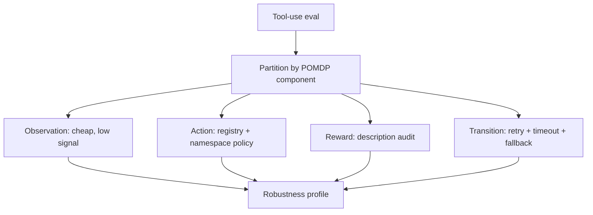

# Tool-Use Sim-to-Real Perturbation Taxonomy

> Tool-use benchmarks assume clean inputs, unambiguous tool registries, and reliable APIs. Real deployments violate all three. Partition perturbations by which POMDP component they hit — observation, action, reward, or transition — and the robustness profile of your agent stops being a surprise.

## The Sim-to-Real Gap for Tool-Use Agents

Agents benchmarked on clean inputs rank high; deployed against real queries, dozens of MCP tools, and flaky APIs they degrade sharply and unevenly. [Zhou et al. (2026), *When Simulation Lies*](https://arxiv.org/abs/2605.11928) frames this as a sim-to-real gap in the tool-use POMDP and partitions deployment noise by which component it perturbs.

Across 21 models from 1.5B to 32B (including o4-mini), headline drops on their RobustBench-TC suite:

| POMDP component | Accuracy drop | What it perturbs |
|---|---|---|
| Observation | <5% | What the agent reads (user query, tool description) |
| Action | ~15% | Which tools are visible to choose between |
| Reward | ~40% | Metadata steering the choice (descriptions, cost annotations) |
| Transition | ~30% | What happens after the call (HTTP errors, timeouts, malformed responses) |

Scale alone does not close these gaps — a 32B model has the same profile shape as a 1.5B model, only translated [Source: [Zhou et al., 2026](https://arxiv.org/abs/2605.11928)].

## The Four POMDP Components

Each axis maps to a class of real-world failure documented in framework GitHub issues.

### Observation — noisy inputs the agent must read

Perturbations to user query, tool descriptions, and parameter descriptions: typos, semantic rephrasing, paraphrased descriptions. The language prior absorbs surface noise.

The failure bites when noise propagates into a generated tool call. A query `what's an occrra account?` provoked a LlamaIndex agent to emit `occcra_information` — a hallucinated typo. The dispatcher crashed with `Tool with name occcra_information not found` ([run-llama/llama_index #7170](https://github.com/run-llama/llama_index/issues/7170)).

### Action — ambiguous tool spaces

Perturbations to the tool registry: duplicate tool names across sources, and functionally similar redundant tools.

Two MCP servers with the same tool name freeze the OpenAI Agents SDK — it raises `Duplicate tool names found across MCP servers` ([openai-agents-python #464](https://github.com/openai/openai-agents-python/issues/464), April 2025). In the variant where listing hangs rather than erroring, the agent loop never returns ([#1167](https://github.com/openai/openai-agents-python/issues/1167), July 2025). The SDK's remediation is per-server prefixing, but until opted-in the failure is silent.

### Reward — misleading metadata

Perturbations to the metadata that drives tool selection: misleading descriptions, response-time annotations nudging toward worse options, adversarial suffixes or abbreviated names.

This is the largest drop (~40%) [Source: [Zhou et al., 2026](https://arxiv.org/abs/2605.11928)]. Tool descriptions are part of the prompt, so a misleading description is an injected instruction steering selection.

### Transition — runtime failures after the call

Perturbations after the agent decides: HTTP timeout, 429, 401/403, 5xx, malformed JSON, schema validation failure. The choice was correct; the environment broke.

LangChain's `BaseChatOpenAI.request_timeout` defaults to `None` ([source](https://github.com/langchain-ai/langchain/blob/master/libs/partners/openai/langchain_openai/chat_models/base.py)) — the OpenAI SDK reads this as "disable all HTTP timeouts". An autonomous agent on a hung call blocks forever.

## Why the Partition Predicts Where You'll Fail

**Observation robustness is mostly free.** Language modelling makes agents tolerant to typos and rephrasing — eval budget here yields a low-information signal.

**Reward and transition robustness must be designed.** A 40% drop on reward-relevant perturbations means tool descriptions are not documentation, they are part of the selection prompt. A 30% drop on transition perturbations means runtime failure policy determines tail behaviour more than model choice does.

## What Domain Randomization Buys You

Domain randomization — training on perturbed inputs so the real distribution falls inside the trained envelope — is the standard sim-to-real recipe from robotics ([Tobin et al., 2017](https://arxiv.org/abs/1703.06907)). [Zhou et al. (2026)](https://arxiv.org/abs/2605.11928) adapt it as ToolRL-DR: a 3B Qwen2.5 backbone trained with GRPO on 3,984 trajectories across the 16 statically-augmentable perturbation types. Transition perturbations are excluded — they only happen at runtime.

ToolRL-DR-Full retains ~75% of clean accuracy under perturbation and closes ~27% of the transition gap without training on transition perturbations — RL on adversarial static inputs induces a persistent retry policy that transfers.

Caveats: one backbone, one recipe; the ~25% clean-accuracy regression is the price. For teams without RL infrastructure, the taxonomy alone is the load-bearing contribution — SDK-layer fixes (pinning timeouts, namespacing MCP tools, validating model-emitted tool names) address most documented failures without retraining.

## When the Taxonomy Changes a Decision

Use it before designing an eval suite for a tool-using agent:



A team that measures only single-axis robustness (typos, or duplicate tools, or timeouts) ships an agent that passes one bar and falls off another.

## Example

A team building a customer-support agent over five MCP servers (CRM, ticketing, billing, knowledge base, internal search) plans to ship to production.

Without the taxonomy, their eval is 100 hand-curated user queries with expected tool calls — observation-axis coverage only.

With the taxonomy, they expand to four buckets:

```
Observation suite (4 axes):
  - Inject character-level typos into queries
  - Paraphrase queries while preserving intent
  - Paraphrase tool descriptions
  - Paraphrase parameter descriptions

Action suite (6 axes):
  - Add a duplicate-named tool from a second server (no description)
  - Same name, plausible-but-wrong description
  - Same name, wrong parameter list
  - Same name, swapped description (description of a different tool)
  - Same name, abbreviated form
  - Add a functionally similar but incorrect distractor

Reward suite (6 axes):
  - Misleading description on the ground-truth tool
  - Response-time annotation steering toward slower tool
  - Misleading description + neutral suffix
  - Time annotation + neutral suffix
  - Misleading description on an abbreviated name
  - Time annotation on an abbreviated name

Transition suite (6 axes):
  - Inject Timeout on first call
  - Inject HTTP 429
  - Inject HTTP 401/403
  - Inject HTTP 5xx
  - Return malformed JSON
  - Return JSON failing parameter schema
```

The shape of the resulting accuracy table tells them which production hardening to fund:

- High drops on the **Reward** axis → audit tool descriptions, treat them as part of the system prompt.
- High drops on the **Transition** axis → write a retry/timeout/fallback policy, pin HTTP timeouts.
- High drops on the **Action** axis → namespace MCP tools per server.
- Low drops on **Observation** → no further work, the language prior absorbs surface noise.

The team ships with a robustness profile instead of a single number, and they know which axis a regression came from.

## Key Takeaways

- Tool-use robustness is not one quantity — it is a profile across four POMDP components, and the components fail unevenly.
- Observation robustness is largely free from language modelling; reward and transition robustness must be explicitly designed.
- Each perturbation class is grounded in framework-level GitHub issues (LlamaIndex hallucinated tool names, OpenAI Agents SDK duplicate-name hangs, LangChain `request_timeout=None`) — these are deterministic SDK failures before they are model failures.
- Scale alone does not close the gaps. A 32B model has the same robustness shape as a 1.5B model.
- Domain-randomization RL (ToolRL-DR) closes some of the gap and transfers ~27% to unseen transition failures, but costs ~25% of clean accuracy and is one recipe on one backbone — try, don't rely on.
- The taxonomy is the durable contribution; use it to size your eval suite even if you never train a model.

## Related

- [PASS@(k,T): Evaluate RL for Agents Along Sampling and Interaction Depth](pass-at-k-t-agentic-rl-eval.md) — when robustness training is RL, vary sampling and interaction depth jointly to see what it actually buys
- [Behavioral Testing for Agents](behavioral-testing-agents.md) — non-deterministic eval design that the four-axis partition slots into
- [Benchmark-Driven Tool Selection for Code Generation](benchmark-driven-tool-selection.md) — same theme: benchmark conditions overstate real-world capability
- [Skill Retrieval Realism Gap](skill-retrieval-realism-gap.md) — the retrieval-side analogue: idealized benchmark conditions collapse under realistic deployment
- [Nonstandard Errors in AI Agents](nonstandard-errors-ai-agents.md) — model-family variance under identical inputs, complementary to perturbation-class variance
- [Tool Description Quality](../tool-engineering/tool-description-quality.md) — descriptions are part of the selection prompt; this page explains why reward-axis perturbations hit so hard
