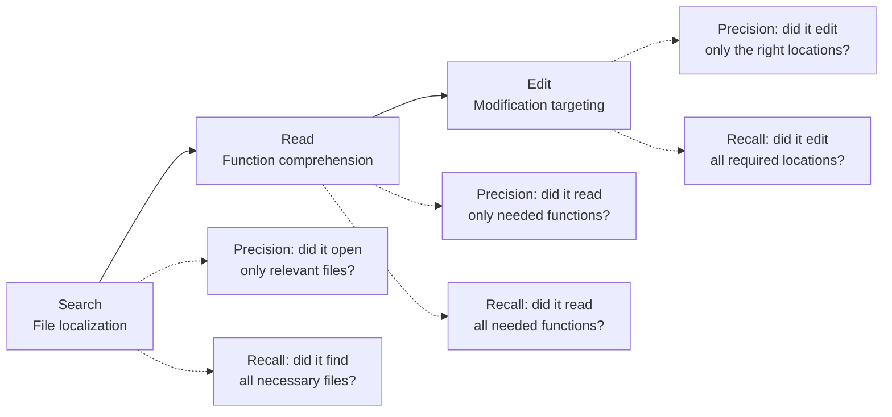

# Trajectory Decomposition: Diagnose Where Coding Agents Fail

> When Pass@1 tells you an agent failed but not why, decompose the trajectory into search, read, and edit stages and measure each independently. This turns "it didn't work" into "it found the right files but read too many functions and edited the wrong one."

## The Problem with Binary Outcomes

[pass@k metrics](pass-at-k-metrics.md) tell you whether an agent solved a problem and how consistently. [Outcome grading](grade-agent-outcomes.md) tells you whether the final state is correct. Neither tells you *where* the agent went wrong when it fails.

A coding agent that fails a SWE-bench task could have failed at any point: wrong files, wrong functions, or wrong edits. Binary metrics collapse these distinct failure modes into a single "fail," making targeted improvement impossible.

## Three-Stage Decomposition

The TRAJEVAL framework decomposes every agent trajectory into three stages, each measurable with standard information retrieval metrics. [Source: [TRAJEVAL: Decomposing Code Agent Trajectories for Fine-Grained Diagnosis](https://arxiv.org/abs/2603.24631)]



| Stage | What it measures | Precision question | Recall question |
|-------|-----------------|-------------------|-----------------|
| **Search** | File localization | Did it open only relevant files? | Did it find all necessary files? |
| **Read** | Function comprehension | Did it examine only needed functions? | Did it examine all needed functions? |
| **Edit** | Modification targeting | Did it change only the right locations? | Did it change all required locations? |

Compare each stage against the reference patch (the known-correct solution) to compute precision and recall independently.

## What the Evidence Shows

Analysis of 16,758 trajectories across three architectures and seven models reveals patterns invisible to binary metrics. [Source: [TRAJEVAL](https://arxiv.org/abs/2603.24631)]

### Universal over-reading

All agents examine approximately 22x more functions than necessary. This is not a model-specific bug — it is a structural property of how current agents explore code. Context engineering to reduce read scope has the highest ROI for most agent configurations.

### Model-specific failure stages

Different models fail at different stages:

| Model | Primary failure stage | Implication |
|-------|----------------------|-------------|
| GPT-5 | Edit (targets wrong locations) | Improve edit targeting — search and read are adequate |
| Qwen-32B | Search (misses files entirely) | Improve file discovery — edits are accurate when it finds the right code |

A single Pass@1 score would rank both equally. Stage decomposition reveals they need opposite interventions.

### Predictive power

Stage-level metrics predict Pass@1 within 0.87-2.1% MAE at the model level — meaning the decomposed measurements reconstruct the aggregate outcome metric with high fidelity while providing far more diagnostic information.

## Applying This in Practice

### 1. Log trajectories with stage boundaries

Capture which files were opened (search), which functions were read (read), and which locations were modified (edit). [Trajectory logging](../observability/trajectory-logging-progress-files.md) provides the capture mechanism; stage decomposition provides the analysis layer.

### 2. Compute per-stage precision and recall

For each failed task, compare agent actions against the reference solution at each stage:

```
search_precision = |files_opened ∩ files_in_patch| / |files_opened|
search_recall    = |files_opened ∩ files_in_patch| / |files_in_patch|
```

Apply the same formula at the read (function) and edit (location) levels.

### 3. Diagnose before optimizing

| Symptom | Stage bottleneck | Likely fix |
|---------|-----------------|------------|
| Low search recall | Agent misses relevant files | Better repository maps, improved file discovery tools |
| Low read precision | Agent reads too many functions | Tighter context filtering, [semantic context loading](../context-engineering/semantic-context-loading.md) |
| Low edit precision | Agent modifies wrong locations | More specific edit instructions, [constraint-based prompting](../instructions/negative-space-instructions.md) |

### 4. Inject real-time feedback

Stage-level signals are not limited to post-hoc analysis. Feeding trajectory diagnostics back to the agent during execution improved two state-of-the-art models by 2.2-4.6 percentage points while reducing token costs by 20-31%. [Source: [TRAJEVAL](https://arxiv.org/abs/2603.24631)]

This aligns with [agent self-review loops](../agent-design/agent-self-review-loop.md) — the agent checks its own search/read coverage before committing to edits.

## When to Use This vs. Outcome Grading

[Outcome grading](grade-agent-outcomes.md) remains the right default for evals — it avoids penalizing valid alternative solutions. Trajectory decomposition is the diagnostic layer you add when:

- An agent is failing and you need to know *why*
- You are comparing models or architectures and need to understand their different failure profiles
- You want to prioritize which component (search, context, edit) to improve next

The two approaches are complementary: outcome grading for the scorecard, trajectory decomposition for the diagnosis.

## Unverified Claims

- The 22x over-reading ratio likely varies by codebase size and complexity; the paper tests on SWE-bench which may not represent all production settings [unverified]
- The cost reduction from real-time feedback may depend on the agent architecture supporting mid-execution intervention [unverified]

## Key Takeaways

- Binary pass/fail metrics hide where agents fail — decompose into search, read, and edit stages
- All current agents over-read by ~22x — reducing read scope is the highest-ROI optimization for most setups
- Different models fail at different stages — diagnose first, then apply model-specific fixes
- Stage-level feedback during execution (not just post-hoc) improves outcomes and reduces cost
- Use outcome grading for scoring, trajectory decomposition for diagnosis — they serve different purposes
