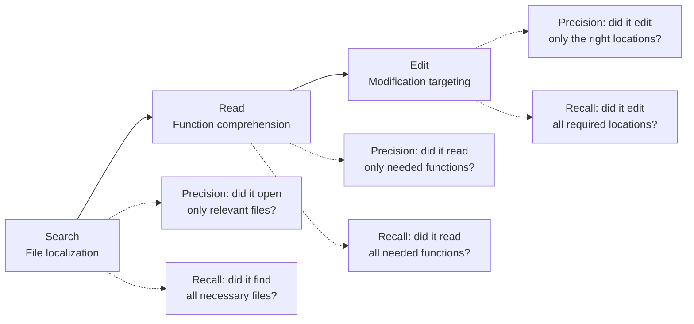

# Trajectory Decomposition: Diagnose Where Coding Agents Fail

> When Pass@1 tells you an agent failed but not why, decompose the trajectory into search, read, and edit stages and measure each independently. This turns "it didn't work" into "it found the right files but read too many functions and edited the wrong one."

## The Problem with Binary Outcomes

[pass@k metrics](pass-at-k-metrics.md) tell you whether an agent solved a problem. [Outcome grading](grade-agent-outcomes.md) tells you whether the final state is correct. Neither tells you *where* the agent went wrong when it fails.

A coding agent that fails a [SWE-bench](https://arxiv.org/abs/2310.06770) task could have failed at any point: wrong files, wrong functions, or wrong edits. Binary metrics collapse these into a single "fail," making targeted improvement impossible.

## Three-Stage Decomposition

The TRAJEVAL framework decomposes every agent trajectory into three stages, each measured with standard information retrieval metrics. [Source: [TRAJEVAL: Decomposing Code Agent Trajectories for Fine-Grained Diagnosis](https://arxiv.org/abs/2603.24631)]



| Stage | What it measures | Precision question | Recall question |
|-------|-----------------|-------------------|-----------------|
| **Search** | File localization | Did it open only relevant files? | Did it find all necessary files? |
| **Read** | Function comprehension | Did it examine only needed functions? | Did it examine all needed functions? |
| **Edit** | Modification targeting | Did it change only the right locations? | Did it change all required locations? |

Compare each stage against the reference patch to compute precision and recall independently.

Stage independence is why this works: precision and recall at each stage are computed against the same reference independently, so a failure in one stage does not distort scores in others.

## What the Evidence Shows

Analysis of 16,758 trajectories across three architectures and seven models reveals patterns binary metrics hide. [Source: [TRAJEVAL](https://arxiv.org/abs/2603.24631)]

### Universal over-reading

All agents examine approximately 22x more functions than necessary — a structural property of how agents explore code, not a model-specific bug. Reducing read scope has the highest ROI for most configurations.

### Model-specific failure stages

Different models fail at different stages:

| Model | Primary failure stage | Implication |
|-------|----------------------|-------------|
| GPT-5 | Edit (targets wrong locations) | Improve edit targeting — search and read are adequate |
| Qwen-32B | Search (misses files entirely) | Improve file discovery — edits are accurate when it finds the right code |

A single Pass@1 score would rank both equally. Stage decomposition reveals they need opposite interventions.

### Predictive power

Stage-level metrics predict Pass@1 within 0.87-2.1% MAE at the model level, reconstructing aggregate outcomes while providing richer diagnostic signal.

## Applying This in Practice

### 1. Log trajectories with stage boundaries

Capture which files were opened (search), which functions were read (read), and which locations were modified (edit). [Trajectory logging](../observability/trajectory-logging-progress-files.md) provides the capture layer.

### 2. Compute per-stage precision and recall

For each failed task, compare agent actions against the reference at each stage:

```
search_precision = |files_opened ∩ files_in_patch| / |files_opened|
search_recall    = |files_opened ∩ files_in_patch| / |files_in_patch|
```

Apply the same formula at the read and edit levels.

### 3. Diagnose before optimizing

| Symptom | Stage bottleneck | Likely fix |
|---------|-----------------|------------|
| Low search recall | Agent misses relevant files | Better [repository maps](../context-engineering/repository-map-pattern.md), improved file discovery tools |
| Low read precision | Agent reads too many functions | Tighter context filtering, [semantic context loading](../context-engineering/semantic-context-loading.md) |
| Low edit precision | Agent modifies wrong locations | More specific edit instructions, [constraint-based prompting](../instructions/negative-space-instructions.md) |

### 4. Inject real-time feedback

Stage-level signals extend beyond post-hoc analysis. Feeding trajectory diagnostics back during execution improved two models by 2.2-4.6 percentage points while reducing token costs by 20-31% — aligning with [agent self-review loops](../agent-design/agent-self-review-loop.md). [Source: [TRAJEVAL](https://arxiv.org/abs/2603.24631)]

## When to Use — and When Not To

[Outcome grading](grade-agent-outcomes.md) is the right default — it avoids penalizing valid alternative solutions. Add trajectory decomposition when an agent is failing and you need to know *why*, when comparing models by failure profile, or when deciding which component (search, context, edit) to improve next.

Skip it when:

- **No reference patch**: Precision and recall require a known-correct solution. Open-ended tasks and production settings without ground truth cannot be evaluated this way.
- **Non-sequential stages**: The model assumes forward-linear traversal. Agents that interleave stages (read → search → read → edit) produce ambiguous per-stage metrics.
- **Uninstrumented trajectories**: Stage decomposition requires logs that separate file-open, function-read, and location-edit events. Agents wrapped in opaque APIs or sandboxes cannot be decomposed.

## Key Takeaways

- Binary pass/fail metrics hide where agents fail — decompose into search, read, and edit stages
- All current agents over-read by ~22x — reducing read scope is the highest-ROI optimization for most setups
- Different models fail at different stages — diagnose first, then apply model-specific fixes
- Stage-level feedback during execution (not just post-hoc) improves outcomes and reduces cost
- Use outcome grading for scoring, trajectory decomposition for diagnosis — they serve different purposes

## Related

- [pass@k Metrics](pass-at-k-metrics.md) — the aggregate metric trajectory decomposition diagnoses
- [Outcome Grading](grade-agent-outcomes.md) — complement to trajectory decomposition for scoring
- [Completion Failure Taxonomy](completion-failure-taxonomy.md) — categorizes why code suggestions fail
- [Behavioral Testing for Non-Deterministic AI Agents](behavioral-testing-agents.md) — stage-level behavioral verification approach
- [Trajectory-Opaque Evaluation Gap](trajectory-opaque-evaluation-gap.md) — where outcome-only grading misses safety and robustness signals that trajectory-aware auditing catches
