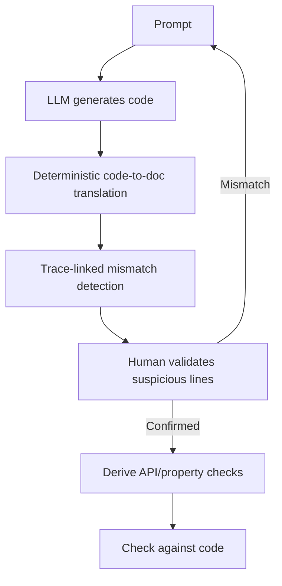

# Natural-Language Documentation as a Code-Review Intermediate (Verifiable Literate Programming)

> Translate LLM code into a deterministic natural-language documentation layer, then validate that readable prose to catch intent-code mismatches a direct code review misses.

Put a readable natural-language layer between the prompt and the generated code, and review that layer instead of the code. Verifiable Literate Programming (VLP) generates the code, then translates it back into unambiguous prose the user can read, so intent-code mismatches surface as prose a human can judge rather than logic they have to trace ([Yuan et al., 2026](https://arxiv.org/abs/2607.02333)). Reach for it when you accept LLM code you cannot easily read line by line, and can spare the effort to validate a documentation layer in exchange for catching underspecified-requirement bugs that partial validation misses.

## The intermediate layer

VLP inserts documentation between prompt and code and drives review through three parts ([Yuan et al., 2026](https://arxiv.org/abs/2607.02333)):

- A natural-language literate language with unambiguous syntax and mostly deterministic code-to-documentation translation. The doc describes what the code does, not what the prompt asked for, so drift between intent and behavior becomes visible.
- Fine-grained mismatch detection that uses trace links between the prompt and the documentation to point the reviewer at suspicious lines, bounding review effort instead of asking for a whole-program read.
- A verification module that derives API-usage checks and formal properties from the user-validated documentation and checks them against the code.

The motivating bug study found that detailed human feedback is essential, because failures often trace to underspecified requirements or subtle semantic deviations — the class of defect that validating only prompts or test cases leaves uncaught ([Yuan et al., 2026](https://arxiv.org/abs/2607.02333)).

## Why it works

Humans catch intent mismatches far more reliably in readable prose than in code, and because the code-to-documentation translation is mostly deterministic, the doc reflects what the code actually does rather than what the prompt hoped it would — so validating the doc approximates validating the code ([Yuan et al., 2026](https://arxiv.org/abs/2607.02333)). Trace links concentrate attention on the lines where intent and behavior diverge, so review cost scales with the mismatches, not the program size. The same mechanism is documented independently: validating an intermediate artifact instead of the code scored 84% correct against 40% for direct code review, with lower measured cognitive load ([Fakhoury et al., 2024](https://arxiv.org/abs/2404.10100)). That external corroboration is why the effect is not an artifact of one paper. VLP reports pass@1 rising from a 28.7%–73.2% baseline to 65.4%–93.5% with reasonable user effort ([Yuan et al., 2026](https://arxiv.org/abs/2607.02333)).

## When this backfires

- Trivial or exploratory code. Generating and reading a documentation layer costs more than the mismatch risk it removes when the change is small or throwaway.
- Lossy translation. The code-to-doc step is only mostly deterministic. Where it drops or misstates a detail, the reviewer validates prose that misrepresents the code, and a real bug passes review.
- Unfamiliar domain. A reviewer who does not already know the intended behavior cannot recognize a mismatch in the doc — the same limit that lets developers approve wrong intermediate artifacts in [test-driven intent clarification](test-driven-intent-clarification.md) ([Fakhoury et al., 2024](https://arxiv.org/abs/2404.10100)).
- Garbage-in derived checks. The verification module derives checks from the user-validated doc. If the user validated the wrong behavior, the derived checks encode and enforce the wrong specification.
- LLM-judged steps stay fallible. Mismatch detection is an LLM step, and LLM conformance checks between a natural-language artifact and code misjudge — enriching the checker prompt can raise false negatives ([Jin & Chen, 2026](https://arxiv.org/abs/2603.00539)). Only the derived deterministic checks escape this; the review layer does not.
- Executable oracles already exist. Where tests, types, and lints cover the behavior, they catch mismatches deterministically without a translation step that can itself be wrong. Prefer the [deterministic guardrail](deterministic-guardrails.md) and add the doc layer for what no oracle reaches.

## Example

No mainstream assistant ships a VLP loop, so approximate it manually:

1. Generate the code, then ask the assistant to "describe what this code actually does, line group by line group, in plain English — do not restate my prompt." This is the code-to-doc translation.
2. Read the description against your intent. You are judging prose, not tracing control flow.
3. Where the description names behavior you did not ask for, flag that line and correct the code — the mismatch is now explicit.
4. For each behavior you confirmed, ask for an assertion or type that pins it, and run it in CI. This is the derived-check step, and unlike the review it holds deterministically.

A prompt for "return the median of a list" yields code whose plain-English description reads "sorts the list and returns the middle element; for an even-length list returns the lower of the two middle elements." The prose exposes the even-length tie-break the prompt never specified — a mismatch you would likely miss reading the sort-and-index code directly.

## Key Takeaways

- Review a deterministic natural-language translation of LLM code, not the code, so intent-code mismatches surface as prose a human can judge ([Yuan et al., 2026](https://arxiv.org/abs/2607.02333)).
- Trace links point the reviewer at suspicious lines, so review effort scales with mismatches, not program size.
- Validating an intermediate artifact beats reviewing code — 84% against 40% correct in an independent study — which is why the mechanism generalizes beyond one paper ([Fakhoury et al., 2024](https://arxiv.org/abs/2404.10100)).
- Only the derived checks are deterministic; the doc translation is mostly deterministic and the mismatch detection is an LLM step that stays fallible.
- Skip it for trivial code, unfamiliar domains, or behavior that existing tests and types already cover.

## Related

- [Test-Driven Intent Clarification](test-driven-intent-clarification.md) — Uses AI-generated tests as the intermediate artifact validated before code exists; VLP validates a documentation layer derived from code after it exists.
- [LLM Static Verification Against Natural-Language Requirements](llm-static-verification-natural-language-requirements.md) — Checks code against an existing spec; VLP produces the readable spec from the code, then checks it back.
- [Per-Line Requirement Citations for Hallucination Detection](per-line-requirement-citations.md) — Another line-level traceability check; a deterministic set-difference test rather than a human prose review.
- [Spec-Derived Execution as a Correctness Oracle](spec-derived-execution-correctness-judging.md) — Grounds a natural-language spec in execution instead of human reading of a doc.
- [Deterministic Guardrails Around Probabilistic Agents](deterministic-guardrails.md) — The hard-check layer VLP's derived API and property checks belong to.
