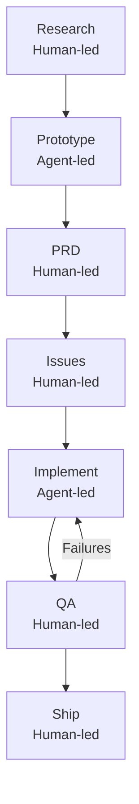

# The 7 Phases of AI-Assisted Feature Development

> A structured phase model for feature-scale AI-assisted development: Research → Prototype → PRD → Issues → Implement → QA → Ship. Each phase has a distinct human/agent ratio and a concrete handoff criterion.

This model operates at the **feature lifecycle** level — a single feature or project from idea to production. It is distinct from the [Research-Plan-Implement pattern](research-plan-implement.md) (a per-task inner loop) and the [AI Development Maturity Model](ai-development-maturity-model.md) (a career-phase adoption arc).

Matt Pocock documented this workflow from production use of Claude Code, publishing it in March 2026 ([My 7 Phases Of AI Development](https://www.aihero.dev/posts/my-7-phases-of-ai-development), [Real-world feature build with Claude Code](https://www.aihero.dev/posts/real-world-feature-build-with-claude-code)).

## Phase Map

Phases alternate between human-led (judgment, decisions, commitments) and agent-led (execution, generation, verification). The pattern is not sequential automation — it is deliberate alternation.

## The Phases

### 1. Research

**Human-led.** Explore the problem space with AI before committing to an approach. The goal is to surface constraints, understand existing code, and identify what is not known. No code is written and no requirements are fixed.

Exit criterion: you can describe the problem clearly, identify the relevant codebase areas, and name the open questions that the prototype will resolve.

Tools and patterns: Claude's [Plan Mode](plan-mode.md) (read-only exploration), the [Research-Plan-Implement pattern](research-plan-implement.md), structured "Grill Me" sessions where the agent interviews you to surface assumptions.

### 2. Prototype

**Agent-led.** Build a throwaway spike to validate assumptions before formalizing requirements. The prototype is not production code — it is an experiment. Its purpose is to answer the open questions from the Research phase.

Exit criterion: the key unknowns are resolved (feasibility, API behavior, performance characteristics) and the prototype can be discarded.

Common failure: treating the prototype as the starting point for production. Prototypes routinely take design shortcuts that are expensive to undo in production code.

### 3. PRD (Product Requirements Document)

**Human-led.** Formalize the feature requirements based on what the Research and Prototype phases revealed. The PRD is a structured Markdown document capturing who uses the feature, what behavior it produces, and what the success criteria are.

Exit criterion: the PRD is specific enough that a developer who has not seen the prototype could implement the feature from it.

The PRD is the most expensive phase to skip: issues decomposed from vague requirements produce vague implementations. GitHub's [Spec Kit](https://github.com/github/spec-kit) formalizes this step under the name "Specify" ([Spec-Driven Development with AI](https://github.blog/ai-and-ml/generative-ai/spec-driven-development-with-ai-get-started-with-a-new-open-source-toolkit/)).

### 4. Issues

**Human-led.** Decompose the PRD into trackable GitHub issues. Each issue is a unit of work the agent can pick up, execute, and close without additional clarification. The decomposition is itself the planning work — the act of writing issues forces scope decisions that the PRD left open.

Exit criterion: every issue has concrete acceptance criteria (a test to pass, a behavior to verify, a file to change) and no issue depends on another issue to define its scope.

This decomposition step is the highest-value handoff point in the model. Issue description quality is the primary lever for delegation success — specific context, acceptance criteria, and file references directly affect output quality ([Issue-to-PR Delegation Pipeline](issue-to-pr-delegation-pipeline.md)).

### 5. Implement

**Agent-led.** Agents pick up and close issues. For multi-issue features, this phase benefits from [parallel agent sessions](parallel-agent-sessions.md) — multiple agents running concurrently on independent issues.

Exit criterion: all issues are closed, CI passes, and the implementation matches the acceptance criteria in each issue.

Context management is the primary concern here. Long-running implementation phases require a harness that persists phase state across context windows. Without this, agents lose track of prior work mid-phase and repeat or contradict earlier decisions. See [Effective Harnesses for Long-Running Agents](https://www.anthropic.com/engineering/effective-harnesses-for-long-running-agents).

### 6. QA

**Human-led.** Structured review and testing pass. QA reviews the implementation against the PRD requirements — not just against the individual issues — and identifies gaps, edge cases, and regressions.

Exit criterion: implementation matches PRD requirements, automated tests pass, and any gaps discovered are converted back into Issues for another Implement cycle.

QA is a loop gate, not a formality. Discoveries here feed back into Phase 5 (Implement) or Phase 3 (PRD) if requirements were under-specified.

### 7. Ship

**Human-led.** Release and verify in production. Monitor for regressions, validate that the feature behaves as specified under real conditions.

Exit criterion: the feature is running in production with no regressions, and the PRD requirements are confirmed as met.

## Human vs. Agent Ratio

| Phase | Dominant party | Primary risk |
|-------|---------------|--------------|
| Research | Human | Skipping → implementing against wrong assumptions |
| Prototype | Agent | Treating the prototype as production code |
| PRD | Human | Under-specifying → vague issues → vague implementation |
| Issues | Human | Over-coupling issues → agent blocked on dependencies |
| Implement | Agent | Context loss mid-phase → contradictory decisions |
| QA | Human | Rubber-stamping → shipping to production with gaps |
| Ship | Human | No monitoring → regressions go undetected |

## Why Phases Alternate

The alternation between human-led and agent-led phases maps to the cost asymmetry between discovery and execution. Kief Morris describes this as two nested loops in software development: the "why loop" (human judgment over goals and outcomes) and the "how loop" (execution over artifacts) ([Humans and Agents in Software Engineering Loops](https://martinfowler.com/articles/exploring-gen-ai/humans-and-agents.html)).

Phases 1, 3, 4 are commitments — they produce artifacts that govern subsequent agent work. Phases 2, 5 are execution — agents generate output against those constraints. QA and Ship are human phases because they evaluate outcomes against original intent, which agents cannot do without grounding in the PRD and user context.

Anthropic's own 4-step recommendation (Explore → Plan → Code → Verify) reflects the same mechanism at a smaller scope: "letting Claude jump straight to coding can produce code that solves the wrong problem" ([Claude Code Best Practices](https://www.anthropic.com/engineering/claude-code-best-practices)). The 7-phase model extends this to feature scope.

## Compressing Phases

Not every feature requires all seven phases. Apply compression deliberately:

| Feature complexity | Reasonable compression |
|-------------------|----------------------|
| Trivial (bug fix, copy change) | Research → Implement → Ship |
| Small feature (well-understood domain) | Research → PRD → Issues → Implement → Ship |
| Medium feature (some unknowns) | Full 7 phases |
| Large feature (many unknowns, novel domain) | Full 7 phases; multiple Implement/QA cycles |

The phases that carry the most compression risk are PRD and Issues. Skipping them shifts scope decisions from human judgment to agent inference — agents will make those decisions for you, and may make them wrong.

## When This Model Adds Overhead

The 7-phase model was designed for feature-scale work by one or more developers with access to CI, issue tracking, and agent tooling. It adds overhead without value when:

- The task fits in a single agent context (use [Research-Plan-Implement](research-plan-implement.md) instead)
- Requirements are entirely fixed and well-understood before work begins (skip Research and Prototype)
- The team is solo and holds all context in working memory (the Issues phase adds documentation cost with no coordination benefit)
- Requirements are expected to change significantly during implementation (the PRD becomes a maintenance liability)

## Example

**Feature:** Add OAuth 2.0 login to a TypeScript API that currently supports only API key auth.

**Research** — agent reads the auth module, git log for prior OAuth attempts, and existing session management. Human identifies the open question: does the current session store support the OAuth callback flow?

**Prototype** — agent implements a minimal OAuth callback handler wired to a mock user store. Confirms the session store works without modification; surfaces that the token refresh flow requires a new DB table.

**PRD** — human writes requirements: supported providers (GitHub, Google), token storage schema, error states, redirect behavior, and the specific DB migration needed. Exit criterion: a reviewer unfamiliar with the codebase can implement from the PRD.

**Issues** — human decomposes into five issues: DB migration, token storage service, OAuth callback handler, provider-specific configuration, and integration tests. Each issue has explicit acceptance criteria.

**Implement** — agent works through issues in parallel (migration and tests independently; handler after migration merges). CI gates each PR.

**QA** — human tests the complete flow against the PRD requirements. Discovers token expiry behavior missing from the acceptance criteria; creates a new issue for a sixth Implement cycle.

**Ship** — feature deployed, OAuth login monitored for provider errors and token refresh failures.

## Key Takeaways

- The 7-phase model operates at feature scope — it is not a replacement for per-task loops like Research-Plan-Implement
- Human-led phases are commitment points; agent-led phases are execution points — the alternation is intentional
- The PRD-to-Issues decomposition is the highest-value handoff: vague issues produce vague implementations
- Compress phases deliberately based on feature complexity; the PRD and Issues phases carry the most compression risk
- Context management during the Implement phase requires a harness that persists state across context windows in long runs

## Related

- [The Research-Plan-Implement Pattern](research-plan-implement.md) — the inner per-task loop that runs within the Implement phase
- [Plan Mode](plan-mode.md) — read-only exploration used in the Research phase
- [Issue-to-PR Delegation Pipeline](issue-to-pr-delegation-pipeline.md) — detailed coverage of the Implement phase mechanics
- [The AI Development Maturity Model](ai-development-maturity-model.md) — career-phase adoption arc; distinct from this feature-lifecycle model
- [Spec-Driven Development](spec-driven-development.md) — alternative approach to PRD formalization using a persistent spec file
- [Humans and Agents in Development Loops](humans-agents-development-loops.md) — the why/how loop hierarchy that explains why phases alternate
- [Parallel Agent Sessions](parallel-agent-sessions.md) — running multiple agents on independent issues during the Implement phase
