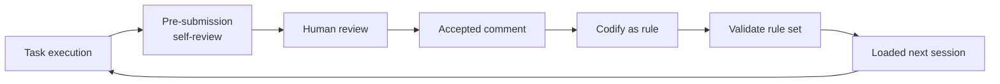

# Accumulated Behavioral Rules from Review Feedback

> Turn every accepted review comment into a persistent rule the agent loads and self-checks, so it stops repeating the same class of mistake.

This workflow converts each accepted code-review comment into a declarative behavioral rule in a version-controlled instruction file, has the agent load that file as context every session, and runs a self-review checklist derived from the rules before the agent submits ([Aggarwal and Farhady Ghalaty, arXiv 2607.13091](https://arxiv.org/abs/2607.13091)). The result is a ratchet: each error class the loop captures is one the agent can detect itself next time, with no change to model weights. It pays off only under specific conditions, so start there.

## Why agents repeat the same mistakes

A coding agent flags the same class of error across sessions because nothing retains the correction — once a pull request merges, the review feedback is discarded and the next session starts from the same defaults ([arXiv 2607.13091](https://arxiv.org/abs/2607.13091)). Human teams close this gap with conventions and onboarding; an agent with no persistent memory of accepted feedback re-derives, or re-fails, the same judgment every time.

## When this pays off

Adopt the loop only when all of these hold:

- Your team already produces written review comments. The loop's only input is accepted feedback, so a team that reviews verbally or rubber-stamps PRs has nothing to codify.
- Your agent surface loads an instruction file as context — a `CLAUDE.md`, `AGENTS.md`, or `copilot-instructions.md`. If the agent never reads the file, the rules never reach it.
- Someone owns codification. A rule appears only when an engineer spends the few minutes to write it after accepting the comment; without that step the feedback still evaporates.
- Your reviewers are trustworthy. Incorrect rules amplify errors, and a noisy review culture can poison the rule set faster than validation catches it ([arXiv 2607.13091](https://arxiv.org/abs/2607.13091)).

The reported deployment ran on a typed language with strong framework conventions ([arXiv 2607.13091](https://arxiv.org/abs/2607.13091)). On a weakly-typed codebase with loose conventions, more corrections are context-specific judgment calls that resist a general rule, so expect a lower hit rate.

## The loop

Each cycle turns one merged correction into a durable constraint the next session inherits.



1. The agent runs a self-review against the current checklist before it opens the PR.
2. A human reviews and leaves comments.
3. When the team accepts a comment, an engineer codifies it as a rule in the instruction file.
4. Automated validation checks that the rule set stays internally consistent as it grows.
5. The next session loads the file, so the agent now self-detects that error class.

The accumulation curve is logarithmic, not linear: the frequent error classes get covered early, and new rules arrive more slowly as coverage saturates ([arXiv 2607.13091](https://arxiv.org/abs/2607.13091)). In the reported deployment the rule set grew from 5 to 18 behavioral rules over four weeks, alongside language standards and a 15-item self-review checklist, reaching roughly 4,809 words — under 5% of a 128K-token context window ([arXiv 2607.13091](https://arxiv.org/abs/2607.13091)).

## The rule schema

A behavioral rule is more than a one-line instruction. Each carries enough structure to stay auditable and to feed the self-review checklist ([arXiv 2607.13091](https://arxiv.org/abs/2607.13091)):

- An identifier and a category, so rules can be grouped and referenced.
- The trigger origin — the review comment, bot finding, or production incident that produced it — for traceability back to why it exists.
- Scope and the constraint itself: what the rule requires or forbids, and where it applies.
- A rationale, so a future reader can judge whether the rule still holds.
- A mapping to the self-review checklist item that enforces it before submission.

Traceability is what lets you retire a rule later: when you can see which comment produced a rule, you can tell when the underlying problem no longer occurs.

## Why it works

The mechanism is retention, not intelligence. Codifying each accepted correction as a rule the agent loads every session gives it a persistent, growing set of error classes it can check itself against before submitting, with no model-weight change ([arXiv 2607.13091](https://arxiv.org/abs/2607.13091)). Because the rules live in a shared version-controlled file rather than one session's memory, a correction learned in one repository transfers to others: in the reported deployment, 60% of knowledge-transfer events crossed a repository, tool, or task-type boundary ([arXiv 2607.13091](https://arxiv.org/abs/2607.13091)). The self-review checklist is the enforcement surface — it turns a passive rule into an active pre-submission gate, the same move as an [agent self-review loop](../code-review/agent-self-review-loop.md) running checks on its own output before a human sees it.

## When this backfires

- Unbounded growth saturates the context budget. A monotonically growing rule file is the instruction-bloat anti-pattern: each rule is useful alone, but the aggregate dilutes attention and buried guidance gets missed as context fills ([Thoughtworks Technology Radar — agent instruction bloat](https://www.thoughtworks.com/radar/techniques/agent-instruction-bloat); [Anthropic — effective context engineering](https://www.anthropic.com/engineering/effective-context-engineering-for-ai-agents)). Pair every addition with retirement, the way [agent context file evolution](../instructions/agent-context-file-evolution.md) pairs each drift update with a compaction pass.
- Multiple teams share one flat rule set. The model works for a single team; several teams need hierarchical or namespaced rules the base framework does not provide ([arXiv 2607.13091](https://arxiv.org/abs/2607.13091)).
- Rules conflict. As the set grows, two rules can contradict — the deployment hit one genuine conflict over resource-disposal guidance that needed manual resolution ([arXiv 2607.13091](https://arxiv.org/abs/2607.13091)).
- The evidence base is thin. The results come from a single four-week observational deployment with no control group and no ablation against static prompt engineering or a no-rule baseline, and the counts are small enough that the authors report no p-values ([arXiv 2607.13091](https://arxiv.org/abs/2607.13091)). Treat the zero-recurrence figure as a promising signal, not a proven effect size.

## How this differs from promoting comments to mechanical checks

For a high-frequency invariant a machine can verify — an import boundary, a formatting rule — the stronger move is to promote the comment into a deterministic check rather than an advisory rule, which is the [Review-Feedback-to-Rule Loop](../code-review/review-feedback-to-rule-loop.md). A lint rule or checklist fires every time and costs no context budget; a behavioral rule is probabilistic and adds to the file the agent must read. The two compose: promote mechanically-checkable invariants into the lint stack and hooks, and reserve accumulated behavioral rules for the semantic corrections that resist a deterministic check — design judgment, API-shape preferences, context-dependent trade-offs.

## Example

A reviewer repeatedly flags that new HTTP clients are constructed per-request instead of reused. The team accepts the comment and codifies it:

```markdown
### Rule R14 — reuse pooled HTTP clients
- Category: performance
- Origin: PR #482 review comment (accepted 2026-03-04)
- Scope: any service issuing outbound HTTP
- Constraint: obtain the shared client from the DI container; do not
  construct a new client per request or per handler invocation.
- Rationale: per-request construction exhausts sockets under load.
- Checklist: SR-07 "no HTTP client constructed inside a request path"
```

The next session loads this rule, and the self-review step checks item SR-07 before opening the PR — so the agent catches the pattern itself instead of waiting for the same comment a second time. Months later, if the codebase moves to a framework that injects the client automatically, rule R14 is a retirement candidate: the origin trace names the problem it solved and lets you confirm the problem is gone.

## Key Takeaways

- The loop retains corrections that would otherwise vanish at merge: accepted comment, then behavioral rule, then self-review checklist, then loaded next session.
- It pays off only with a written-review culture, an agent that loads instruction files, an owner for codification, and reviewers you trust.
- Give each rule a schema — id, category, origin, scope, constraint, rationale, checklist mapping — so it stays auditable and retirable.
- Pair accumulation with retirement, or the growing file becomes the instruction-bloat problem it was meant to prevent.
- Promote mechanically-checkable invariants into deterministic checks instead; reserve behavioral rules for semantic corrections that resist a machine check.
- The evidence is a single observational deployment with no control group — a promising signal, not a proven effect.

## Related

- [Review-Feedback-to-Rule Loop](../code-review/review-feedback-to-rule-loop.md) — the complementary move: promote recurring comments into deterministic mechanical checks instead of loaded rules.
- [Agent Self-Review Loop](../code-review/agent-self-review-loop.md) — the pre-submission checklist that enforces the accumulated rules.
- [Agent Context File Evolution](../instructions/agent-context-file-evolution.md) — the retirement and compaction discipline that keeps the rule file from bloating.
- [Continuous Agent Improvement](continuous-agent-improvement.md) — the broader observe-categorize-update-verify loop this is one instance of.
- [Learned Review Rules](../code-review/learned-review-rules.md) — the reviewer-side analogue that tunes an agent from accept and reject signals.
