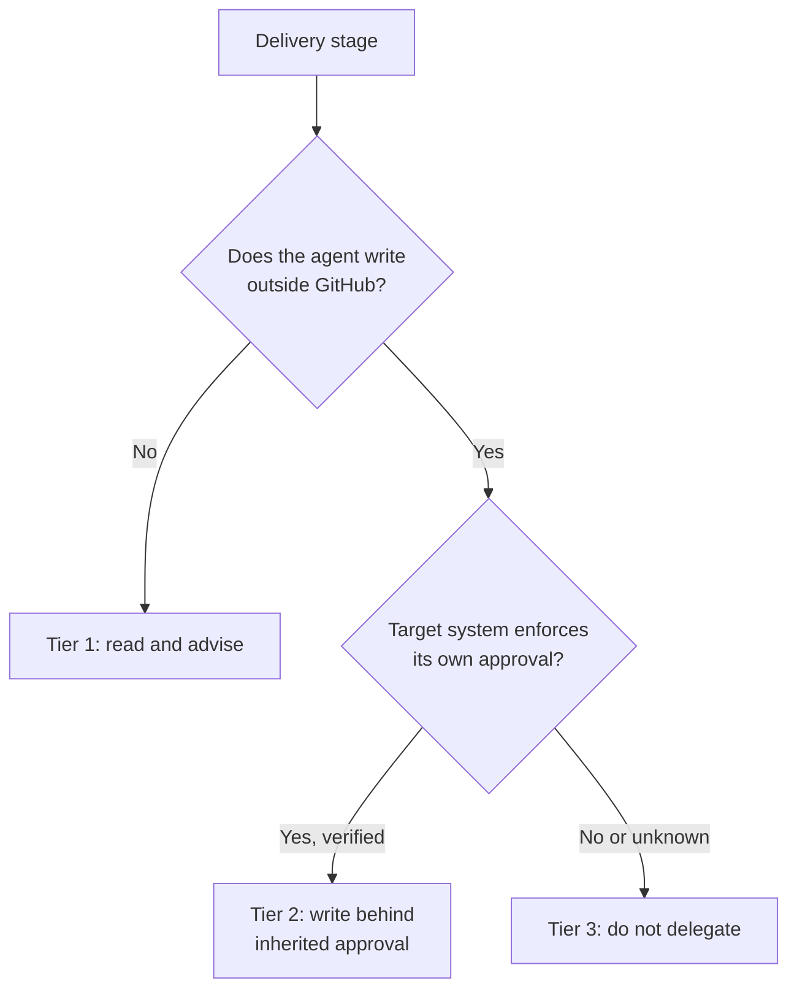

# Delegating Delivery Stages to GitHub Agent Apps

> Hand a delivery stage to an agent app when it only reads, or when the write lands behind an approval the agent inherits.

An agent app is a partner AI agent installed as a GitHub App: "Agent apps are AI agents from GitHub partners, installable from the GitHub Marketplace, and integrated directly into GitHub" ([GitHub Changelog, 2026-06-02](https://github.blog/changelog/2026-06-02-extend-github-with-agent-apps/)). Because it runs on the platform rather than in an editor, it can read and act at any stage of delivery, not only while code is being written. Which of those stages you actually hand over is decided by one property of the stage, not by the agent's quality: where the agent's write lands. A stage that only reads is cheap to delegate. A stage that writes is safe to delegate only when the system being written into already enforces an approval boundary the agent's own identity cannot cross.

## Why stage selection is not a question of agent quality

The install decision and the invocation decision sit at different levels, and only the first one is administered. An agent app becomes available once "it's installed and enabled by an administrator" ([GitHub Changelog, 2026-06-02](https://github.blog/changelog/2026-06-02-extend-github-with-agent-apps/)), after which it is invoked by assigning an issue, mentioning the agent in a pull request comment, or selecting it in the Agents interface. One administrator decides that the agent may exist; the routes above then carry whatever anyone able to use them types.

The ecosystem has not closed that gap at the agent level. A study of 1,033 real-world AI-assisted actions found that "only 21 provide explicit caller-identity access controls", and that "composition-facing interfaces are common, while action-level access controls are rare" ([Wang et al., 2026, arXiv:2605.07135v1](https://arxiv.org/abs/2605.07135v1)). So the control you are choosing when you delegate a stage is rarely a control on the agent. It is a control on what the agent's write can reach.

## Three delegation tiers

The tiers below are this page's classification, not GitHub's. Applying them to the four agents GitHub demonstrates across a delivery flow ([GitHub Blog, 2026-08-14](https://github.blog/ai-and-ml/github-copilot/how-to-bring-your-software-delivery-workflow-into-github-with-agent-apps/)) puts three of the four in the first tier.

### Tier 1: read and advise

The agent queries an external system and returns an answer into the thread. Nothing outside GitHub changes. GitHub's scoping example asks a product-analytics agent about funnel behavior, its build-stage example asks a dependency agent what to watch out for in the dependencies a pull request touches, and its pre-deploy example uses an incident agent that "maps the repository to its PagerDuty service, checks for active incidents, reviews the previous 90 days, and compares the files in the pull request with areas involved in past incidents" ([GitHub Blog, 2026-08-14](https://github.blog/ai-and-ml/github-copilot/how-to-bring-your-software-delivery-workflow-into-github-with-agent-apps/)).

Delegate these freely on repositories with a trusted contributor set. The output is a comment a reviewer reads, and a wrong answer costs a reviewer's attention rather than a production change.

### Tier 2: write behind an inherited approval

The agent performs a real write in the target system, and that system's existing approval boundary applies to the write unchanged. GitHub's rollout example is the only one of the four that writes: "The agent creates the flag in LaunchDarkly and adds the code implementation as a commit you review. If the target environment requires approval, it creates an approval request instead of applying the targeting change directly. A human still decides whether the rollout moves forward" ([GitHub Blog, 2026-08-14](https://github.blog/ai-and-ml/github-copilot/how-to-bring-your-software-delivery-workflow-into-github-with-agent-apps/)).

Delegate this only after you have opened the target system and confirmed the approval requirement is switched on for the specific environment the agent will touch. The safety property lives in that setting, owned by whoever administers the other product.

### Tier 3: no downstream gate

The agent's action is itself the last control. Nothing downstream reviews it, and no second identity has to agree before the change takes effect. Do not delegate this tier to an agent app. Move the gate first, then reclassify the stage as Tier 2.

Moving the gate is only available to you when you own the system being written into. Where you do own it, build the capability boundary directly rather than adding an approver, as in [agent-driven deployment](agent-driven-deployment.md). The tier rule exists for the case a partner agent creates, where the boundary belongs to a product you administer through someone else's settings page and can verify but not author.

## Why it works

An agent app moves context rather than authority. Its value is that it renders state from another system into the pull request thread at the moment the decision is being made, which is where the reviewer is already looking. Its safety, where it has any, comes from somewhere else entirely: the consequential action still lands in the external system, so that system's approval boundary applies exactly as it would to a human operator. The Tier 2 example states that chain as a conditional. The promised human decision holds because a setting in the other product makes it hold, so the gate is inherited rather than supplied.

GitHub applies the same non-transitive logic to the install itself. Enterprise-level installation deliberately does not cascade downward: "Enterprise installations grant access to the enterprise account itself; they do not grant access to organizations or repositories in the enterprise" ([GitHub Changelog, 2026-08-07](https://github.blog/changelog/2026-08-07-enterprises-can-now-install-third-party-github-apps)). A grant at one level is not a grant at the level below it, and the tier rule is that principle applied to delivery stages instead of accounts.

## Triggers and constraints

Agent apps have three invocation routes and no schedule of their own. Each route bounds authority differently in practice.

| Route | What reaches the agent | Who can fire it |
|---|---|---|
| Assign an issue to the agent | The issue body, written by whoever filed or edited it | Whoever may assign on that repository |
| Mention the agent in a pull request comment | The thread, including comments written earlier by others | Whoever may comment on that thread |
| Select the agent in the Agents interface | The prompt typed at that moment | Whoever may reach the interface |

The tier rule is specific to platform-resident agents that write into third-party systems, so it applies to GitHub agent apps and to equivalent installed integrations rather than to editor-resident assistants. The underlying move, placing the gate in the system that owns the consequence, transfers to any tool.

## When this backfires

- The downstream approval is not configured. The demonstrated safety property rests on a conditional. Where the target environment has no approval requirement set, the agent applies the change directly, and nothing in GitHub reports the state of that setting.
- The repository accepts outside contributions. The invocation routes are the same untrusted event context that agentic workflow injection exploits. Applying taint analysis to 13,392 real-world agentic workflows across 10,792 repositories surfaced 519 potential vulnerabilities, "of which 496 are confirmed exploitable under our threat model" ([Wang et al., 2026, arXiv:2605.07135v1](https://arxiv.org/abs/2605.07135v1)).
- Adding a vendor is treated as the fix. A live-workflow evaluation across four AI providers found that "all tested providers are susceptible to at least one attack class in their default configuration", and that the worst flaws "are structural: they arise from how CI/CD infrastructure handles credentials and configuration files, not from any specific model's behavior" ([Isbarov et al., 2026, arXiv:2606.09935v1](https://arxiv.org/abs/2606.09935v1)). Swapping agent apps does not move a structural flaw.
- Tier 1 is assumed to be the safe tier. Advisory output is the highest-leverage thing to corrupt and the least likely to be re-checked, and the cheap defenses do not reach it. The same evaluation reports that "config-file judgment manipulation has no cheap workflow-level fix" because "no shell commands are involved so tool restriction provides no protection" ([Isbarov et al., 2026, arXiv:2606.09935v1](https://arxiv.org/abs/2606.09935v1)).
- Author filtering is the only mitigation applied. Restricting invocation to trusted contributors works "by refusing service rather than hardening the reviewer" ([Isbarov et al., 2026, arXiv:2606.09935v1](https://arxiv.org/abs/2606.09935v1)), which removes much of the reason to put the agent in the delivery flow at all.
- Usage cannot be reconciled afterward. Per-app activity in the Copilot usage metrics is not a partition of the total, so an organization cannot confirm from telemetry alone which installed app a team is actually invoking. See [per-agent-app attribution](../human/per-agent-app-attribution-copilot-metrics.md).

## Key Takeaways

- Classify each delivery stage by where its write lands, then delegate the stage rather than the tool.
- Verify the approval setting in the target system before any Tier 2 delegation, because that setting is the entire safety property.
- Treat read-and-advise stages as injection-sensitive, since judgment manipulation survives tool restriction.
- Remember that installation is administered and invocation usually is not, so decide who may fire an agent app separately from who approved it.

## Related

- [Comment-Triggered Agent Dispatch on Issues and PRs](comment-triggered-agent-dispatch.md) — governs the trigger these agents are fired from
- [Agent-Driven Deployment: What to Delegate and What to Gate](agent-driven-deployment.md) — the same gate question when you own the target system and can build the boundary yourself
- [Deterministic Precondition Gates for Tool-Using Agents](../patterns/agent-design/deterministic-precondition-gates.md) — the building block when no downstream gate exists to inherit
- [Delegated-Autonomy Boundary Artifacts (AJR and ADP)](../patterns/agent-design/delegated-autonomy-boundary-artifacts.md) — recording the authority boundary a tier decision implies
- [Per-Agent-App Attribution in the Copilot Usage Metrics API](../human/per-agent-app-attribution-copilot-metrics.md) — measuring which installed apps are used
