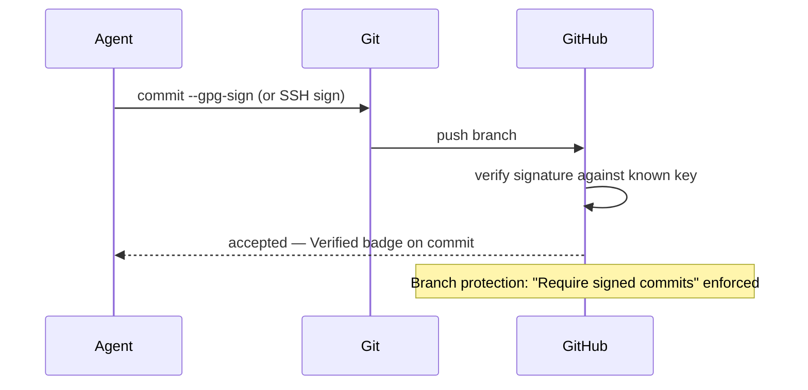

# Agent Commit Attribution: Signed Commits and Agent Identity

> Agents that commit to shared repositories should carry verifiable identity so audit trails distinguish agent-generated changes from human-authored ones.

## Why Attribution Matters

When an agent commits code, the git history records an author name and email — but without additional verification, nothing prevents any commit from claiming any identity. As agents become regular contributors, three governance needs emerge:

- **Audit trails** — compliance requirements for regulated code (finance, healthcare, government) may mandate tracking which changes originated from automated systems vs. human engineers
- **Regression traceability** — when a bug is introduced, knowing the commit came from a specific agent session (with model version, task reference, and session ID) accelerates root-cause analysis
- **Policy enforcement** — branch protection rules can block pushes from agents that lack verified identity, giving teams an explicit gate on agent contributions

## Two Attribution Mechanisms

### 1. Cryptographic Commit Signing

Git supports GPG and SSH signing. A signed commit includes a signature over the commit object, verifiable against the signer's public key. GitHub displays signed commits from known keys as `Verified`.

For agents that push commits directly:

- **Dedicated bot accounts with enforced signing** — create a GitHub user or GitHub App for the agent; configure the signing key in the agent's git environment; require all commits from that account to be signed via branch protection or repository rulesets
- **Platform-native signing** — GitHub's Copilot cloud agent signs all its commits automatically as of April 3, 2026 ([GitHub Changelog](https://github.blog/changelog/2026-04-03-copilot-cloud-agent-signs-its-commits/)), enabling it to push to repositories with the "Require signed commits" rule enabled — previously a blocker

The branch protection approach enforces signing at the policy layer: enable "Require signed commits" on `main` (or via a ruleset scoped to the branch pattern). Any agent that cannot present a valid signature is rejected at push time, not at review time.



### 2. Commit Metadata Annotation

Cryptographic signing establishes *who* signed; metadata annotation establishes *what session and task* produced the commit. These are complementary.

Standard git trailers (appended after the commit message body) carry structured metadata:

```
docs: add agent commit attribution page

Implement pattern page for agent identity in version control.

Co-authored-by: github-actions[bot] <41898282+github-actions[bot]@users.noreply.github.com>
Agent-Session: sess_01abc123
Model: claude-sonnet-4-6
Task-Reference: #673
```

- `Co-authored-by` — standard GitHub convention; GitHub renders co-authors in the commit UI and PR timeline
- `Agent-Session` — links the commit to a specific agent session log for replay and debugging
- `Model` — records the model version at time of commit; relevant when a model upgrade changes agent behavior
- `Task-Reference` — ties the commit to the originating issue or ticket

[unverified] `Agent-Session`, `Model`, and `Task-Reference` trailers are not yet standardized across tools — conventions vary by team.

## Branch Protection Configuration

GitHub offers two mechanisms to enforce signing at the policy layer — see [GitHub's branch protection documentation](https://docs.github.com/en/repositories/configuring-branches-and-merges-in-your-repository/managing-protected-branches/about-protected-branches) for current UI steps, as menu paths change across GitHub plans.

**Option A — Branch protection rule** (classic): enable "Require signed commits" for the target branch pattern. Any push without a valid signature is rejected.

**Option B — Repository ruleset** (recommended for organizations): create a ruleset targeting the branch pattern and add the "Require a signature" rule. Rulesets support actor-scoped conditions — require signing only for bot accounts while allowing human contributors to push unsigned commits during a migration period.

## Trade-offs

| Factor | Signed commits | Metadata annotation only |
|--------|---------------|--------------------------|
| **Verification** | Cryptographic — tamper-evident | None — any actor can write any trailer |
| **Operational overhead** | Key generation, rotation, distribution to agent environment | None — add trailers in commit message |
| **Branch protection compatibility** | Required for "Require signed commits" rules | Not compatible — rule checks signature, not trailers |
| **Reviewer experience** | `Verified` badge in GitHub UI | Requires reading commit message |
| **Blast radius of key compromise** | Agent's signing key must be revoked and rotated | No key to compromise |

Cryptographic signing is the right choice when:
- Your repository enforces "Require signed commits"
- Compliance requires tamper-evident agent authorship records
- You are running an agent with broad write access to production branches

Metadata annotation alone is sufficient when:
- You need session traceability for debugging but not compliance
- Signing infrastructure is not yet in place
- The agent works in a staging or feature branch environment with a human review gate before merge

## Example

**Before** — agent commits without attribution:

```bash
git commit -m "fix: update retry logic"
# Commit author: github-actions <noreply@github.com>
# No signature. No session metadata. Indistinguishable from any other bot commit.
```

**After** — agent commits with signing and metadata:

```bash
git -c user.signingkey=~/.ssh/agent_ed25519 \
    -c gpg.format=ssh \
    commit -S -m "fix: update retry logic

Agent-Session: sess_01abc123
Model: claude-sonnet-4-6
Task-Reference: #412"
# GitHub displays: Verified ✓
# Blame graph shows: agent identity + session link
```

For the Copilot cloud agent, signing is automatic — no configuration required. Verify your repository has "Require signed commits" enabled to take advantage of it.

## Key Takeaways

- Cryptographic commit signing is the only tamper-evident attribution mechanism; metadata trailers are readable but unverified.
- GitHub's Copilot cloud agent signs commits automatically as of April 2026, unblocking repositories with mandatory signing policies.
- "Require signed commits" branch protection is the policy lever that forces agent identities into the signed-commit model or blocks them from pushing.
- Metadata trailers (`Agent-Session`, `Model`, `Task-Reference`) complement signing by providing session-level traceability for debugging and auditing.
- Key management for agent signing identities is real operational overhead; weigh it against the compliance requirement.

## Unverified Claims

- Whether Claude Code agents can be configured to sign commits via `git -c gpg.format=ssh -c user.signingkey=...` — likely supported via standard git configuration but no primary source was found.
- `Agent-Session`, `Model`, and `Task-Reference` commit trailers are not a standardized convention — adoption varies by team.

## Related

- [Headless Claude in CI](headless-claude-ci.md)
- [Agent Governance Policies](agent-governance-policies.md)
- [Worktree Isolation](worktree-isolation.md)
- [Tool Signing and Signature Verification](../security/tool-signing-verification.md)
- [Secrets Management for Agent Workflows](../security/secrets-management-for-agents.md)
