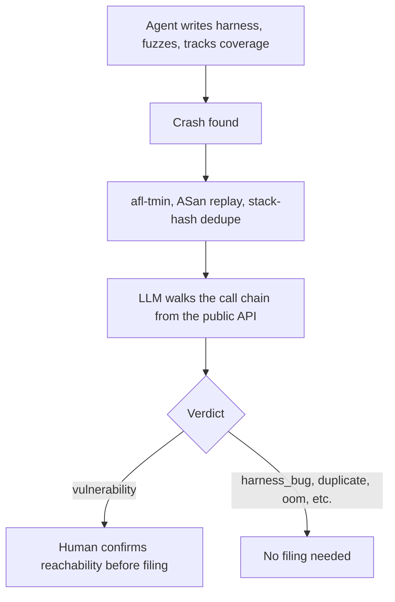

# Agent-Driven Fuzzing with Human-Gated Crash Triage

> An agent can run the fuzz-harness and crash triage loop unattended, but a human still confirms every vulnerability verdict before it ships.

GitHub Security Lab's fuzzing taskflow takes a single C/C++ repository, writes AFL++ harnesses for it, fuzzes them, and sorts every crash into a labeled verdict, with no person watching each step ([GitHub Blog, 2026-09-24](https://github.blog/security/application-security/ai-powered-fuzzing-with-the-github-security-lab-taskflow-agent/)). The README lists ten verdicts ([README, seclab-taskflows-fuzzing](https://github.com/GitHubSecurityLab/seclab-taskflows-fuzzing)). The README scopes it to projects that build with clang and AFL++ flags and warns that it runs LLM-chosen build commands directly on the host, so run it only in a disposable environment without elevated privileges ([README, seclab-taskflows-fuzzing](https://github.com/GitHubSecurityLab/seclab-taskflows-fuzzing)). The blog author adds the third condition: treat the verdicts as "a very well-prepared starting point for a human, not as final result" ([GitHub Blog](https://github.blog/security/application-security/ai-powered-fuzzing-with-the-github-security-lab-taskflow-agent/)). So every crash labeled `vulnerability` needs a person to check the call chain before anyone reports it. Drop the sandbox and a prompt-injected repository can run whatever build command the model picks. Skip the human check and the OSS-Fuzz-Gen data says most crashes that reach a person will be false positives ([arXiv:2510.02185v1](https://arxiv.org/abs/2510.02185v1)).

## The harness-and-triage bottleneck

Fuzzing catches real memory-safety bugs, but two manual steps keep most projects from doing it: writing a harness that calls the API correctly, and reading every crash to decide whether it means anything. Google names five steps a developer used to do by hand for one fuzz target: draft it, fix the compile errors, fix the runtime errors, run it longer and triage the crashes, then fix the vulnerabilities. Its LLM now does the first four ([Google Security Blog, 2024-11](https://security.googleblog.com/2024/11/leveling-up-fuzzing-finding-more.html)). Google's triage is binary, though: the prompt asks only whether the crash comes from the fuzz driver or the project. GitHub Security Lab's taskflow widens that step to ten verdicts and a full report per unique bug.

## Three implementation layers

### Layer 1: the agent-run harness and coverage loop

Each harness compiles twice: an `.afl` binary carrying AFL instrumentation plus ASan and UBSan, and a `.cov` binary carrying coverage mapping, so the coverage report the agent reads is measured, not estimated ([GitHub Blog](https://github.blog/security/application-security/ai-powered-fuzzing-with-the-github-security-lab-taskflow-agent/)). After each round, the agent replays the queue against the `.cov` binary, reads the uncovered branches, and takes one of four actions: add a seed aimed at an uncovered branch, edit the harness to call another API, add a magic constant to the AFL dictionary, or skip a cold error path or vendor code ([GitHub Blog](https://github.blog/security/application-security/ai-powered-fuzzing-with-the-github-security-lab-taskflow-agent/)). Round time doubles each iteration, from 30 seconds to 960 seconds, for about 32 minutes per target, and the loop stops once two consecutive rounds each gain less than 1% absolute line coverage ([GitHub Blog](https://github.blog/security/application-security/ai-powered-fuzzing-with-the-github-security-lab-taskflow-agent/)). [Coverage-Guided Agents for Fuzz Harness Generation](../verification/coverage-guided-fuzz-harness-generation.md) covers how an agent writes and refines this harness in more depth; this page picks up once it starts finding crashes.

### Layer 2: deterministic crash triage

Every crash first passes through tools that carry no model judgment. `afl-tmin` shrinks the crashing input, an ASan replay captures the stack trace, and a normalized stack-top hash drops duplicates. A separate `confirm_fixed_crashes` stage replays old crashes against the current binary to catch fixes made upstream ([GitHub Blog](https://github.blog/security/application-security/ai-powered-fuzzing-with-the-github-security-lab-taskflow-agent/); [README](https://github.com/GitHubSecurityLab/seclab-taskflows-fuzzing)). This layer answers one question only: did it crash, and is it new.

### Layer 3: LLM attribution and the human check

The LLM layer reads the harness and the crashing function, walks the call chain back from the public API, and assigns one of ten verdicts: `vulnerability`, `library_hardening`, `harness_bug`, `non_reproducible`, `oom`, `timeout`, `assertion_failure`, `fixed`, `duplicate`, or `needs_investigation` ([README](https://github.com/GitHubSecurityLab/seclab-taskflows-fuzzing)). Each report attaches the verdict to a CWE, a severity, a confidence level, a root cause with file and line, the reachability call chain, an exploitability assessment, a fix as a unified diff marked "review required," and a regression-test sketch ([README](https://github.com/GitHubSecurityLab/seclab-taskflows-fuzzing)).

The taskflow's author names the limit on this layer: "Treat the verdicts as a very well-prepared starting point for a human, not as final result." They call the `vulnerability` versus `harness_bug` split "exactly the kind of judgment call that used to require me to sit down and trace the code by hand" ([GitHub Blog](https://github.blog/security/application-security/ai-powered-fuzzing-with-the-github-security-lab-taskflow-agent/)). Google, with a narrower two-way triage prompt, still lists "Improving automated triaging: to get to a point where we're confident about not requiring human review" as future work ([Google Security Blog](https://security.googleblog.com/2024/11/leveling-up-fuzzing-finding-more.html)).

## Triggers and constraints

A run starts manually with `./scripts/fuzzing/run_fuzzing.sh owner/repo`, pointed at one repository ([README](https://github.com/GitHubSecurityLab/seclab-taskflows-fuzzing)). The taskflow's output is a report with patches marked "review required," so treat filing or fixing a `vulnerability` verdict as a human decision ([GitHub Blog](https://github.blog/security/application-security/ai-powered-fuzzing-with-the-github-security-lab-taskflow-agent/)). The default model is Claude Sonnet 5, chosen because it "passed all of our internal tests without issues," and it is configurable in `model_config.yaml` — the loop's shape does not depend on any one coding-agent tool ([GitHub Blog](https://github.blog/security/application-security/ai-powered-fuzzing-with-the-github-security-lab-taskflow-agent/)). Scope is C/C++ with AFL++ only; a project with Bazel, a vendored libc, or another non-trivial build ends as `BUILD_FAILED` and gets skipped rather than mis-fuzzed ([README, Limitations](https://github.com/GitHubSecurityLab/seclab-taskflows-fuzzing)). The taskflow runs LLM-chosen build commands directly on the host with no confirmation prompt, so the README says to run it only in a disposable Codespace or VM, without root or admin rights, with network access scoped to git, apt, and the build itself ([README, security warning](https://github.com/GitHubSecurityLab/seclab-taskflows-fuzzing)).

## Why it works

Every step a machine can check gets a machine-checkable fact, and judgment is saved for attribution. Iterative harness generation is already measured to solve 159% more driver-generation questions than one-shot generation ([arXiv:2307.12469v5](https://arxiv.org/abs/2307.12469v5)), so that bottleneck yields to compile-and-run feedback. A crash itself is an executable oracle: `afl-tmin`, an ASan replay, and a stack-hash dedupe turn "did it crash, and is it new" into a fact with no model judgment in it. What stays uncertain is attribution — whether the fault sits in the library or the harness, and whether a real caller can reach it. That is the step the FalseCrashReducer benchmark measured at only 50% reliable and 68% consistent across reruns ([arXiv:2510.02185v1](https://arxiv.org/abs/2510.02185v1)). The agent removes setup cost and pre-sorts the crash pile. It does not remove the reachability check.

## When this backfires

- Non-C/C++ code or a non-trivial build. The target ends as `BUILD_FAILED` with nothing fuzzed (see Triggers and constraints).
- Stateful or constraint-heavy APIs. Generated harnesses violate API preconditions and skip setup and teardown, and those violations produce crashes in the harness rather than the library ([arXiv:2510.02185v1](https://arxiv.org/abs/2510.02185v1); [arXiv:2307.12469v5](https://arxiv.org/abs/2307.12469v5)). The more setup an API needs, the more of the crash pile is harness noise, and triage cost outruns the finding rate.
- A target that is already well fuzzed, in a short session. The three mature targets in the benchmark (see Example) produced zero crashes, which the README calls expected because "those projects are heavily fuzzed upstream" ([README benchmark](https://github.com/GitHubSecurityLab/seclab-taskflows-fuzzing)). Google's 26 AI-found vulnerabilities came from projects that "already had hundreds of thousands of hours of fuzzing", with fuzz targets run for extended periods on infrastructure such as ClusterFuzz ([Google Security Blog](https://security.googleblog.com/2024/11/leveling-up-fuzzing-finding-more.html)).
- Filing a verdict without the human check. Across 1,555 OSS-Fuzz-Gen benchmark functions, 70% of the 4,835 recorded crashes were marked false positives, and the paper's crash-validation agent produced reliable conclusions in 50% of manually examined analyses ([arXiv:2510.02185v1](https://arxiv.org/abs/2510.02185v1)). A related paper cites harness-induced false-positive rates as high as 94% from earlier work and reports that maintainers distrust automated fuzzing because earlier workflows sent large numbers of false-positive reports ([arXiv:2605.21824v1](https://arxiv.org/abs/2605.21824v1)). curl ended its bug bounty after "the current torrent of submissions put a high load on the curl security team", hoping to stop "non-well researched reports to us. AI generated or not." ([The Register](https://www.theregister.com/2026/01/21/curl_ends_bug_bounty/)). Unreviewed fuzz verdicts sent upstream add to the same load.

## Example

The taskflow's benchmark shows the spread of real outcomes. Across five repositories fuzzed for about 32 minutes each, xz, cJSON, and libexpat produced no crashes at all. jansson produced 10 crashes, and the LLM layer marked none of them `vulnerability`. oniguruma produced 13 crashes, and the LLM layer classed two of them `vulnerability`: out-of-bounds reads in `regerror.c` ([README benchmark](https://github.com/GitHubSecurityLab/seclab-taskflows-fuzzing)). The README lists `harness_bug`, `library_hardening`, `duplicate`, and `needs_investigation` for jansson, and `library_hardening`, `harness_bug`, and `non_reproducible` for the rest of oniguruma. It describes the two oniguruma findings as one-byte reads past `pat_end` in `onig_snprintf_with_pattern` when a pattern ends with a backslash, and ships suggested patches. Out of 23 crashes, a person had two leads to trace from a public entry point before anyone filed anything.

## Key Takeaways

- Treat every `vulnerability` verdict as a lead to verify: reproduce the ASan trace, then walk the call chain from a public entry point before anyone acts on it.
- The deterministic half of triage — minimization, replay, stack-hash dedupe — needs no review; the attribution call between `harness_bug` and `vulnerability` needs one every time.
- Run the loop only in a disposable sandbox with network access scoped to git, apt, and the build; it runs LLM-chosen commands on the host with no confirmation prompt.
- Skip the loop on a target with a non-trivial build (it ends as `BUILD_FAILED`) or a heavily fuzzed upstream (the benchmark's three mature targets gave zero crashes in 32 minutes); expect mostly `harness_bug` noise on a stateful API.
- Never let a verdict reach a maintainer or a report queue without the human reachability check. OSS-Fuzz-Gen marked 70% of its crashes false positives, and curl ended its bug bounty over the load of low-quality reports.

## Related

- [Coverage-Guided Agents for Fuzz Harness Generation](../verification/coverage-guided-fuzz-harness-generation.md) — the harness-authoring and coverage-feedback half of this same loop
- [AI-Powered Vulnerability Triage](ai-powered-vulnerability-triage.md) — the same taskflow framework applied to static analysis instead of fuzzing
- [Reproduce-Before-Report Verification Gate](../code-review/reproduce-before-report-verification-gate.md) — the general form of dropping any finding a verifier cannot reproduce
- [Agent-Laundered Bug Reports](../patterns/anti-patterns/agent-laundered-bug-reports.md) — the failure mode the human reachability check prevents
