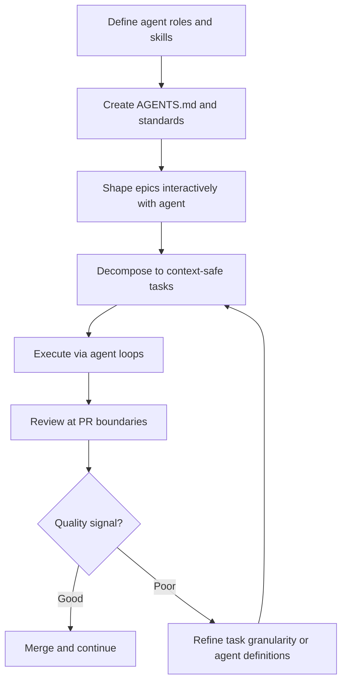

# Agent-Driven Greenfield Product Development

> Build a new product agent-first by defining agent roles and skills as the architectural foundation, decomposing work to context-window-safe granularity, and executing through autonomous agent loops with human review at PR boundaries.

## Why Greenfield Is Different

Most agent workflows assume an existing codebase. Greenfield projects offer a different opportunity: you can design the project structure, conventions, and workflow around agent collaboration from the start rather than retrofitting it.

The key insight is that in a greenfield agent-first project, the agent topology is the architecture. The agents you define, the skills they carry, and the boundaries between them shape how the codebase is structured — just as team structure shapes system architecture ([Conway's Law](https://en.wikipedia.org/wiki/Conway%27s_law)).

## The Workflow



### Phase 1: Define Agents Before Code

Start by identifying what agents will do, not what code they will produce. Map discrete task types to agent definitions:

- Which agent handles feature implementation?
- Which agent handles tests?
- Which agent handles documentation?
- Which agent reviews output?

Each role maps to a separate agent definition with scoped tools, specific instructions, and bounded context.

Write AGENTS.md, standards files, and skill definitions before writing a single line of product code. These artifacts serve as both human documentation and agent instructions. The [AGENTS.md standard](https://agents.md) provides the format for expressing project-level context.

### Phase 2: Shape Epics Interactively

Use an agent interactively to decompose product requirements into epics. The agent surfaces questions, trade-offs, and dependencies that a solo developer might miss or defer.

Example prompt:

```text
I want to build a CLI tool that manages Kubernetes deployments
with rollback support. Help me break this into epics.
For each epic, identify dependencies on other epics,
the key technical decisions, and acceptance criteria.
```

Capture decisions and trade-offs as issue comments — not just in conversation history. Conversation history is ephemeral; issue comments persist and seed future agent sessions with context about why decisions were made.

### Phase 3: Recursive Decomposition to Context-Safe Tasks

Epics must be decomposed until each work item fits within an agent's effective context window. The [context window dumb zone](../context-engineering/context-window-dumb-zone.md) defines the constraint: output quality degrades beyond a model-specific token threshold, and tasks that push into that zone produce unreliable results.

**Right-sizing heuristic.** A task is agent-safe when:

- It touches a bounded set of files (typically 3–5)
- The full context of those files plus instructions fits within the model's effective context range — see [context window dumb zone](../context-engineering/context-window-dumb-zone.md) for per-model thresholds
- Success criteria can be verified without understanding the entire system
- The task has no ambiguous dependencies on concurrent work

If a task fails this test, decompose further. A feature that requires reading 20 files to understand is not one agent task — it is four or five.

### Phase 4: Execute Through Agent Loops

Point agents at backlog items in a continuous loop. Each cycle follows the [Ralph Wiggum Loop](../agent-design/ralph-wiggum-loop.md) pattern: read state from disk, complete a bounded task, write results, restart with fresh context.

For parallel execution, assign independent tasks to separate agent sessions using [worktree isolation](worktree-isolation.md). Each session operates on its own branch without file conflicts. The developer's role shifts from writing code to [making decisions and reviewing PRs](parallel-agent-sessions.md).

```text
# Session 1: implements user auth
claude -w auth-feature

# Session 2: implements data models
claude -w data-models

# Session 3: implements API endpoints
claude -w api-endpoints
```

### Phase 5: Feedback Integration

Agent output quality is a signal about your decomposition and instructions, not just about agent capability. When output quality drops:

- **Tasks too large**: agent output degrades toward the end of implementation. Decompose further.
- **Tasks too vague**: agent makes wrong assumptions. Add explicit acceptance criteria and reference files.
- **Missing context**: agent reinvents patterns that exist elsewhere in the codebase. Add references to AGENTS.md pointing to example implementations.
- **Wrong patterns**: agent follows conventions that differ from your intent. Add or refine standards files.

Treat each quality issue as a signal to improve the infrastructure (agent definitions, task templates, standards) rather than just fixing the output.

## Design Issue Templates as Agent Intake Forms

GitHub issue templates (or equivalent) define the structured input agents receive. Design them to capture what agents actually need:

- Problem statement with enough context to start research
- Acceptance criteria phrased as verifiable outcomes
- Labels that route issues to the correct agent role
- References section — known sources relevant to the task

Issue templates that are human-friendly but agent-hostile force a translation step. Templates that capture structured context eliminate that step and reduce misinterpretation.

## Dog-Food the Pipeline

Use the pipeline you just built to build the project itself. This is the most effective validation step. If agents cannot use the pipeline to produce project content, the pipeline has problems that should be fixed before adding complexity.

For a code project, use the pipeline to generate the initial scaffold. For a documentation project, generate the first content pages using the content agents. Issues that surface during dog-fooding reveal gaps in standards, missing skills, or unclear pipeline stage definitions. Dog-fooding also produces the pipeline's first real history — commit logs that demonstrate agent behavior under the actual conventions.

## Minimum Viable Agent Project

Before adding commands, multiple agents, or CI gates, a project needs:

1. `AGENTS.md` — project purpose, conventions, what agents should and should not do
2. One standards file referenced from AGENTS.md
3. One agent definition for the first task type
4. One pipeline command that invokes that agent
5. A pre-commit hook or CI check that validates output format

This is sufficient to produce validated output from day one. Add complexity only when the minimum proves insufficient.

## Greenfield vs. Brownfield Agent Integration

| Dimension | Greenfield (this workflow) | Brownfield (adding agents to existing code) |
|-----------|---------------------------|---------------------------------------------|
| **Starting point** | Agent definitions and standards | Existing codebase and conventions |
| **Architecture driver** | Agent topology shapes code structure | Code structure constrains agent roles |
| **Convention source** | Written before code exists | Extracted from existing patterns |
| **Primary challenge** | Getting decomposition right | Getting context loading right |
| **Key reference** | This page | [Repository Bootstrap Checklist](repository-bootstrap-checklist.md) |

## Example

A team builds a Kubernetes deployment CLI with rollback support using the agent-first greenfield workflow.

**Step 1 — Define agents.** Before writing code, the team creates three agent definitions: `implement` (feature code), `test` (test suites), and `review` (PR review). Each agent has scoped tools and a standards file reference. They write `AGENTS.md` describing project conventions: Go modules, Cobra CLI framework, table-driven tests.

**Step 2 — Shape epics.** An interactive agent session decomposes the product into four epics: CLI scaffold, deployment commands, rollback logic, and status reporting. Each epic's trade-offs and dependencies are captured as GitHub issue comments.

**Step 3 — Decompose to context-safe tasks.** The "deployment commands" epic splits into five tasks: `deploy create` subcommand, Kubernetes client wrapper, deployment status polling, configuration validation, and integration test harness. Each task touches 3–4 files and stays well within the model's effective context range.

**Step 4 — Execute in parallel.**

```text
claude -w deploy-create    # implements deploy create subcommand
claude -w k8s-client       # implements Kubernetes client wrapper
claude -w deploy-status    # implements status polling
```

Each session reads `AGENTS.md`, picks up its assigned issue, and produces a PR. The developer reviews PRs, not code-in-progress.

**Step 5 — Iterate on infrastructure.** The first round of PRs reveals that the `implement` agent reinvents error handling patterns. The team adds an `errors.go` reference to the standards file. Subsequent tasks produce consistent error handling without per-task instructions.

## Key Takeaways

- In greenfield projects, define agent roles, skills, and AGENTS.md before writing product code — the agent topology shapes the architecture
- Shape epics interactively with agents and persist decisions in issue comments, not conversation history
- Decompose tasks until each fits within the model's effective context range — the [dumb zone](../context-engineering/context-window-dumb-zone.md) makes oversized tasks unreliable
- Execute through [fresh-context loops](../agent-design/loop-strategy-spectrum.md) with human review at PR boundaries, not mid-implementation
- Treat agent output quality as feedback on your decomposition and instructions, not just agent capability
- Design issue templates as agent intake forms — capture structured context, not just human-readable descriptions
- Dog-food the pipeline immediately; issues surface faster under real use than inspection
- Start with the minimum viable stack (AGENTS.md, one standards file, one agent, one command, one hook); add complexity only when the minimum proves insufficient

## Related

- [Repository Bootstrap Checklist](repository-bootstrap-checklist.md)
- [Context Window Management: The Dumb Zone](../context-engineering/context-window-dumb-zone.md)
- [The Plan-First Loop: Design Before Code](plan-first-loop.md)
- [Parallel Agent Sessions](parallel-agent-sessions.md)
- [The Ralph Wiggum Loop](../agent-design/ralph-wiggum-loop.md)
- [Skeleton Projects as Agent Scaffolding](skeleton-projects-as-scaffolding.md)
- [AI Development Maturity Model](ai-development-maturity-model.md)
- [Central Repo and Shared Agent Standards](central-repo-shared-agent-standards.md)
- [Changelog-Driven Feature Parity](changelog-driven-feature-parity.md)
- [Escape Hatches: Unsticking Stuck Agents](escape-hatches.md)
- [AI-Powered Vulnerability Triage](ai-powered-vulnerability-triage.md)
- [Agent-First Software Design](../agent-design/agent-first-software-design.md)
- [Bootstrapping an Agent-Driven Project](bootstrapping-agent-driven-project.md)
- [Lay the Architectural Foundation by Hand Before Delegating to Agents](architectural-foundation-first.md)
- [Codebase Readiness for Agents](codebase-readiness.md)
- [Compound Engineering: Systematic Agent Learning Loop](compound-engineering.md)
