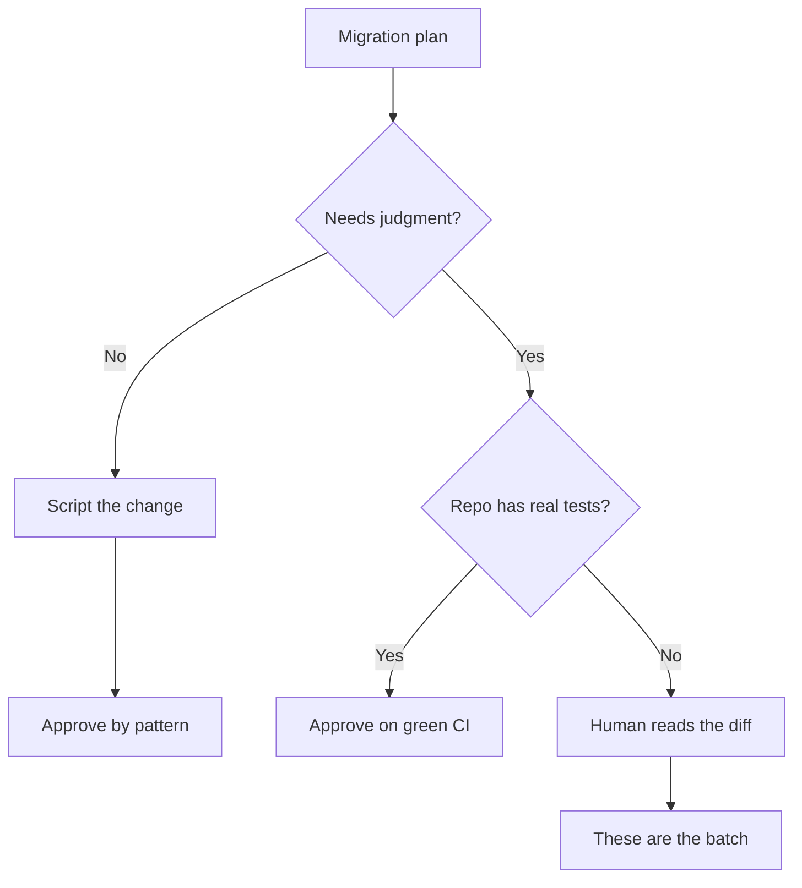

# Sizing an Agent Migration Fan-Out by Diff Uniformity

> An agent fan-out buys per-repo adaptation by spending diff uniformity, so size the batch by the diffs no pattern and no test can approve.

Count the repositories where the change needs a judgment call and the tests cannot vouch for the result. That count, not the number of repositories in scope, is the batch one reviewer can absorb. The rest of the migration should still be a script, and the vendor shipping this capability agrees. Sourcegraph's Agentic Batch Changes decides for each piece of a plan "whether the change needs judgment or just needs doing", and "Most of the time it writes a script, because a large migration is mostly the same change made over and over" ([Sourcegraph, 2026-09-14](https://sourcegraph.com/blog/introducing-agentic-batch-changes)). An agent per repository is the minority path inside the product built for this.

## Why an agent fan-out costs more review than a script

Scripted mass change never scaled on reviewer headcount. It scaled by making the review skippable. Google's large-scale change committee commonly directs every review for one change to a single global approver, who does not read the shards one at a time: "Instead of reviewing each change individually, global reviewers use a separate set of pattern-based tooling to review each of the changes and automatically approve ones that meet their expectations. Thus, they need to manually examine only a small subset that are anomalous because of merge conflicts or tooling malfunctions, which allows the process to scale very well" ([Software Engineering at Google, ch. 22](https://abseil.io/resources/swe-book/html/ch22.html)).

The same chapter states the condition. That route applies "for most mechanical LSCs", where one expert can "understand the nature of the change and build automation around reviewing it properly", and it rests on the shards being "semantic-preserving, machine-generated changes" ([Software Engineering at Google, ch. 22](https://abseil.io/resources/swe-book/html/ch22.html)). Uniform diffs are what let one pattern stand in for the reads.

An agent fan-out spends that. Sourcegraph names the purchase: "Where repositories differ, it adapts" ([Sourcegraph, 2026-09-14](https://sourcegraph.com/blog/introducing-agentic-batch-changes)). A diff shaped by per-repo reasoning matches no pattern written for the transformation, so it drops out of auto-approval and lands in a human queue. You bought correctness in the awkward repositories with the property that made the easy ones free. The [swarm migration pattern](../patterns/multi-agent/swarm-migration-pattern.md) describes how to fan the work out; this page is about how wide.

## Three implementation layers

### Layer 1: Route each plan piece to a script or an agent

Split the migration before dispatching anything. A piece is mechanical when the same edit is correct in every repository that matches it, and it goes to a codemod. A piece needs judgment when the correct edit depends on how the affected code is used locally. Sourcegraph's router makes this call per plan piece and hands the judgment cases to Claude Code or Codex with "specific instructions and codebase context" ([Sourcegraph, 2026-09-14](https://sourcegraph.com/blog/introducing-agentic-batch-changes)). Doing it by hand is cheap, because the split is the plan you already wrote.

### Layer 2: Sort the agent-routed repositories by what vouches for the diff

A diff reaches merge by one of three routes, and only the third costs reviewer attention.

| Route | What vouches for the diff | Available when |
|-------|---------------------------|----------------|
| Pattern match | The transformation was reviewed once at the generator, and the diff conforms | The change is scripted and semantics-preserving |
| Test evidence | The repository's own suite exercises the changed behavior and CI is green | The repository has real tests on the affected paths |
| A human read | Nothing else | Always |

The second route is what the agent loop supplies: "A diff is not a shipped change, so when CI fails, it reacts" ([Sourcegraph, 2026-09-14](https://sourcegraph.com/blog/introducing-agentic-batch-changes)). It is a real substitute for reading, and it is worth exactly as much as the suite behind it. Check coverage on the paths the migration touches, not overall coverage, because a repository with high overall coverage can have nothing on the call sites you are changing.

### Layer 3: Dispatch the batch the must-read column supports

What lands in the third column is the batch. Plan the run against that number and stage the rest behind it. A team that dispatches 80 repositories and finds 30 in the third column has not scheduled 30 reviews. Those reviews are what decide whether the migration was correct. Where the third column is larger than the week allows, split the run by repository rather than widening the reviewer's day.

## Triggers and constraints

This is a manually triggered workflow, not a scheduled one. The trigger is a specific migration with a known repository list, produced by the scoping step in [whole-codebase visibility as a migration prerequisite](whole-codebase-visibility-migration-prerequisite.md). Two constraints bound the agents' authority: they open pull requests and never merge them, and the mechanical pieces stay outside their reach so the scripted diffs keep the uniformity the pattern approval depends on.

The workflow is tool-agnostic. Sourcegraph's product hands judgment work to Claude Code or Codex ([Sourcegraph, 2026-09-14](https://sourcegraph.com/blog/introducing-agentic-batch-changes)), and the sorting rule does not depend on which agent runs in the repository.

## Why it works

Review scales when a diff can be approved without being read, and each skip route rests on a property the fan-out can remove. Pattern approval rests on uniformity, which per-repo adaptation destroys by design. Test approval rests on coverage, which no agent can create where it does not exist. Google records what happens when neither holds and the batch ships anyway: "local owners don't often treat LSCs with the same rigor as regular changes—they trust the engineers generating LSCs too much... these changes are often given only cursory review" ([Software Engineering at Google, ch. 22](https://abseil.io/resources/swe-book/html/ch22.html)). Google names the asymmetry behind it, in tooling that predates coding agents: "it became easier to generate a large number of changes very cheaply, and it became equally easy for a single engineer to impose a burden on a large number of reviewers across the company" ([Software Engineering at Google, ch. 22](https://abseil.io/resources/swe-book/html/ch22.html)).

Volume by itself degrades outcomes once it passes what reviewers clear. In a different population, open-source drive-by contributions rather than internal migrations, a study across "294 repositories with over 2 million pull requests and issues" found that "while PR volume increased in 2025, merge rates declined, with one-time contributors experiencing an 18.18% drop in PR merge rates relative to the counterfactual" ([Afroz et al., arXiv:2607.04003v1](https://arxiv.org/abs/2607.04003v1)). Plausible machine-authored changes do not get read more carefully when there are more of them.

## When this backfires

- The change is mechanical everywhere. An agent that adapts produces diffs that differ for no semantic reason, which removes the pattern-approval path a codemod would have kept. Script it.
- Target repositories have thin tests. CI returns green on an unverified adaptation and the reviewer has nothing to read instead of the diff. This case looks safest and is not.
- No global approver exists. Google can assign all of an LSC's shards to one person holding ownership rights throughout the repository. Where each repository has a distinct owning team, the batch fans out across as many review queues as repositories and nobody sees the change twice.
- The judgment call is wrong the same way everywhere. A scripted change carries the same blast radius but gets inspected once at the generator. Per-repo agent reasoning has no equivalent central artifact, so a correlated error has nowhere to be caught before it lands in every repository.
- The batch is under roughly a dozen repositories. The sorting and tracking cost more than doing the work by hand.

## Example

Mercari ran Agentic Batch Changes against a GitHub Actions environment-variable injection vulnerability. Team lead Patrick Klitzke reports: "I was able to fix it with one prompt on both the Help Center frontend and backend, then extended this to all repos in Mercari. I found around 80 potential repos affected." He names why a script was not enough: "you're able to handle repos that have similar, but not identical setups. A normal scripted change would most likely be a text search and replace operation without any context of how it's actually used" ([Sourcegraph, 2026-09-14](https://sourcegraph.com/blog/introducing-agentic-batch-changes)).

At Canva a library migration produced "50+ pull requests across our repos", and senior software engineer William L. reports that the outcome most teams fear did not arrive. It "made the process easier for both reviewers and me" ([Sourcegraph, 2026-09-14](https://sourcegraph.com/blog/introducing-agentic-batch-changes)). Fifty adapted diffs is a batch a team absorbs.

The scale gap in the same post is the part to plan against. The largest single scripted Batch Change Sourcegraph reports merged "more than 2,200 changesets", while across the whole agentic beta customers merged "nearly a thousand changesets" ([Sourcegraph, 2026-09-14](https://sourcegraph.com/blog/introducing-agentic-batch-changes)). Scripted change still runs at a scale adapted change has not reached, which is consistent with a product that routes most of each plan back to a script.

## Key Takeaways

- The number to plan against is the count of repositories where the change needs judgment and the tests cannot vouch for it, not the count in scope.
- Pattern approval needs uniform diffs and test approval needs real suites. A repository with neither costs a full read.
- Per-repo adaptation is a purchase and diff uniformity is the price. Pay it only where a script genuinely cannot do the work.
- Thin coverage on the changed paths is the trap: CI goes green, nothing was verified, and the diff looks approved.
- Sort the repository list into scripted, CI-vouched, and must-read before dispatching. Repositories past the batch limit get staged into a later run, not squeezed into the same week.

## Related

- [Swarm Migration Pattern](../patterns/multi-agent/swarm-migration-pattern.md) — the dispatch shape upstream of this sizing decision
- [Whole-Codebase Visibility as a Migration Prerequisite](whole-codebase-visibility-migration-prerequisite.md) — the scoping check that runs before the fan-out
- [Verification Capacity Saturation: Three Levers, One Default](../verification/verification-capacity-saturation.md) — what a saturated review gate does when nobody picks a lever
- [Reviewer's Playbook for Agent-Authored Pull Requests](../code-review/reviewers-playbook-agent-authored-prs.md) — how to spend the reads the batch does cost
- [AI Slop as a Process Problem: Encoding Quality Standards as Pipeline Gates](slop-as-process-problem.md) — moving the standard off the reviewer and into the pipeline
