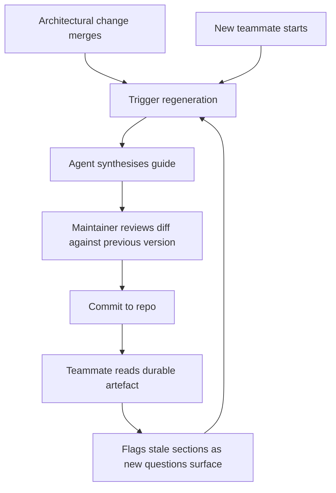

# Agent-Generated Onboarding Guide as a Durable Artefact

> Use an agent with broad repository access to synthesise a teammate ramp-up guide, then version-control that artefact and regenerate it on architectural change — shifting onboarding cost from repeated human reading to one-shot agent synthesis plus amortised review.

## Artefact, Not Conversation

An agent that can read a codebase can answer onboarding questions interactively — see [Agent-Powered Codebase Q&A and Onboarding](codebase-qa-onboarding.md). The artefact variant is the complement: instead of a live Q&A session that evaporates when the newcomer closes the terminal, the agent emits a single structured document that is reviewed, committed, and reused.

Claude Code released `/team-onboarding` in version 2.1.101 (2026-04-10) to "generate a teammate ramp-up guide from your local Claude Code usage" ([Claude Code changelog](https://code.claude.com/docs/en/changelog)). The command is one implementation of the artefact pattern. The durable shape is tool-agnostic: any agent that can read the repository and a curated set of usage traces can produce the same output.

| Dimension | Interactive Q&A | Generated artefact |
|---|---|---|
| Lifespan | Single session | Version-controlled, persists |
| Audience | One newcomer | Every future teammate |
| Drift source | None (regenerated each query) | Bounded by regeneration cadence |
| Review surface | Nothing to review | PR-sized document |
| Failure mode | Newcomer asks wrong question | Unreviewed hallucinations enter history |

## Artefact Shape

A ramp-up guide produced by an agent typically covers five sections:

- **Entry points** — top-level scripts, service binaries, `main` functions, CI entrypoints
- **Hot files** — modules changed most often in the last N months and the directories where most pull-request review time accumulates
- **Conventions** — naming patterns, directory layout, test structure, commit style
- **Must-read history** — commits that introduced current architectural invariants, post-mortems, ADRs
- **Glossary** — project-specific vocabulary mapped to the modules and types that implement it

The Claude Code best-practices guide explicitly frames this kind of durable artefact — `/init` "analyzes your codebase to detect build systems, test frameworks, and code patterns, giving you a solid foundation to refine" and the resulting CLAUDE.md "compounds in value over time" when checked into git ([Claude Code best practices](https://code.claude.com/docs/en/best-practices)). The onboarding guide is the reader-facing sibling to CLAUDE.md: CLAUDE.md tells future agents how to behave; the ramp-up guide tells future humans how to read the code.

## Why Synthesise Instead of Q&A

The causal mechanism is that an agent with codebase search and file-reading tools can assemble a repository-wide view in a single synthesis pass and compress it into a map for human consumption. [RepoAgent (arXiv 2402.16667)](https://arxiv.org/abs/2402.16667) formalises this as a framework for LLM-generated repository-level documentation, motivated by the observation that hand-written docs drift from implementation within weeks. The artefact amortises the comprehension cost: the human reviews once, the artefact serves many subsequent readers.

The durable form also enables patterns the conversational form cannot:

- A newcomer can read it before their first terminal session, so they arrive with a mental model rather than constructing one from cold.
- Reviewers can audit the *claims* the artefact makes, caught early rather than propagating through individual onboarding sessions.
- Git history of the artefact itself becomes a signal — when the file changes significantly between regenerations, that is a prompt to tell the team about the architectural shift.

## Regeneration Cadence

Calendar-based regeneration (monthly, quarterly) creates churn without reliably matching code change. Tie regeneration to architectural events instead:

- Merge of a change that introduces or removes a service boundary
- Migration that reshapes the data model or top-level directory layout
- Breaking dependency upgrade that changes conventions
- Onboarding of a new team member — the existing guide is re-run, diffs are reviewed, staleness is caught against fresh eyes



Regeneration-on-trigger bounds drift by the frequency of significant change rather than by an arbitrary calendar. Between triggers, the artefact is stable enough to cite.

## When This Backfires

The artefact pattern has specific failure conditions. Prefer the interactive Q&A form, or skip onboarding tooling entirely, when any of these apply:

- **Solo or two-person teams** — there is no audience downstream of the author. Regeneration and review cost more than the onboarding time saved.
- **Rapidly-changing greenfield codebases** — the artefact is stale before the next teammate arrives. Live Q&A produces better results because it reflects current code.
- **Teams without review discipline** — unreviewed generated guides become a hallucination vector. Agents fabricate file paths and invent architectural rationale; the Claude Code best-practices guide warns that over-specified auto-generated docs cause agents to "ignore half of it because important rules get lost in the noise," and the same noise confuses humans ([Claude Code best practices](https://code.claude.com/docs/en/best-practices)).
- **Codebases dominated by tacit knowledge** — the agent reads what is in the repo; it cannot extract judgments that live in senior engineers' heads. The artefact will look complete while missing the conventions that actually matter. Pair with [encoding tacit knowledge](encoding-tacit-knowledge.md) rather than relying on synthesis alone.
- **Over-reliance that deepens comprehension debt** — if newcomers read only the artefact and never engage with source, [comprehension debt](../anti-patterns/comprehension-debt.md) accumulates. Treat the guide as a map, not a substitute for the terrain.

## Review Discipline

Treat the generated guide like any agent output: the artefact must pass review before it enters the repo. Specific checks:

- Every file path and symbol name the guide references is verified to exist in the current tree
- Architectural claims (service boundaries, dependency directions) are cross-checked against the import graph or configuration
- Historical claims (who introduced a pattern, why a convention exists) are checked against `git log`, not accepted from the agent's summary — agents confabulate history readily
- Conventions listed in the guide match what the team actually does today, not what it did when the pattern was first introduced

The review is lighter than writing the guide from scratch, heavier than rubber-stamping. That is the trade the artefact pattern buys.

## Example

A platform team maintaining a payments service regenerates their ramp-up guide whenever the service topology changes.

**Trigger.** A PR splits the capture module into two services. The merge hook invokes the agent:

```bash
claude /team-onboarding --out docs/onboarding/ramp-up.md
```

**Agent output — structured ramp-up.** The agent produces a Markdown file with the five sections above. Entry points list the new binary for the split-out service; hot files are computed from the last 90 days of commits, excluding generated code; conventions enumerate the processor-adapter naming pattern and the event-sourcing layout.

**Review.** The module owner compares the diff against the previous version. Two sections changed materially: the entry-points section now lists two services instead of one, and the glossary adds "capture sidecar" with a link to the new module. The reviewer spot-checks three claims against the code — the first entry point exists at the claimed path, the second is correct, and a claimed "retry policy convention" is accurate in two adapters but overgeneralised as universal; the reviewer corrects the phrasing to "retry policy convention in processor adapters, see `adapters/stripe.ts` for the canonical example."

**Commit.** The corrected artefact lands as `docs/onboarding/ramp-up.md`. The next teammate who joins reads it before opening their first file.

**Regeneration-on-arrival.** When that teammate starts, the guide is regenerated once more and the diff reviewed; stale sections surface naturally against a fresh reader's questions, which become the next round of corrections.

## Key Takeaways

- The artefact pattern shifts onboarding from repeated individual Q&A to one-shot synthesis plus amortised review, producing a version-controlled map that survives across teammates.
- The durable artefact typically covers entry points, hot files, conventions, must-read history, and glossary — content an agent with repository access can reliably produce.
- Tie regeneration to architectural events, not the calendar — this bounds drift by significant change rather than by a fixed cadence.
- The pattern fails on solo teams, rapidly-changing greenfield code, review-less cultures, and tacit-knowledge-heavy codebases; prefer interactive Q&A or skip the tooling in those conditions.
- Review the generated guide the way you review agent code output: verify claims against the tree, check history against `git log`, and flag overgeneralisations rather than merging the first pass.

## Related

- [Agent-Powered Codebase Q&A and Onboarding](codebase-qa-onboarding.md) — the interactive complement to the artefact pattern
- [Team Onboarding for Agent Workflows](team-onboarding.md) — team-coordination onboarding, distinct from the artefact
- [Encoding Tacit Knowledge into Agent Improvement Loops](encoding-tacit-knowledge.md) — captures judgments the generated guide will miss
- [Continuous Documentation](continuous-documentation.md) — the broader drift-detection pipeline the ramp-up guide can plug into
- [Getting Started with Instruction Files](getting-started-instruction-files.md) — CLAUDE.md and AGENTS.md are sibling artefacts to the ramp-up guide
- [Pre-Execution Codebase Exploration](pre-execution-codebase-exploration.md) — the reader-side skill the guide accelerates
- [Comprehension Debt](../anti-patterns/comprehension-debt.md) — the primary failure mode when newcomers substitute the guide for code reading
- [Three Knowledge Tiers](../instructions/three-knowledge-tiers.md) — how the ramp-up guide fits alongside hot, warm, and cold knowledge
