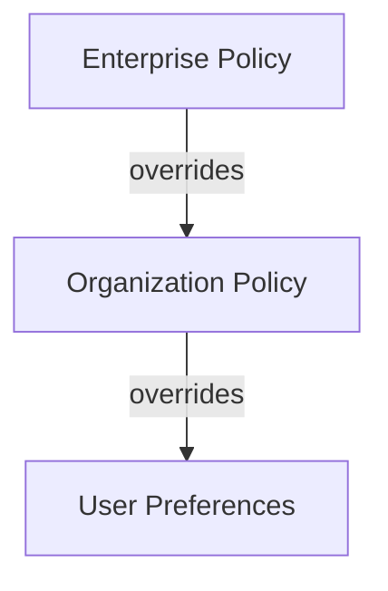

# Agent Governance Policies

> Enterprise policy controls for AI agent behavior — agent mode access, model availability, MCP server allowlists, and audit logging — implemented through a hierarchical override model.

## Policy Hierarchy

GitHub Copilot governance follows a three-tier hierarchy where higher tiers override lower ones:



Enterprise owners can enforce uniform policies across all organizations or delegate decisions to individual organization owners ([GitHub Docs: Managing Copilot policies for your organization](https://docs.github.com/en/copilot/how-tos/administer-copilot/manage-for-organization/manage-policies)). This delegation model lets enterprises set guardrails while giving organizations flexibility within those bounds.

## Core Policy Controls

### Agent Mode Access

A dedicated policy controls whether Copilot agent mode is available in the IDE. The policy defaults to `Enabled` to maintain backward compatibility — organizations that want to restrict agent mode must actively disable it ([GitHub Changelog: Agent Mode Policy](https://github.blog/changelog/2025-11-03-github-copilot-policy-now-supports-agent-mode-in-the-ide/)).

Configuration surfaces:

- **Enterprise level**: AI Controls tab on github.com
- **Organization level**: Copilot policies tab on github.com

### Model Availability

Enterprise administrators control which AI models are available to Copilot users. This determines which models appear in the model picker across IDE integrations. Restricting model availability lets organizations limit exposure to models that have not cleared internal data-handling or compliance review.

### MCP Server Allowlists

The MCP servers policy controls access to Model Context Protocol server support where it is generally available. MCP is disabled by default for Business and Enterprise plans — administrators must explicitly enable it and can maintain allowlists of approved servers ([GitHub Docs: Configure MCP server access](https://docs.github.com/en/copilot/how-tos/administer-copilot/manage-mcp-usage/configure-mcp-server-access)).

This default-deny posture prevents unvetted MCP servers from accessing repository context without administrative approval.

### Third-Party Agent Access

Policies govern whether third-party AI tools (beyond Copilot itself) can access repositories. This controls the blast radius of agent integrations and ensures that only approved tools interact with organizational code.

### Preview Feature Controls

Toggle switches enable or disable access to preview and experimental Copilot features at the enterprise or organization level. This lets security-conscious organizations wait for general availability before exposing new capabilities.

## Agent Activity Metrics

Governance requires visibility. GitHub provides agent activity metrics through both API and dashboard interfaces ([GitHub Changelog: Plan Mode Metrics](https://github.blog/changelog/2026-03-02-copilot-metrics-now-includes-plan-mode/)):

### Tracked Dimensions

- **Feature usage**: Requests broken down by Copilot feature (chat, agent mode, [plan mode](plan-first-loop.md))
- **Model usage**: Which models are consumed, broken down by feature and programming language
- **Adoption trends**: Engagement patterns across teams and time periods

### Access Channels

- **API**: Usage data appears under `totals_by_feature`, `totals_by_language_feature`, and `totals_by_model_feature` keys
- **Dashboard**: Insights > Copilot usage in the GitHub UI

Plan mode metrics were previously aggregated under "Custom" usage. The separation into a distinct `chat_panel_plan_mode` category provides granular visibility into how teams use research-and-planning workflows versus direct code generation ([GitHub Changelog: Plan Mode Metrics](https://github.blog/changelog/2026-03-02-copilot-metrics-now-includes-plan-mode/)).

## Implementation Approach

### Rolling Out Agent Governance

1. **Audit current state**: Review which agent features are currently enabled across the enterprise before applying restrictions.
2. **Set enterprise guardrails**: Establish enterprise-level policies for high-risk controls (MCP servers, third-party agent access, model availability).
3. **Delegate where appropriate**: Allow organizations to manage lower-risk controls (agent mode access, preview features) within enterprise bounds.
4. **Monitor adoption metrics**: Use the Copilot metrics API and dashboard to track feature adoption and identify teams that may need guidance or training.

### Governance as Enablement

Effective governance is not about restricting AI usage — it is about creating the conditions where teams can adopt agent capabilities confidently. Default-deny for high-risk features (MCP servers, third-party access) combined with default-enable for standard features (agent mode) balances security with adoption velocity.

## Example

The following shows a typical enterprise governance configuration that sets hard limits at the enterprise level while delegating operational decisions to organizations.

At the enterprise level (AI Controls tab on github.com), an admin sets non-negotiable guardrails:

```yaml
# Enterprise-level Copilot policy configuration (representative — applied via GitHub UI)
enterprise_policies:
  mcp_server_support: disabled          # default-deny; orgs must request enablement
  third_party_agent_access: disabled    # no unvetted tools access org repos
  model_availability:
    - claude-3-5-sonnet                 # approved models only
    - gpt-4o
    # gemini-2-pro: excluded — data residency not confirmed
  preview_features: disabled            # wait for GA before org exposure
  agent_mode_in_ide: delegated_to_org   # each org controls their own rollout
```

An organization that has validated MCP usage for a specific workflow then requests an allowlist exception:

```yaml
# Organization-level override (within enterprise bounds)
org_policies:
  mcp_server_support: enabled
  mcp_server_allowlist:
    - server: github.com/modelcontextprotocol/servers/tree/main/src/github
      purpose: "GitHub API access for coding agent workflows"
    - server: internal.acme.com/mcp/jira
      purpose: "Jira issue sync for delegation pipeline"
  agent_mode_in_ide: enabled
```

To monitor adoption after rollout, query the Copilot metrics API:

```bash
# Fetch agent mode adoption broken down by feature
gh api \
  /orgs/acme-org/copilot/metrics \
  --jq '.[] | {date: .date, agent_mode: .totals_by_feature.agent_mode, plan_mode: .totals_by_feature.chat_panel_plan_mode}'
```

This lets governance teams confirm that agent mode is being adopted at the expected rate and identify teams that may need onboarding support, without reviewing individual conversation contents.

## When This Backfires

Centralized governance creates bottlenecks when allowlist approval cycles are slower than team delivery cadence — developers route around blocked MCP servers using personal Copilot subscriptions outside the enterprise plan, which eliminates the visibility the policy was designed to create. Overly broad model restrictions that block capable models for compliance reasons not grounded in actual data-handling requirements reduce output quality without reducing risk. Default-deny postures applied uniformly across all teams ignore maturity differences — a team with mature code review and CI checks has lower blast radius from agent access than one without, making uniform restrictions a poor fit for heterogeneous organizations. Monitor shadow-IT signals (personal subscription usage, local MCP server adoption) as leading indicators that governance friction is exceeding its value.

## Key Takeaways

- Agent governance operates through a three-tier hierarchy (enterprise > organization > user) where higher tiers override lower ones — set enterprise guardrails and delegate operational decisions to organizations.
- MCP server access is disabled by default on Business/Enterprise plans, requiring explicit administrative enablement — this default-deny posture prevents unvetted tool integrations.
- Agent activity metrics (feature usage, model consumption, adoption trends) provide the visibility layer that makes governance data-driven rather than policy-driven.

## Related

- [Blast Radius Containment: Least Privilege for AI Agents](../security/blast-radius-containment.md)
- [Human-in-the-Loop Confirmation Gates](../security/human-in-the-loop-confirmation-gates.md)
- [Human-in-the-Loop Placement: Where and How to Supervise](human-in-the-loop.md)
- [Architecting a Central Repo for Shared Agent Standards](central-repo-shared-agent-standards.md)
- [Enterprise Skill Marketplace](enterprise-skill-marketplace.md)
- [Changelog-Driven Feature Parity](changelog-driven-feature-parity.md)
- [Canary Rollout for Agent Policy Changes](canary-rollout-agent-policy.md)
- [Team Onboarding for Agent Workflows](team-onboarding.md)
