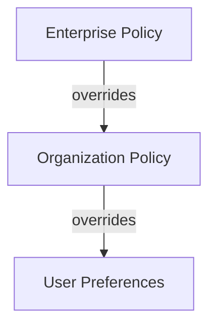

# Agent Governance Policies

> Enterprise policy controls for AI agent behavior — agent mode access, model availability, MCP server allowlists, and agent activity metrics — implemented through a hierarchical override model.

## Policy hierarchy

GitHub Copilot governance follows a three-tier hierarchy where higher tiers override lower ones:


```mermaid
graph TD
    A[Enterprise Policy] -->|overrides| B[Organization Policy]
    B -->|overrides| C[User Preferences]
```

Enterprise owners can enforce uniform policies across all organizations or delegate decisions to individual organization owners ([GitHub Docs: Managing Copilot policies for your organization](https://docs.github.com/en/copilot/how-tos/administer-copilot/manage-for-organization/manage-policies)). This delegation model lets enterprises set guardrails while organizations keep some flexibility within those bounds.

## Core policy controls

### Agent mode access

A dedicated policy controls whether Copilot agent mode is available in the IDE. The policy defaults to `Enabled` to maintain backward compatibility — organizations that want to restrict agent mode must actively disable it ([GitHub Changelog: Agent Mode Policy](https://github.blog/changelog/2025-11-03-github-copilot-policy-now-supports-agent-mode-in-the-ide/)).

Configuration surfaces:

- Enterprise level: AI Controls tab on github.com
- Organization level: Copilot policies tab on github.com

### Model availability

Enterprise administrators control which AI models Copilot users can reach. This setting determines which models appear in the model picker across IDE integrations. Restricting model availability lets organizations limit exposure to models that have not cleared internal data-handling or compliance review.

### MCP server allowlists

The MCP servers policy controls access to [Model Context Protocol](../standards/mcp-protocol.md) server support where it is generally available. MCP is disabled by default for Business and Enterprise plans — administrators must explicitly enable it and can maintain allowlists of approved servers ([GitHub Docs: Configure MCP server access](https://docs.github.com/en/copilot/how-tos/administer-copilot/manage-mcp-usage/configure-mcp-server-access)).

This default-deny posture prevents unvetted MCP servers from accessing repository context without administrative approval.

Enforcement caveat: allowlist enforcement is name-based, not cryptographic. For local stdio servers the policy validates only the server name. So a developer who edits `.vscode/mcp.json` or the user-profile `mcp.json` directly can sideload a server that matches an allowlisted name without going through the registry ([GitHub Docs: MCP allowlist enforcement](https://docs.github.com/en/copilot/reference/mcp-allowlist-enforcement)). The policy also scopes per-client: the same Copilot identity used in JetBrains, Neovim, or third-party hosts like Cursor and Claude is not covered by a VS Code allowlist. Treat the allowlist as an honesty layer for compliant developers, not as a hard boundary. Pair it with auditable MCP gateways, or disable MCP entirely for high-risk repos until strict path-and-argument matching ships.

### Third-party agent access

Policies govern whether third-party AI tools (beyond Copilot itself) can access repositories. This controls the blast radius of agent integrations, so only approved tools interact with organizational code.

### Preview feature controls

Toggle switches enable or disable access to preview and experimental Copilot features at the enterprise or organization level. This lets security-conscious organizations wait for general availability before exposing new capabilities.

## Agent activity metrics

Governance requires visibility. GitHub provides agent activity metrics through both API and dashboard interfaces ([GitHub Changelog: Plan Mode Metrics](https://github.blog/changelog/2026-03-02-copilot-metrics-now-includes-plan-mode/)):

### Tracked dimensions

- Feature usage: requests broken down by Copilot feature (chat, agent mode, [plan mode](plan-first-loop.md))
- Model usage: which models are consumed, broken down by feature and programming language
- Adoption trends: engagement patterns across teams and time periods

### Access channels

- API: usage data appears under `totals_by_feature`, `totals_by_language_feature`, and `totals_by_model_feature` keys
- Dashboard: Insights > Copilot usage in the GitHub UI

Plan mode metrics were previously grouped under "Custom" usage. A distinct `chat_panel_plan_mode` category now separates them, so you can see how teams use research-and-planning workflows versus direct code generation ([GitHub Changelog: Plan Mode Metrics](https://github.blog/changelog/2026-03-02-copilot-metrics-now-includes-plan-mode/)).

## Implementation approach

### Rolling out agent governance

1. Audit current state: review which agent features are enabled across the enterprise before you apply restrictions.
2. Set enterprise guardrails: establish enterprise-level policies for high-risk controls (MCP servers, third-party agent access, model availability).
3. Delegate where appropriate: let organizations manage lower-risk controls (agent mode access, preview features) within enterprise bounds.
4. Monitor adoption metrics: use the Copilot metrics API and dashboard to track feature adoption and find teams that may need guidance or training.

### Governance as enablement

Effective governance is not about restricting AI usage. It is about creating the conditions where teams adopt agent capabilities with confidence. Default-deny for high-risk features (MCP servers, third-party access), paired with default-enable for standard features (agent mode), balances security against adoption speed.

## Example

The following shows a typical enterprise governance configuration that sets hard limits at the enterprise level while delegating operational decisions to organizations.

At the enterprise level (AI Controls tab on github.com), an admin sets non-negotiable guardrails:

```yaml
# Enterprise-level Copilot policy configuration (representative — applied via GitHub UI)
enterprise_policies:
  mcp_server_support: disabled          # default-deny; orgs must request enablement
  third_party_agent_access: disabled    # no unvetted tools access org repos
  model_availability:
    - claude-3-5-sonnet                 # approved models only
    - gpt-4o
    # gemini-2-pro: excluded — data residency not confirmed
  preview_features: disabled            # wait for GA before org exposure
  agent_mode_in_ide: delegated_to_org   # each org controls their own rollout
```

An organization that has validated MCP usage for a specific workflow then requests an allowlist exception:

```yaml
# Organization-level override (within enterprise bounds)
org_policies:
  mcp_server_support: enabled
  mcp_server_allowlist:
    - server: github.com/modelcontextprotocol/servers/tree/main/src/github
      purpose: "GitHub API access for coding agent workflows"
    - server: internal.acme.com/mcp/jira
      purpose: "Jira issue sync for delegation pipeline"
  agent_mode_in_ide: enabled
```

To monitor adoption after rollout, query the Copilot metrics API:

```bash
# Fetch agent mode adoption broken down by feature
gh api \
  /orgs/acme-org/copilot/metrics \
  --jq '.[] | {date: .date, agent_mode: .totals_by_feature.agent_mode, plan_mode: .totals_by_feature.chat_panel_plan_mode}'
```

This lets governance teams confirm that teams are adopting agent mode at the expected rate, and spot teams that need onboarding support, without reviewing individual conversation contents.

## When this backfires

Centralized governance creates bottlenecks when allowlist approval cycles are slower than the team's delivery pace. Developers then route around blocked MCP servers using personal Copilot subscriptions outside the enterprise plan, which eliminates the visibility the policy was designed to create. Overly broad model restrictions cause a second problem: when they block capable models for compliance reasons that are not grounded in actual data-handling requirements, they reduce output quality without reducing risk. Default-deny postures applied uniformly across all teams also ignore maturity differences. A team with mature code review and CI checks has a lower blast radius from agent access than one without, so uniform restrictions fit heterogeneous organizations poorly. Monitor shadow-IT signals (personal subscription usage, local MCP server adoption) as early indicators that governance friction is exceeding its value.

## Key Takeaways

- Agent governance operates through a three-tier hierarchy (enterprise > organization > user) where higher tiers override lower ones — set enterprise guardrails and delegate operational decisions to organizations.
- MCP server access is disabled by default on Business/Enterprise plans, requiring explicit administrative enablement — this default-deny posture prevents unvetted tool integrations.
- Agent activity metrics (feature usage, model consumption, adoption trends) provide the visibility layer that makes governance data-driven rather than policy-driven.

## Related

- [Governing Production Agents: Cost, Control, Compliance](governing-production-agents.md) — the tool-agnostic tri-axis framework these product-policy controls implement.
- [Blast Radius Containment: Least Privilege for AI Agents](../security/blast-radius-containment.md)
- [Human-in-the-Loop Confirmation Gates](../security/human-in-the-loop-confirmation-gates.md)
- [Human-in-the-Loop Placement: Where and How to Supervise](human-in-the-loop.md)
- [Architecting a Central Repo for Shared Agent Standards](central-repo-shared-agent-standards.md)
- [Enterprise Skill Marketplace](enterprise-skill-marketplace.md)
- [Canary Rollout for Agent Policy Changes](canary-rollout-agent-policy.md)
- [Team-Scoped Agent Policy Delegation](../security/team-scoped-policy-delegation.md) — the enterprise-team dimension that cuts across this three-tier hierarchy.
- [Team Onboarding for Agent Workflows](team-onboarding.md)
